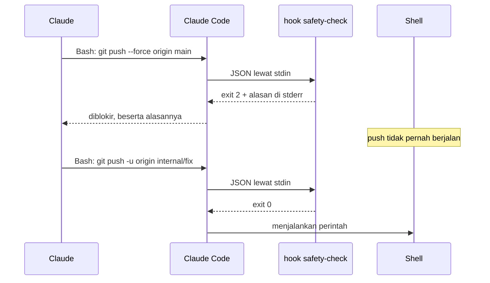
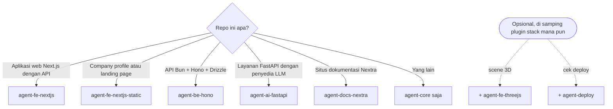
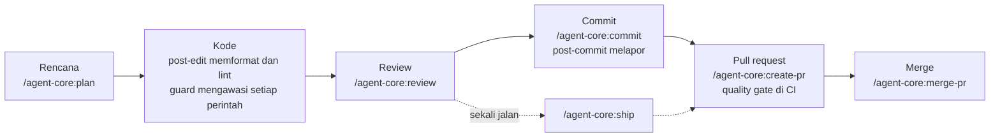
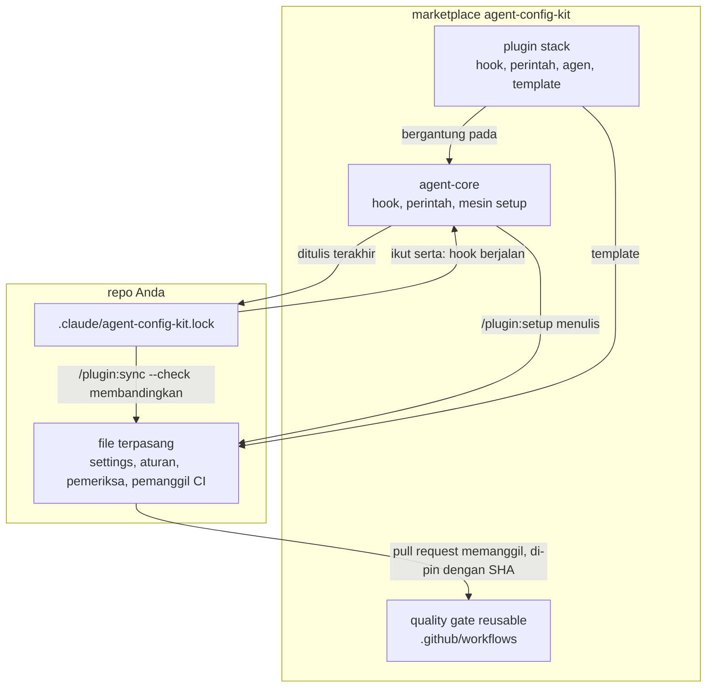

[English](README.md) | **Bahasa Indonesia**

<picture>
  <source media="(prefers-color-scheme: dark)" srcset="docs/assets/banner-kit-dark.svg">
  <source media="(prefers-color-scheme: light)" srcset="docs/assets/banner-kit-light.svg">
  
</picture>

# agent-config-kit

[](https://github.com/adhibuchori/agent-config-kit/actions/workflows/self-test.yml)
[](LICENSE)
[](CHANGELOG.md)

Kumpulan plugin Claude Code yang mencegah agen AI melakukan hal yang akan Anda sesali: force-push
ke `main`, menghapus `src/`, membaca `.env` ke dalam percakapan, atau menulis ke database produksi.
Penjaganya berupa hook yang sungguh menolak (exit code 2), bukan sekadar saran di prompt. Di
sekelilingnya, kit ini memasang aturan, skrip pemeriksa, dan CI pull request yang dibutuhkan stack
Anda, sehingga agen bekerja seperti tim Anda bekerja: rencana, review, commit, buka PR, merge.

> [!TIP]
> **Singkatnya.** Tambahkan marketplace, pasang `agent-core` beserta plugin untuk stack Anda, lalu
> jalankan `/<plugin>:setup` di repo Anda. Setup menampilkan setiap file yang akan ditulis dan baru
> menulis setelah Anda membalas **go**. Sejak itu, perintah berbahaya ditolak beserta alasannya,
> file `.env` dan penulisan ke produksi tetap terkunci sampai *Anda sendiri* membukanya, dan
> `/agent-core:help` memberi tahu perintah apa yang berikutnya. Guard berjalan di mesin Anda dan
> tidak pernah memakai jaringan; hanya perintah yang Anda mulai sendiri (langkah GitHub dan deploy,
> pemindaian React Doctor) yang online.

## Daftar isi

- [Mengapa kit ini ada](#mengapa-kit-ini-ada)
- [Lihat cara kerjanya](#lihat-cara-kerjanya)
- [Untuk siapa kit ini](#untuk-siapa-kit-ini)
- [Pilih plugin Anda](#pilih-plugin-anda)
- [Mulai cepat](#mulai-cepat)
- [Sehari bekerja dengan kit ini](#sehari-bekerja-dengan-kit-ini)
- [Apa saja yang dipasang](#apa-saja-yang-dipasang)
- [Bagaimana bagian-bagiannya saling terhubung](#bagaimana-bagian-bagiannya-saling-terhubung)
- [Semua isi kit](#semua-isi-kit)
- [Konfigurasi](#konfigurasi)
- [Apa yang diblokir, dan cara mematikannya](#apa-yang-diblokir-dan-cara-mematikannya)
- [Membuka kunci .env dan database produksi](#membuka-kunci-env-dan-database-produksi)
- [Penyiapan untuk tim](#penyiapan-untuk-tim)
- [CI: quality gate yang dapat dipakai ulang](#ci-quality-gate-yang-dapat-dipakai-ulang)
- [Model keamanan](#model-keamanan)
- [Biaya dan beban tambahan](#biaya-dan-beban-tambahan)
- [Keterbatasan](#keterbatasan)
- [Contoh jadi: repo template](#contoh-jadi-repo-template)
- [Upgrade dan uninstall](#upgrade-dan-uninstall)
- [Penomoran versi](#penomoran-versi)
- [FAQ dan pemecahan masalah](#faq-dan-pemecahan-masalah)
- [Peta jalan dan di luar cakupan](#peta-jalan-dan-di-luar-cakupan)
- [Kontribusi, keamanan, dan lisensi](#kontribusi-keamanan-dan-lisensi)

## Mengapa kit ini ada

Instruksi di `CLAUDE.md` hanyalah permintaan. Hook yang keluar dengan exit 2 adalah tembok. Setiap
cerita di bawah adalah jenis kegagalan yang nyata, apa yang dilakukan kit terhadapnya, dan bagian
mana yang menanganinya.

1. **Agen melakukan force-push ke `main`.**
   *Masalahnya:* rebase berantakan, agen "memperbaikinya" dengan `git push --force origin main`, dan
   commit milik rekan setim hilang.
   *Solusinya:* branch yang dilindungi ditolak lewat refspec, `--all`, `--mirror`, maupun branch
   yang sedang aktif, baik dari shell maupun dari tool MCP GitHub. Perubahan masuk ke `main` lewat
   pull request.
   *Ditangani oleh:* [safety-check](docs/agent-core/safety-check.md),
   [mcp-guard](docs/agent-core/mcp-guard.md), aturan `deny` yang dipasang
   [setup](docs/agent-core/setup.md).

2. **Rahasia masuk ke transkrip.**
   *Masalahnya:* "coba saya cek konfigurasinya" berubah menjadi `cat .env.production`, dan API key
   Anda kini ada di log percakapan, di layar orang lain, dan di laporan bug.
   *Solusinya:* tidak ada perintah shell yang boleh membaca atau menulis file `.env*` asli, lewat jalur
   apa pun yang bisa dibaca analyzer. Claude melihat daftar key lewat helper yang menyamarkan setiap
   rahasia, dan baru boleh mengubah nilai setelah Anda sendiri membuka kunci `env`.
   *Ditangani oleh:* [safety-check](docs/agent-core/safety-check.md), [unlock](docs/unlock.md),
   sandbox Bash yang bisa diaktifkan oleh setup.

3. **Agen menulis ke produksi.**
   *Masalahnya:* `DELETE` untuk "bersih-bersih sebentar" berjalan ke database produksi lewat tool MCP.
   *Solusinya:* satu pernyataan baca-saja boleh lewat; setiap penulisan menunggu sampai Anda
   menjalankan `! bun unlock db`, dan kuncinya menutup sendiri setelah 15 menit.
   *Ditangani oleh:* [db-guard](docs/agent-core/db-guard.md), [unlock](docs/unlock.md).

4. **Aturan di `CLAUDE.md` diabaikan.**
   *Masalahnya:* file itu bilang "jangan ubah kode hasil generator dengan tangan" dan "jangan lewati
   hook pre-commit", dan setelah sesi panjang agen melanggar keduanya.
   *Solusinya:* aturan yang penting ditegakkan di tempat agen tidak bisa berdebat: guard menolak
   editnya, dan `--no-verify` ditolak. Aturan lainnya hanya dimuat saat file yang cocok dibuka,
   sehingga `CLAUDE.md` tetap cukup pendek untuk benar-benar dibaca.
   *Ditangani oleh:* [generated-guard](docs/agent-fe-nextjs/generated-guard.md),
   [migration-guard](docs/agent-be-hono/migration-guard.md),
   [safety-check](docs/agent-core/safety-check.md), aturan di `.claude/rules/`.

5. **YAML CI yang disalin ke banyak repo mulai berbeda-beda.**
   *Masalahnya:* setiap repo punya salinan quality gate sendiri; satu perbaikan hanya masuk ke tiga
   repo, dan tidak ada yang tahu repo mana yang masih melewatkan pemindaian rahasia.
   *Solusinya:* setiap repo memanggil satu reusable workflow yang di-pin ke satu commit, dan
   `/<plugin>:sync --check` melaporkan file mana pun yang sudah bergeser dari hasil setup.
   *Ditangani oleh:* [CI: quality gate yang dapat dipakai ulang](#ci-quality-gate-yang-dapat-dipakai-ulang),
   [sync](docs/agent-core/sync.md).

6. **Agen menghapus pekerjaan orang lain.**
   *Masalahnya:* dua sesi berbagi satu checkout; salah satunya menjalankan `git reset --hard` atau
   `git stash`, atau `rm -rf src` supaya "mulai bersih".
   *Solusinya:* perintah yang menghapus pekerjaan yang belum di-commit atau path yang dilindungi
   ditolak, dan setelah setiap commit Claude diperlihatkan file apa saja yang benar-benar ikut.
   *Ditangani oleh:* [safety-check](docs/agent-core/safety-check.md),
   [post-commit](docs/agent-core/post-commit.md), [/agent-core:commit](docs/agent-core/commit.md).

<details>
<summary><strong>Sebelum dan sesudah: lima menit yang sama, tanpa dan dengan kit</strong></summary>

### Tanpa kit

```text
Anda:    Deploy gagal, tolong perbaiki env-nya lalu push.
Claude:  Saya lihat dulu file env-nya.           $ cat .env.production      ← rahasia kini ada di chat
Claude:  DATABASE_URL salah. Saya perbaiki.      $ sed -i … .env.production
Claude:  Saya push perbaikannya.                 $ git push --force origin main
         (commit rekan setim dari sepuluh menit lalu hilang)
```

### Dengan kit

```text
Anda:    Deploy gagal, tolong perbaiki env-nya lalu push.
Claude:  $ cat .env.production
         [safety] BLOCKED: .env.production holds secrets … List its keys with
         `bash scripts/env/show.sh .env.production` (secret values masked).
Claude:  $ bash scripts/env/show.sh .env.production
         DATABASE_URL=post…(58 chars)  … DATABASE_URL masih mengarah ke host lama.
         File ini terkunci; tolong jalankan: ! bun unlock env
Anda:    ! bun unlock env
Claude:  $ printf '%s' "$NEW_URL" | bash scripts/env/set.sh .env.production DATABASE_URL
Claude:  Saya push branch kerja lalu buka PR: /agent-core:create-pr
```

Pesan penolakan di atas adalah pesan asli dari hook (dipersingkat dengan `…`, dan tetap dalam bahasa
Inggris seperti aslinya); baris di sekitarnya menunjukkan di mana pesan itu muncul dalam sesi.

</details>

## Lihat cara kerjanya

<picture>
  <source media="(prefers-color-scheme: dark)" srcset="docs/assets/demo-blocked-dark.svg">
  <source media="(prefers-color-scheme: light)" srcset="docs/assets/demo-blocked-light.svg">
  
</picture>

Inilah balasan asli dari hook, direkam di repo yang sudah di-setup dengan agent-fe-nextjs. Claude
Code memberikan panggilan tool ke hook sebagai JSON; hook menjawab dengan exit code 2 dan alasan di
stderr, yang kemudian dibaca dan ditindaklanjuti oleh Claude:

```text
tool call  Bash  {"command": "git push --force origin main"}
exit 2     [safety] BLOCKED: pushing to a protected branch (dev/prod/main/master) is not allowed.
           Push your work branch and open a PR; when a release needs this push, the user runs it
           with `!`.

tool call  Bash  {"command": "git status"}
exit 0     (tidak ada apa-apa: perintahnya berjalan)
```

Anda bisa mengulanginya dari clone repo ini dengan satu baris; halaman setiap hook punya potongan
[Check it yourself](docs/agent-core/safety-check.md#check-it-yourself) sendiri.

<picture>
  <source media="(prefers-color-scheme: dark)" srcset="docs/assets/hook-flow-dark.svg">
  <source media="(prefers-color-scheme: light)" srcset="docs/assets/hook-flow-light.svg">
  
</picture>



Ilustrasinya beranimasi (landak berkedip, perintah seolah diketik). Jika sistem Anda meminta
gerakan dikurangi (reduced motion), yang tampil adalah gambar diam.

## Untuk siapa kit ini

**Cocok jika Anda:**

- memakai Claude Code (CLI atau ekstensi IDE) di repositori sungguhan, sendiri atau bersama tim;
- membangun dengan salah satu stack yang didukung: aplikasi Next.js, situs Next.js statis, API Bun +
  Hono + Drizzle, layanan FastAPI + LLM, atau situs dokumentasi Nextra;
- menginginkan penolakan yang bisa dipercaya, dan setup yang bisa Anda baca sebelum ia menulis apa pun.

**Tidak cocok jika Anda:**

- hanya memakai Claude di claude.ai atau Cowork: keduanya tidak memasang plugin yang punya folder
  `bin/`, sedangkan agent-core membutuhkan `bin/` untuk setup;
- menginginkan batas keamanan terhadap agen yang berniat jahat: hook membaca teks perintah dan
  berfungsi sebagai pagar pengaman terhadap kekeliruan dan instruksi yang disusupkan (lihat
  [Model keamanan](#model-keamanan));
- membutuhkan stack yang belum dicakup kit ini (lihat [.out-of-scope](.out-of-scope/README.md) untuk
  hal yang sengaja tidak dikerjakan, dan buka issue fitur untuk sisanya).

## Pilih plugin Anda

Setiap repo mendapat **agent-core** ditambah **satu** plugin stack. Dua add-on bersifat opsional.



| Plugin | Untuk | Tambahan di atas agent-core |
| --- | --- | --- |
| [agent-core](plugins/agent-core/README.md) | setiap repo (wajib) | 7 hook dan satu pengingat setup, 16 perintah, 2 agen, mesin setup |
| [agent-fe-nextjs](plugins/agent-fe-nextjs/README.md) | aplikasi Next.js dengan klien API hasil generator | generated-guard, 5 perintah, 3 agen, 2 skill |
| [agent-fe-nextjs-static](plugins/agent-fe-nextjs-static/README.md) | company profile, landing page | 6 perintah, 3 agen, 11 pemeriksaan situs |
| [agent-be-hono](plugins/agent-be-hono/README.md) | API Bun + Hono + Drizzle | migration-guard, reviewer, gate backend |
| [agent-ai-fastapi](plugins/agent-ai-fastapi/README.md) | FastAPI + penyedia LLM, uv | migration-guard, reviewer layanan AI |
| [agent-docs-nextra](plugins/agent-docs-nextra/README.md) | situs dokumentasi Nextra | generated-guard, reviewer keamanan dan SEO |
| [agent-fe-threejs](plugins/agent-fe-threejs/README.md) | add-on: three.js / React Three Fiber | aturan 3D dan pemeriksaan anggaran aset |
| [agent-deploy](plugins/agent-deploy/README.md) | add-on: host mana pun | smoke test deploy dari luar, promosi cadangan |

## Mulai cepat

<picture>
  <source media="(prefers-color-scheme: dark)" srcset="docs/assets/install-flow-dark.svg">
  <source media="(prefers-color-scheme: light)" srcset="docs/assets/install-flow-light.svg">
  :setup, yang menampilkan dry run sebelum menerapkan apa pun.">
</picture>

<!-- install:start -->
1. **Tambahkan marketplace** (sekali per mesin). Di terminal:

   ```bash
   claude plugin marketplace add adhibuchori/agent-config-kit
   ```

   Di dalam Claude Code, `/plugin marketplace add adhibuchori/agent-config-kit` melakukan hal yang
   sama.

2. **Pasang agent-core dan satu plugin stack.** Di dalam Claude Code:

   ```text
   /plugin install agent-core@agent-config-kit
   /plugin install agent-fe-nextjs@agent-config-kit
   ```

   Ganti `agent-fe-nextjs` dengan plugin stack yang cocok untuk repo Anda. Memasang plugin stack
   juga memasang agent-core, karena setiap plugin stack bergantung padanya. Jika perintah barunya
   tidak muncul, mulai ulang Claude Code.

3. **Jalankan setup di repo Anda**, untuk plugin stack yang Anda pasang:

   ```text
   /agent-fe-nextjs:setup
   ```

   Setup mengajukan beberapa pertanyaan, satu per satu, masing-masing dengan jawaban yang
   disarankan. Lalu setup menampilkan dry run dari setiap file yang akan ditulis, dan baru menulis
   setelah Anda membalas **go**. Commit file-file barunya bersama `.claude/agent-config-kit.lock`:
   lock itulah yang menyalakan hook untuk semua orang yang meng-clone repo.

**Pembaruan** baru sampai ke Anda saat versi sebuah plugin dinaikkan. Jalankan
`claude plugin marketplace update agent-config-kit`, lalu
`claude plugin update <plugin>@agent-config-kit`, mulai ulang Claude Code, dan jalankan
`/<plugin>:sync` di setiap repo.
<!-- install:end -->

**Yang akan Anda lihat.** Draf setup untuk aplikasi Next.js kecil diawali seperti ini (keluaran
asli, dipersingkat dengan `…`):

```text
agent-setup plan · agent-fe-nextjs 1.0.1 + agent-core 1.0.1 · project .
  create   .claude/rules/web/security.md
  …
  create   .claude/settings.json                   +$schema, +16 permissions.allow, +7 permissions.ask, +14 permissions.deny, +sandbox.enabled, …
  block    .gitignore                              agent-config-kit block (16 lines) (new file)
  block    CLAUDE.md                               ## Agent config kit (appended)
  alias    package.json                            scripts.unlock = "bash scripts/ops/unlock.sh"
  by-hand  tsconfig.json                           add what …/_kit/snippets/tsconfig.scripts.jsonc holds; the engine does not merge this format
  lock     .claude/agent-config-kit.lock           written last; turns the hooks on
digest sha256:664a6b9d…
```

Setelah **go**, `/agent-fe-nextjs:sync --check` diakhiri dengan `result: in sync (0 findings; exit 0)`.

Sejak 1.0.1, plugin stack mem-pin quality gate reusable ke commit rilis v1.0.0, jadi setup ikut
memasang pemanggil CI. Pemanggil yang masih memakai placeholder rilis ditahan lewat baris `warn`,
alih-alih workflow yang pasti gagal; `/<plugin>:sync` berikutnya memasangnya. Lihat [CI: quality gate yang dapat dipakai ulang](#ci-quality-gate-yang-dapat-dipakai-ulang).

## Sehari bekerja dengan kit ini

`/agent-core:help` menampilkan alur ini kapan saja. Setiap langkah menyebutkan perintah dan hook yang
membantu di sana.



| Langkah | Anda menjalankan | Yang membantu dengan sendirinya |
| --- | --- | --- |
| Rencana | `/agent-core:plan add password reset` (atau perencana stack seperti `/agent-fe-nextjs:plan-fullstack`) | aturan stack dimuat saat rencana membaca file yang cocok |
| Kode | tidak ada: cukup minta | [post-edit](docs/agent-core/post-edit.md) memformat dan me-lint setiap file yang ditulis; [safety-check](docs/agent-core/safety-check.md) dan guard lain menolak yang tidak boleh berjalan |
| Review | `/agent-core:review` | reviewer stack dan [security-guard](docs/agent-core/security-guard.md) melapor berdasarkan tingkat keparahan |
| Commit | `/agent-core:commit`, lalu `git commit -- <paths>` | gate pre-commit menjalankan `scripts/check/gates.sh --hook`; [post-commit](docs/agent-core/post-commit.md) menunjukkan apa yang masuk |
| PR | `/agent-core:create-pr` | quality gate reusable berjalan di pull request |
| Merge | `/agent-core:merge-pr 42` | `scripts/ops/pr-ready.sh` memeriksa kesiapan lebih dulu |
| Debug | `/agent-core:rca <gejala>` atau `/debug <gejala>` | [prompt-intent](docs/agent-core/prompt-intent.md) mengarahkan `/debug` ke perintah yang dimulai dari reproduksi |

## Apa saja yang dipasang

Ada dua tempat yang berubah: Claude Code Anda mendapat plugin-pluginnya, dan repo Anda mendapat
file yang ditulis setup. Berikut sisi repo untuk agent-core + agent-fe-nextjs (stack lain berbeda
di file khusus stack-nya):

```text
repo-anda/
├── CLAUDE.md                     milik Anda; setup menambahkan satu blok "## Agent config kit" (sekitar 25 baris)
├── AGENTS.md, SSOT.md            dibuat hanya jika belum ada (aturan bernomor; fakta tentang codebase)
├── .gitignore                    milik Anda; setup menambahkan satu blok terkelola (.claude/state/, file env, …)
├── package.json                  milik Anda; setup hanya menambahkan script yang belum ada, seperti "unlock"
├── docs/unlock.md                cara Anda membuka .env dan penulisan database
├── .mcp.json                     server MCP yang di-pin, jika Anda menjawab mcp=yes (dibuat sekali, lalu milik Anda)
├── .gitleaks.toml                allowlist sempit untuk pemindaian rahasia (dibuat sekali, lalu milik Anda)
├── .claude/
│   ├── agent-config-kit.lock     catatan apa yang ditulis setup; keberadaannya menyalakan hook
│   ├── settings.json             izin (allow, ask, deny) dan sandbox Bash, digabung ke milik Anda
│   ├── agent-config.example.json setiap pengaturan hook beserta default-nya; salin ke agent-config.json untuk mengubahnya
│   ├── rules/                    aturan yang dimuat hanya saat Claude mengedit file yang cocok
│   ├── anti-patterns/            satu file per jebakan yang sudah dikenal, plus INDEX.md
│   ├── docs/                     checklist review, standar, dan alasan di balik konfigurasi lint
│   ├── mcp/*.example.json        server MCP yang jarang dipakai, dimuat untuk satu sesi saat perlu
│   └── *.example.md              catatan ops, database, dan runner CI untuk diisi
├── scripts/
│   ├── check/                    gate: gates.sh menjalankan apa yang disebut gates.list
│   ├── ops/                      unlock.sh (Anda yang menjalankan) dan pr-ready.sh (kesiapan merge)
│   └── env/                      show.sh (daftar tersamar) dan set.sh (menulis hanya saat terbuka)
├── .github/workflows/            CI khusus pull request: pemanggil quality gate, CodeQL, dependency review
├── .husky/pre-commit             menjalankan gate pada file yang di-stage
└── oxlint.json, knip.ts, …       konfigurasi lint dan dead code, dibuat sekali lalu jadi milik Anda
```

Hook-nya sendiri **tidak** disalin ke repo Anda: hook berjalan dari plugin yang terpasang, sehingga
pembaruan plugin ikut memperbarui hook. Setiap berkas dari setiap plugin, satu per satu, ada di
[Setiap berkas yang dipasang](#setiap-berkas-yang-dipasang).

## Bagaimana bagian-bagiannya saling terhubung



<picture>
  <source media="(prefers-color-scheme: dark)" srcset="docs/assets/layers-dark.svg">
  <source media="(prefers-color-scheme: light)" srcset="docs/assets/layers-light.svg">
  
</picture>

Setiap lapisan punya satu tugas. `CLAUDE.md` mengarahkan (sengaja pendek), `AGENTS.md` memuat aturan
bernomor yang bisa dikutip saat review, `SSOT.md` memuat fakta tentang codebase, lapisan mesin
menegakkan (dengan plugin, hook tinggal di plugin dan aturan di `.claude/rules/`), dan gate
menentukan apa yang boleh di-merge.

## Semua isi kit

Setiap tabel menjawab tiga hal untuk tiap bagian: apa fungsinya, cara memakainya, dan mengapa
berguna. Setiap nama menaut ke halamannya (dalam bahasa Inggris). Daftar lengkap yang dihasilkan
otomatis ada di akhir bagian ini.

### Hook

| Nama | Fungsinya | Cara memakai | Mengapa berguna |
| --- | --- | --- | --- |
| [safety-check](docs/agent-core/safety-check.md) | Menolak perintah shell yang merusak atau tak bisa dibatalkan, push ke branch yang dilindungi, melewati gate, dan setiap pembacaan shell atas file `.env*` asli | Berjalan sendiri sebelum setiap panggilan `Bash` | Perintah yang akan Anda sesali tidak pernah berjalan |
| [db-guard](docs/agent-core/db-guard.md) | Meloloskan satu pernyataan SQL baca-saja; menahan penulisan sampai Anda membuka `db` | Berjalan sendiri sebelum tool SQL produksi | Tidak ada `DELETE` mendadak di produksi |
| [mcp-guard](docs/agent-core/mcp-guard.md) | Menolak penulisan MCP GitHub ke branch yang dilindungi | Berjalan sendiri sebelum empat tool MCP GitHub | Menutup jalan memutar di luar guard shell |
| [generated-guard](docs/agent-fe-nextjs/generated-guard.md) (fe-nextjs, docs-nextra) | Menolak edit tangan pada keluaran generator | Berjalan sendiri sebelum penulisan file | Perubahan masuk ke sumbernya, bukan ke file yang akan ditimpa generator |
| [migration-guard](docs/agent-be-hono/migration-guard.md) (be-hono, ai-fastapi) | Menolak edit tangan pada migrasi hasil generator | Berjalan sendiri sebelum penulisan file | Database, log migrasi, dan skema tetap selaras |
| [post-edit](docs/agent-core/post-edit.md) | Memformat lalu me-lint setiap file yang ditulis, dengan tool proyek Anda sendiri | Berjalan sendiri setelah penulisan file | Temuan diperbaiki di edit berikutnya, bukan saat commit |
| [post-commit](docs/agent-core/post-commit.md) | Menunjukkan apa yang benar-benar dibawa sebuah commit | Berjalan sendiri setelah commit | Perubahan staged milik sesi lain tidak bisa ikut diam-diam |
| [prompt-intent](docs/agent-core/prompt-intent.md) | Mengarahkan `/debug` ke debugging yang dimulai dari reproduksi | Ketik `/debug <gejala>` | Debugging dimulai dari reproduksi, bukan tebakan |
| [session-start](docs/agent-core/session-start.md) | Membuat zsh milik Claude berperilaku seperti bash untuk glob dan pemisahan kata | Berjalan sendiri saat sesi dimulai | Lebih sedikit kegagalan shell yang membingungkan |
| setup-check (agent-core) | Memberi tahu jika setup belum dijalankan di sini, atau sync belum dijalankan sejak plugin diperbarui | Berjalan sendiri saat sesi dimulai; diam jika semuanya terbaru | Versi plugin baru tidak pernah berjalan dengan file lama |

### Perintah

Ketik di Claude Code. `/agent-core:help` juga mendaftarnya. Perintah yang memasang file, membuat
commit, push, merge, atau mengirim ke GitHub (setup, sync, commit, create-pr, merge-pr,
resolve-pr-review, ship, promote, branch-cleanup, checkpoint, dan dua perintah agent-deploy) hanya
berjalan saat Anda mengetiknya: Claude tidak bisa memulainya sendiri (`disable-model-invocation`).

| Nama | Fungsinya | Cara memakai | Mengapa berguna |
| --- | --- | --- | --- |
| [/&lt;plugin&gt;:setup](docs/agent-core/setup.md) | Memasang izin, aturan, pemeriksa, dan CI milik plugin setelah dry run | `/agent-fe-nextjs:setup` sekali per repo | Plugin tidak bisa membawa ini; Anda melihat setiap penulisan lebih dulu |
| [/&lt;plugin&gt;:sync](docs/agent-core/sync.md) | Melaporkan pergeseran (`--check`) atau memperbarui file yang tidak Anda ubah | `/agent-fe-nextjs:sync --check` | Setiap repo tetap memakai versi aturan yang sama |
| [/agent-core:help](docs/agent-core/help.md) | Memberi tahu perintah berikutnya | `/agent-core:help` | Tidak perlu menghafal perintah |
| [/agent-core:plan](docs/agent-core/plan.md) | Menulis rencana sebelum kode dan menunggu persetujuan Anda | `/agent-core:plan add password reset` | Cakupan dan risiko disepakati sebelum kerja dimulai |
| [/agent-core:review](docs/agent-core/review.md) | Me-review perubahan staged atau branch, menurut tingkat keparahan | `/agent-core:review` | Aturan stack diperiksa baris demi baris |
| [/agent-core:commit](docs/agent-core/commit.md) | Menjalankan gate dan menyusun pesan commit | `/agent-core:commit` | Gate yang merah tidak pernah jadi commit |
| [/agent-core:create-pr](docs/agent-core/create-pr.md) | Menyusun PR dari template Anda, lalu membukanya | `/agent-core:create-pr` | PR konsisten, tidak pernah push ke `main` |
| [/agent-core:merge-pr](docs/agent-core/merge-pr.md) | Memeriksa kesiapan, lalu merge dengan merge commit | `/agent-core:merge-pr 42` | Pemeriksaan yang dilewati dan thread terbuka ketahuan |
| [/agent-core:resolve-pr-review](docs/agent-core/resolve-pr-review.md) | Memilah komentar review terhadap aturan Anda dan menjawab masing-masing | `/agent-core:resolve-pr-review 42` | Saran bot yang melanggar aturan Anda ditolak beserta alasannya |
| [/agent-core:ship](docs/agent-core/ship.md) | Review, perbaiki setiap temuan Medium ke atas, commit, dan push sekali jalan | `/agent-core:ship` | Pekerjaan yang selesai meninggalkan mesin dalam keadaan sudah di-review |
| [/agent-core:promote](docs/agent-core/promote.md) | PR ke `dev`, promosi ke `prod`, deploy diverifikasi berdasarkan waktu | `/agent-core:promote` | "Sudah di-merge" tidak tertukar dengan "sudah live" |
| [/agent-core:branch-cleanup](docs/agent-core/branch-cleanup.md) | Menghapus branch yang sudah di-merge setelah Anda konfirmasi | `/agent-core:branch-cleanup` | Remote rapi, tidak ada yang belum di-merge yang hilang |
| [/agent-core:rca](docs/agent-core/rca.md) | Reproduksi, temukan penyebab, perbaiki dengan tes yang gagal tanpa perbaikannya | `/agent-core:rca checkout returns 500` | Perbaikan yang tidak kambuh |
| [/agent-core:checkpoint](docs/agent-core/checkpoint.md) | Commit pengaman lokal untuk file sesi ini | `/agent-core:checkpoint before refactor` | Jalan pulang yang murah |
| [/agent-core:checkpoint-summary](docs/agent-core/checkpoint-summary.md) | Ringkasan serah terima sesi | `/agent-core:checkpoint-summary` | Sesi berikutnya mulai dari titik akhir sesi ini |
| [/agent-core:learn-session](docs/agent-core/learn-session.md) | Menulis pelajaran ke aturan, pemeriksa, atau anti-pattern | `/agent-core:learn-session` | Jebakan yang sama tidak terulang |
| [/agent-fe-nextjs:a11y-audit](docs/agent-fe-nextjs/a11y-audit.md) | Audit aksesibilitas file `.tsx` | `/agent-fe-nextjs:a11y-audit src/` | Nama aksesibel, alt text, dan gaya fokus yang hilang ketahuan sebelum rilis |
| [/agent-fe-nextjs:review-soc](docs/agent-fe-nextjs/review-soc.md) | Memindahkan logika keluar dari komponen, berdasarkan temuan gate | `/agent-fe-nextjs:review-soc` | Komponen tetap mudah diubah |
| [/agent-fe-nextjs:plan-fullstack](docs/agent-fe-nextjs/plan-fullstack.md) | Merencanakan lintas frontend dan API-nya | `/agent-fe-nextjs:plan-fullstack invites` | Perubahan kontrak direncanakan, bukan ditemukan belakangan |
| [/agent-fe-nextjs-static:review](docs/agent-fe-nextjs-static/review.md) | Review situs statis: keamanan export, SEO, a11y, CWV, header | `/agent-fe-nextjs-static:review` | Menangkap yang terlewat oleh review aplikasi |
| [/agent-fe-nextjs-static:a11y-audit](docs/agent-fe-nextjs-static/a11y-audit.md) | Halaman hasil build di browser sungguhan | `/agent-fe-nextjs-static:a11y-audit` | Menguji apa yang diterima pengunjung |
| [/agent-fe-nextjs-static:seo-audit](docs/agent-fe-nextjs-static/seo-audit.md) | Robots, sitemap, canonical, hreflang, gambar share, JSON-LD | `/agent-fe-nextjs-static:seo-audit` | Situs mudah ditemukan dan preview tetap tersembunyi |
| [/agent-fe-nextjs-static:launch-checklist](docs/agent-fe-nextjs-static/launch-checklist.md) | Tabel PASS / FAIL / MANUAL sebelum peluncuran | `/agent-fe-nextjs-static:launch-checklist https://…` | Tidak ada yang terlupa di hari peluncuran |
| [/agent-deploy:verify-deploy](docs/agent-deploy/verify-deploy.md) | Smoke test deploy live dari luar | `/agent-deploy:verify-deploy https://… --pr 42` | Bukti deploy sampai ke produksi |
| [/agent-deploy:promote-deploy](docs/agent-deploy/promote-deploy.md) | Promosi cadangan saat CI tidak bisa berjalan | `/agent-deploy:promote-deploy internal/x` | Produksi tidak basi saat CI mati |

### Agen

Subagen me-review di konteksnya sendiri dan hanya melapor. `/agent-core:review` memilih yang tepat;
Anda juga bisa meminta langsung: "Use the `agent-core:security-guard` subagent on this branch."

| Nama | Fungsinya | Cara memakai | Mengapa berguna |
| --- | --- | --- | --- |
| [agent-core:reviewer](docs/agent-core/reviewer.md) | Memeriksa diff terhadap `AGENTS.md` dan `.claude/rules/` | Lewat `/agent-core:review` jika tidak ada reviewer stack | Temuan yang mengutip aturan, di stack apa pun |
| [agent-core:security-guard](docs/agent-core/security-guard.md) | Rahasia, injeksi, otorisasi, perubahan pada pagar pengaman | Lewat `/agent-core:review`, atau minta langsung | Kemunduran keamanan ditandai sebelum commit |
| [agent-fe-nextjs:reviewer](docs/agent-fe-nextjs/reviewer.md) | Lapisan Next.js, komponen, lapisan data, struktur | Lewat `/agent-core:review` | Aturan `AGENTS.md` Anda diperiksa |
| [agent-fe-nextjs:i18n-guard](docs/agent-fe-nextjs/i18n-guard.md) | Kesetaraan key next-intl dan string yang ditulis langsung | Minta setelah menyentuh katalog | Tidak ada layar yang setengah diterjemahkan |
| [agent-fe-nextjs:seo-validator](docs/agent-fe-nextjs/seo-validator.md) | Metadata, canonical, sitemap, OG, JSON-LD | Minta setelah perubahan metadata | Halaman tetap mudah ditemukan dan dibagikan |
| [agent-fe-nextjs-static:seo-validator](docs/agent-fe-nextjs-static/seo-validator.md) | Hal yang sama untuk situs statis, plus pengindeksan preview | Lewat `/agent-fe-nextjs-static:seo-audit` | Menilai hal yang tidak bisa dinilai skrip |
| [agent-fe-nextjs-static:security-guard](docs/agent-fe-nextjs-static/security-guard.md) | Header host, CSP berbasis hash, formulir, skrip pihak ketiga | Lewat `/agent-fe-nextjs-static:review` | Hosting statis punya jebakannya sendiri |
| [agent-fe-nextjs-static:i18n-guard](docs/agent-fe-nextjs-static/i18n-guard.md) | Routing locale statis dan hreflang | Minta setelah perubahan i18n | Berjalan tanpa middleware |
| [agent-be-hono:reviewer](docs/agent-be-hono/reviewer.md) | Lapisan, kontrak error, query dan indeks | Lewat `/agent-core:review` | Query lambat dan error yang bocor tertangkap saat review |
| [agent-ai-fastapi:ai-reviewer](docs/agent-ai-fastapi/ai-reviewer.md) | Indireksi penyedia, streaming, problem+json, tipe | Lewat `/agent-core:review` | Kesalahan layanan LLM yang tidak terlihat oleh gate |
| [agent-docs-nextra:security-guard](docs/agent-docs-nextra/security-guard.md) | Header, CSP, rahasia di hasil export, HTML mentah | Minta saat konfigurasi berubah | Export publik tidak membocorkan apa pun |
| [agent-docs-nextra:seo-validator](docs/agent-docs-nextra/seo-validator.md) | Metadata halaman, heading, robots, sitemap | Minta saat konten berubah | Dokumentasi tetap mudah dicari |

### Skill

skeleton dimuat sendiri saat percakapan cocok dengan pemicunya. react-doctor hanya berjalan saat
Anda mengetiknya, karena ia bisa mengunduh React Doctor CLI yang di-pin.

| Nama | Fungsinya | Cara memakai | Mengapa berguna |
| --- | --- | --- | --- |
| [agent-fe-nextjs:react-doctor](docs/agent-fe-nextjs/react-doctor.md) | Memindai kode React dengan React Doctor CLI milik proyek Anda, atau mengunduh versi yang di-pin sekali setelah Anda setuju; hasilnya tetap lokal | `/agent-fe-nextjs:react-doctor` | Masalah keamanan, performa, dan a11y ketahuan sebelum commit |
| [agent-fe-nextjs:skeleton](docs/agent-fe-nextjs/skeleton.md) | Membangun skeleton loading dari komponen asli dan mengukurnya | "the skeleton jumps" | Tidak ada pergeseran layout saat data datang |

### Aturan

Aturan adalah file Markdown yang dipasang setup di `.claude/rules/`. Hampir semuanya hanya dimuat
saat Claude membaca atau mengedit file yang cocok, jadi tidak memakan apa-apa di luar itu. Ubah
aturan dengan mengedit filenya (file itu milik Anda; sync melaporkannya sebagai `modified`, dan
`agent-sync own` mempertahankannya).

<details>
<summary><strong>Ke-48 file aturan, per plugin</strong></summary>

| File aturan | Isinya | Dimuat saat Claude menyentuh | Mengapa berguna |
| --- | --- | --- | --- |
| `common/working-agreements.md` (core) | Cara kerja: satu baris per kesepakatan | setiap sesi (di bawah 5 KB) | Koreksi cukup dilakukan sekali |
| `common/folder-shape.md` (core) | Bentuk folder, diperiksa `folder-shape.mjs` | `src/`, `tests/`, `scripts/`, … | Tidak ada folder tempat buang semua |
| `typescript/types.md`, `python/types.md` (core) | Tanpa `any` / `Any` | `*.ts`, `*.py` | Tipe tetap bermakna |
| `typescript/dead-code.md`, `python/dead-code.md` (core) | Kode mati, diperiksa knip / vulture | kode dan konfigurasi | Kode tak terpakai tidak menumpuk |
| `web/security.md` (fe-nextjs) | Keamanan frontend | halaman, klien API, lib keamanan | XSS dan URL tak aman tertangkap lebih awal |
| `web/separation-of-concerns.md` (fe-nextjs) | Logika keluar dari komponen (S1–S11) | komponen, hook, lib | Komponen tetap presentasional |
| `web/data-fetching.md` (fe-nextjs) | Tanpa waterfall request | hook, komponen, layout | Layar lebih cepat |
| `web/file-organization.md` (fe-nextjs) | Tempat hook dan komponen | hook, komponen, testing | File mudah ditemukan |
| `web/responsive.md` (fe-nextjs, opsional) | Breakpoint bernama, lebar cair | `*.tsx`, `*.css` | Layar tetap rapi di semua lebar |
| `web/dialog-content.md` (fe-nextjs, opsional) | Setiap dialog punya deskripsi | `*.tsx`, pesan | Pembaca layar mengumumkan dialog |
| `web/skeletons.md` (fe-nextjs, opsional) | Skeleton cocok dengan layarnya | file skeleton | Tanpa pergeseran layout |
| `web/testing.md`, `typescript/coverage.md` (fe-nextjs) | Konvensi tes dan batas cakupan | tes, konfigurasi vitest | Cakupan tidak bisa turun diam-diam |
| `web/ui-conventions.md`, `typescript/conventions.md`, `common/error-codes.md` (fe-nextjs) | Teks UI, gaya TS, pesan kode error | komponen, style, error | UI konsisten dan error yang jujur |
| `web/static-export.md` (static) | Menjaga situs tetap statis | `next.config.*`, middleware, route | Tidak ada yang diam-diam berhenti bekerja di host statis |
| `web/seo.md` (static) | Metadata pencarian dan berbagi | layout, halaman, sitemap, robots | Halaman mudah ditemukan dan dibagikan |
| `web/security.md` (static) | Header di hosting statis, CSP hash | `next.config.*`, `public/_headers`, route | Header yang benar-benar berlaku |
| `web/performance.md` (static) | Core Web Vitals dan anggaran | `*.tsx`, `*.css`, `public/`, font | Muat pertama yang cepat |
| `web/forms-on-static-hosting.md` (static) | Endpoint, honeypot, rate limit | file formulir | Formulir tahan spam dan serverless |
| `web/analytics-consent.md` (static) | Analitik yang meminta persetujuan dulu | layout, file analitik | Patuh aturan privasi sejak awal |
| `web/heavy-hero.md` (static) | Visual berat tanpa halaman lambat | file hero, canvas, video | LCP tetap cepat |
| `web/no-app-machinery.md` (static) | Tanpa provider aplikasi di situs statis | provider, layout | Bundle lebih kecil |
| `web/design-quality.md`, `web/responsive.md`, `typescript/conventions.md` (static) | Desain dan layout situs pemasaran | halaman, komponen, CSS | Situs yang tidak terlihat seperti template |
| `web/i18n.md` (static, opsional) | Routing locale statis dan hreflang | pesan, route locale | Banyak bahasa tanpa middleware |
| `backend/hono.md`, `backend/drizzle.md` (be-hono) | Konvensi Hono + zod-openapi dan Drizzle | app, modul, db | Satu cara menulis route dan query |
| `backend/performance.md`, `backend/testing.md` (be-hono) | Performa query, konvensi tes | modul, db, tes | Query cepat dan tes yang bisa dipercaya |
| `common/error-codes.md`, `common/patterns.md`, `common/testing.md`, `typescript/coverage.md` (be-hono) | Kode error, pola, cakupan | sumber dan tes | Kontrak error yang stabil |
| `backend/fastapi.md`, `backend/providers.md` (ai-fastapi) | Pola FastAPI, lapisan penyedia | api, modul, penyedia | Penyedia LLM bisa ditukar |
| `backend/performance.md`, `backend/testing.md` (ai-fastapi) | Performa async, tes | app, tes | Tidak ada panggilan blocking di kode async |
| `common/coding-style.md`, `common/patterns.md`, `common/testing.md`, `python/coverage.md` (ai-fastapi) | Gaya Python, pola, cakupan | `*.py`, tes, konfigurasi | Python yang konsisten |
| `docs-site/content.md` (docs-nextra) | Konvensi konten dokumentasi | konten, komponen, generator | Halaman yang konsisten |
| `web/3d.md` (fe-threejs) | Gating scene, fallback, reduced motion, pembersihan GPU, anggaran | shader, file 3D dan scene | 3D yang tidak menenggelamkan halaman |

</details>

Anti-pattern adalah pendamping aturan: satu file pendek per jebakan yang sudah dikenal (gejala,
penyebab, perbaikan, dan tanda bahwa ia kembali), didaftar di `.claude/anti-patterns/INDEX.md`.
`/agent-core:rca` membaca indeks itu lebih dulu dan `/agent-core:learn-session` menambah yang baru.

### Pemeriksa dan gate

Pemeriksa adalah skrip yang dipasang setup di `scripts/check/`. Gate pre-commit
(`.husky/pre-commit` → `bash scripts/check/gates.sh --hook`) dan CI menjalankan yang disebut di
`scripts/check/gates.list`. Jalankan semuanya secara manual dengan `bash scripts/check/gates.sh`.

<details>
<summary><strong>Setiap skrip pemeriksa, per plugin</strong></summary>

| Skrip | Fungsinya | Cara memakai | Mengapa berguna |
| --- | --- | --- | --- |
| `scripts/check/gates.sh` (core) | Menjalankan setiap gate di `gates.list`, satu log per gate, satu tabel di akhir | `bash scripts/check/gates.sh` (`--hook`, `--only`, `--paths`) | Satu perintah untuk "apakah ini sudah siap?" |
| `scripts/check/ai-config.sh` (core) | Anggaran konteks yang selalu dimuat (15.000 byte), rujukan aturan, pin MCP | di `gates.list` | `CLAUDE.md` tetap cukup pendek untuk dibaca |
| `scripts/check/skills.sh` (core) | Memindai skill, perintah, agen, dan hook dengan SkillSpector (di-pin) | berjalan saat bagian itu berubah | Satu baris prompt injection adalah risiko rantai pasok |
| `scripts/check/double-assertion.sh` (core) | Menolak `x as unknown as T` | di `gates.list` | Pemeriksaan tipe compiler tetap menyala |
| `scripts/check/folder-shape.mjs` (core) | Bentuk folder (SHAPE-1…4) | di `gates.list` | Struktur yang bisa tumbuh |
| `scripts/ops/pr-ready.sh` (core) | Pemeriksaan, mergeability, thread yang belum selesai dalam satu kali baca | `bash scripts/ops/pr-ready.sh 42` | Keputusan merge berdasarkan fakta |
| `scripts/ops/unlock.sh` (core) | Membuka `env` atau `db` selama beberapa menit (hanya Anda) | `! bun unlock env` | Lihat [Membuka kunci](#membuka-kunci-env-dan-database-produksi) |
| `scripts/env/show.sh`, `set.sh`, `envfile.py` (core) | Daftar `.env` tersamar; menulis satu key saat terbuka; parser yang dipakai keduanya | `bash scripts/env/show.sh .env` | Rahasia tidak pernah masuk ke chat |
| `scripts/check/hook-probes.sh`, `hook-probes.tsv` (core) | Mengirim setiap probe ke hook seperti Claude Code melakukannya dan memeriksa setiap kode keluar | `HOOKS_DIR=<dir> bash scripts/check/hook-probes.sh` | Membuktikan guard masih memblokir setelah Anda mengubahnya atau pengaturannya |
| `scripts/sync/workflows.sh` (core) | Mencerminkan perintah buatan Anda dari `_workflow-source/` ke `.claude/commands/` | `bash scripts/sync/workflows.sh --check` | Satu sumber untuk perintah yang Anda tulis sendiri |
| `audit.ts`, `coverage-policy.mjs`, `error-codes.ts`, `error-catch.ts`, `hooks.ts`, `no-reexport.ts`, `soc.ts`, `tailwind-classes.ts` (fe-nextjs) | Audit dependensi, batas cakupan, pesan kode error, error yang ditelan, tempat hook, re-export, logika di komponen, kelas Tailwind kanonik | script paket, misalnya `bun run check:soc` | Masing-masing mengubah satu aturan `AGENTS.md` menjadi gate |
| `i18n.ts`, `i18n-casing.ts`, `dialog-desc.ts`, `responsive.ts`, `skeleton-switch.sh` (fe-nextjs, opsional) | Kesetaraan dan kapitalisasi terjemahan, deskripsi dialog, layout responsif, sakelar preview skeleton | `bun run check:i18n`, … | Hanya dipasang untuk modul yang Anda pakai |
| `static-export.mjs` (static) | Menolak yang rusak atau diam-diam berhenti bekerja saat export | `npm run check:static` | Cepat, sebelum build apa pun |
| `site-audit.mjs` (static) | Menjalankan semua pemeriksaan situs hasil build dalam satu tabel | `npm run check:site` | Gate setelah build |
| `sitemap-robots.mjs`, `metadata.mjs`, `og-image.mjs`, `jsonld.mjs`, `broken-links.mjs` (static) | Robots dan sitemap, metadata per route, kartu share, data terstruktur, tautan | lewat `site-audit.mjs` | SEO dibuktikan pada build sungguhan |
| `security-headers.mjs` (static) | File header host, CSP hash cocok dengan build | lewat `site-audit.mjs` | Header yang berlaku di hosting statis |
| `image-budget.mjs`, `font-budget.mjs`, `bundle-budget.mjs` (static) | Anggaran gambar, font, dan JS/CSS muat pertama | lewat `site-audit.mjs` | Halaman cepat tetap cepat |
| `a11y.mjs`, `serve.mjs` (static) | pa11y-ci atau axe atas halaman hasil build, disajikan lokal | `npm run check:a11y` | Aksesibilitas di browser sungguhan |
| `constants.ts`, `coverage-files.mjs`, `coverage-policy.mjs`, `module-mocks.ts` (be-hono) | Satu rumah per identifier, setiap file dimuat oleh tes, batas cakupan, mock seluruh proses | script paket | Tes yang membuktikan klaimnya |
| `migrations.sh`, `index-coverage.sh` (be-hono) | Skema dan migrasi selaras; setiap foreign key punya indeks | di `gates.list` | Tanpa pergeseran, tanpa join lambat |
| `coverage-policy.mjs`, `.pre-commit-config.yaml` (ai-fastapi) | Batas cakupan; ruff, mypy, pytest, vulture, import-linter | `uv run pre-commit run` | Gate Python |
| `audit.ts`, `.github/scripts/check-comment-*` (docs-nextra, fe-nextjs) | Audit dependensi, gaya komentar | di `gates.list` | Advisory dan komentar berlebih tertangkap |
| `3d-budget.mjs` (fe-threejs) | Anggaran model, segitiga, dan tekstur untuk glTF/GLB | `node scripts/check/3d-budget.mjs` | Aset 3D yang tetap termuat di ponsel |
| `verify-deploy.sh`, `trigger-deploy.sh` (deploy) | Smoke test dari luar; pemicu webhook yang menganggap 3xx sebagai kegagalan | lewat perintah deploy | Deploy dibuktikan, bukan diasumsikan |

</details>

### Workflow CI

Semua CI **hanya untuk pull request**: tanpa trigger `push:`, tanpa jadwal, tanpa Dependabot.
Setiap action di-pin ke SHA commit lengkap beserta komentar versi, izinnya baca-saja, dan checkout
tidak menyimpan token.

| Nama | Fungsinya | Cara memakai | Mengapa berguna |
| --- | --- | --- | --- |
| `<stack>-quality-gate.yml` (lima reusable workflow di repo ini) | Pasang dari lockfile, jalankan `gates.list`, batas cakupan, `.env` yang ter-commit, pemindaian HTML tak aman/`eval`/skema URL pada baris yang ditambahkan, gitleaks, audit, SkillSpector, build, source map, tambahan per stack | Setup memasang pemanggilnya; lihat [CI](#ci-quality-gate-yang-dapat-dipakai-ulang) | Satu gate, banyak repo, satu pin |
| `.github/workflows/quality-gate.y*ml` (di repo Anda) | Pemanggil kecil untuk gate stack Anda, pada pull request ke `dev`, `prod`, `main`, `master` | Dipasang lewat pertanyaan `ci-gate` saat setup | Tidak perlu menyalin apa pun dengan tangan |
| `codeql.yml`, `dependency-review.yml`, `workflows-lint.yml` (core, di repo Anda) | CodeQL di PR; dependensi baru yang rentan atau berlisensi buruk; actionlint, zizmor, dan pinact saat workflow berubah | Dipasang oleh setup agent-core | Pemeriksaan rantai pasok tanpa penjadwal |
| `react-doctor.yml` (fe-nextjs, docs-nextra; opsional) | Komentar React Doctor yang bersifat saran di PR; action milik vendor melapor ke layanan skornya | Pertanyaan setup (disarankan **no**) | Tidak pernah menggagalkan pemeriksaan |
| `changelog.yaml`, `ci-cd.yaml` (docs-nextra; opsional) | Membuat ulang halaman dokumentasi dan deploy saat merge ke `prod` | Pertanyaan setup | Dokumentasi mengikuti kode |
| `actions/quality-gate` (repo ini) | Composite action yang dijalankan kelima gate reusable: rencana, instalasi, gate, batas cakupan, pemindaian diff, gitleaks | Dipanggil oleh reusable workflow; lihat [README-nya](actions/quality-gate/README.md) | Satu implementasi teruji di balik gate setiap stack |
| `actions/strip-ai` (repo ini, opsional) | Setelah merge ke branch produksi, menghapus konfigurasi agen di sana lalu merge balik ke branch pengembangan | Satu job di workflow repo Anda; lihat [README-nya](actions/strip-ai/README.md) | Untuk tim yang tidak ingin konfigurasi agen ikut di-deploy |
| `self-test.yml` (repo ini) | validate `--strict`, katalog dan versi, ShellCheck, bats di macOS dan Ubuntu, lint workflow, gitleaks, pasangan README | Berjalan di setiap PR di sini | Kit menguji dirinya dengan cara yang sama |

### File konfigurasi

| File | Fungsinya | Cara memakai | Mengapa berguna |
| --- | --- | --- | --- |
| `.claude/agent-config-kit.lock` | Mencatat apa yang ditulis setup; membuat repo ikut serta | Commit; jangan diedit | Hook menyala di setiap clone; pergeseran bisa diukur |
| `.claude/agent-config.json` | Pengaturan hook per repo (opsional) | Salin key dari `.claude/agent-config.example.json` | Menyetel satu aturan tanpa mem-fork kit |
| `.claude/settings.json` | Izin, sandbox, plugin tim (digabung oleh setup) | Edit di luar entri milik kit | Sistem izin menjadi lapisan cadangan hook |
| Blok `CLAUDE.md` | `## Agent config kit`: alur dan aturan rumah, sekitar 25 baris | Dikelola setup dan sync | Panduan pendek yang selalu dimuat |
| Blok `.gitignore` | State hook, pengaturan lokal, file env asli, hasil build | Dikelola setup dan sync | Rahasia dan state tidak pernah ter-commit |
| `scripts/check/gates.list` | Gate mana yang berjalan, dan pada apa | Edit bebas (seeded) | Gate Anda, daftar Anda |
| `scripts/check/site.config.json` (static) | URL situs, mode, dan anggaran | Edit bebas (seeded) | Pemeriksaan yang pas untuk situs Anda |
| `scripts/check/3d-budget.json` (threejs) | Batas aset dan pengecualian | Edit bebas (seeded) | Anggaran beserta alasannya |
| `.mcp.json` (core, opsional) | Serena, GitHub, Context7, database baca-saja, masing-masing di-pin | Jawab `mcp=yes` saat setup | Server yang diharapkan oleh perintah |
| `.claude/mcp/*.example.json` (core) | Server yang jarang dipakai (platform deploy, penyedia VPS, Cloudflare), mati secara bawaan | `claude --mcp-config .claude/mcp/<nama>.json` untuk satu sesi | Tool-nya tidak memenuhi konteks setiap sesi |
| `.gitleaks.toml` (core) | Mempertahankan aturan bawaan gitleaks; hanya meloloskan token palsu milik probe hook dan referensi `${VARIABLE}` | Dibaca gate pre-commit dan CI | Pemindaian rahasia yang tetap ketat |
| `.skillspector-baseline.yaml` (core) | Temuan SkillSpector yang sudah di-review dan boleh diabaikan gate skill | Edit saat Anda memilah sebuah temuan | Setiap temuan yang diabaikan tercatat |
| `*.example.md`, `.claude/*.example.md` (core dan stack) | Catatan operasi, database, runner CI, analitik, Serena, produk, dan desain untuk diisi | Salin ke nama tanpa `.example` lalu isi | Perintah membaca fakta Anda, bukan menebak |
| `.claude/docs/lint-config.md` (fe-nextjs, static, be-hono) | Alasan setiap aturan dan override lint (konfigurasinya JSON biasa) | Baca sebelum mengubah sebuah aturan | Aturan tetap punya alasannya |
| `.github/PULL_REQUEST_TEMPLATE/*.md` (stack) | Template pull request untuk pekerjaan ke `dev` dan untuk promosi | Dipilih oleh `/agent-core:create-pr` | Setiap PR memuat yang dibutuhkan reviewer |
| `.claude/OPERATIONS.example.md` | Target deploy dan perintah adapter | Salin ke `OPERATIONS.md` lalu isi | `promote` mengenal platform Anda |

### Setiap berkas yang dipasang

Dihasilkan dari template dan `_kit/setup.json` setiap plugin: setiap berkas yang bisa ditulis setup,
kapan ditulis, dan apa isinya (judul berkasnya, dalam bahasa Inggris). "Milik Anda" berarti setup
membuatnya sekali dan sync tidak pernah membandingkannya lagi.

<!-- files:start -->
<!-- Generated by scripts/catalog.mjs from the plugin manifests, docs/ and docs/catalog.json. Edit those, then run it. -->

<details>
<summary><strong>agent-core</strong>: 38 berkas</summary>

| Berkas | Kapan setup memasangnya | Isinya (judul berkasnya) |
| --- | --- | --- |
| `.claude/CI-RUNNERS.example.md` | selalu; sync menjaganya tetap terbaru | CI Runners — Two Pools Behind Repository Variables |
| `.claude/DATABASE.example.md` | selalu; sync menjaganya tetap terbaru | Postgres — MCP Access for Debugging |
| `.claude/OPERATIONS.example.md` | selalu; sync menjaganya tetap terbaru | Operations — Hooks, GitHub and CI, Reviews, MCP, Deploys |
| `.claude/agent-config.example.json` | selalu; sync menjaganya tetap terbaru | Setiap pengaturan hook beserta default-nya; salin key yang Anda ubah ke agent-config.json |
| `.claude/mcp/cloudflare.example.json` | selalu; sync menjaganya tetap terbaru | Server MCP Cloudflare sesuai kebutuhan, dimuat untuk satu sesi dengan --mcp-config |
| `.claude/mcp/deploy-platform.example.json` | selalu; sync menjaganya tetap terbaru | Server MCP platform deploy sesuai kebutuhan, untuk diisi dan di-pin |
| `.claude/mcp/vps-provider.example.json` | selalu; sync menjaganya tetap terbaru | Server MCP penyedia VPS sesuai kebutuhan, untuk diisi dan di-pin |
| `.claude/rules/common/folder-shape.md` | selalu; sync menjaganya tetap terbaru | SHAPE — Folder Shape |
| `.claude/rules/common/working-agreements.md` | sekali; lalu milik Anda | Working Agreements |
| `.claude/rules/python/dead-code.md` | jika `language=python` / `language=both`; sync menjaganya tetap terbaru | Dead code (Python) |
| `.claude/rules/python/types.md` | jika `language=python` / `language=both`; sync menjaganya tetap terbaru | No `Any` (Python) |
| `.claude/rules/typescript/dead-code.md` | jika `language=typescript` / `language=both`; sync menjaganya tetap terbaru | Dead code (TypeScript) |
| `.claude/rules/typescript/types.md` | jika `language=typescript` / `language=both`; sync menjaganya tetap terbaru | No `any` (TypeScript) |
| `.claude/settings.json` | digabung ke milik Anda (hanya menambah; nilai Anda yang menang) | Izin (allow, ask, deny) dan, dari agent-core, sandbox Bash |
| `.github/workflows/codeql.yml` | selalu; sync menjaganya tetap terbaru | CodeQL: code scanning on pull requests, advanced setup. |
| `.github/workflows/dependency-review.yml` | selalu; sync menjaganya tetap terbaru | Dependency Review: fails a pull request that adds or bumps a dependency with a known vulnerability of high or critical severity. |
| `.github/workflows/workflows-lint.yml` | selalu; sync menjaganya tetap terbaru | Workflows Lint: static checks for GitHub Actions files. |
| `.gitleaks.toml` | sekali; lalu milik Anda | Gitleaks configuration, installed once by /agent-core:setup and yours from then on. |
| `.mcp.json` | jika `mcp=yes`; sekali; lalu milik Anda | Server MCP proyek, masing-masing di-pin: Serena, GitHub, Context7, database baca-saja |
| `.skillspector-baseline.yaml` | sekali; lalu milik Anda | SkillSpector triage record for scripts/check/skills.sh. |
| `docs/unlock.md` | selalu; sync menjaganya tetap terbaru | Unlocking secrets and database writes |
| `scripts/check/ai-config.sh` | selalu; sync menjaganya tetap terbaru | The AI-config checks that pre-commit and the CI quality gate share, so a docs-only commit meets them before CI does. |
| `scripts/check/double-assertion.sh` | jika `language=typescript` / `language=both`; sync menjaganya tetap terbaru | Refuses a TypeScript double assertion through `unknown` (`x as unknown as T`), which switches off the compiler's overlap check. |
| `scripts/check/folder-shape.mjs` | selalu; sync menjaganya tetap terbaru | SHAPE — folder shape. |
| `scripts/check/gates.sh` | selalu; sync menjaganya tetap terbaru | Runs this repo's gates from scripts/check/gates.list: one log per gate, a table at the end, and the tail of every failure. |
| `scripts/check/hook-probes.sh` | selalu; sync menjaganya tetap terbaru | Proves the Claude Code hooks block what they must and let through what they must: every probe is fed to its hook the way Claude Code does it, JSON on stdin, and judged by exit code and output. |
| `scripts/check/hook-probes.tsv` | selalu; sync menjaganya tetap terbaru | Probes for .claude/hooks/safety-check.sh, run by scripts/check/hook-probes.sh. |
| `scripts/check/skills.sh` | selalu; sync menjaganya tetap terbaru | Scans skills, slash commands, subagents and hooks with NVIDIA SkillSpector, pinned to one commit. |
| `scripts/env/envfile.py` | selalu; sync menjaganya tetap terbaru | Membaca dan menulis satu key .env untuk show.sh dan set.sh, nilainya tersamar |
| `scripts/env/set.sh` | selalu; sync menjaganya tetap terbaru | Sets one key of a .env file to the value on stdin, while the user has unlocked env (scripts/ops/unlock.sh env). |
| `scripts/env/show.sh` | selalu; sync menjaganya tetap terbaru | Lists the keys of a .env file with every secret value masked, then the keys that differ from its template (.env.&lt;target&gt;.example). |
| `scripts/ops/pr-ready.sh` | selalu; sync menjaganya tetap terbaru | Says whether a pull request can be merged, in one read: its checks, GitHub's mergeability, the review threads nobody resolved, and whether its head is the branch its base expects. |
| `scripts/ops/unlock.sh` | selalu; sync menjaganya tetap terbaru | Opens one of the locks the hooks keep shut, for a few minutes, or shows or closes them |
| `scripts/sync/workflows.sh` | selalu; sync menjaganya tetap terbaru | Mirrors _workflow-source/ into .agent/workflows/ and .claude/commands/. |
| `CLAUDE.md` | satu blok terkelola, ditambahkan di akhir | `## Agent config kit` |
| `.gitignore` | satu blok terkelola (3 baris) | `.claude/state/`, `.claude/settings.local.json`, `.claude/session-logs/` |
| `package.json` | hanya script yang belum ada: unlock | `scripts` |
| `.claude/agent-config-kit.lock` | ditulis terakhir; keberadaannya menyalakan hook | Catatan apa yang ditulis setup; commit berkas ini |

</details>

<details>
<summary><strong>agent-ai-fastapi</strong>: 38 berkas</summary>

| Berkas | Kapan setup memasangnya | Isinya (judul berkasnya) |
| --- | --- | --- |
| `.claude/ANALYTICS.example.md` | jika `analytics=yes`; sekali; lalu milik Anda | Analytics — Read API Access |
| `.claude/SERENA-WORKSPACE.example.md` | jika `serena-workspace=yes`; sekali; lalu milik Anda | Serena — Multi-Repo Workspace Scoping |
| `.claude/anti-patterns/INDEX.md` | sekali; lalu milik Anda | Anti-Patterns Index |
| `.claude/anti-patterns/a-check-that-matches-nothing-passes.md` | selalu; sync menjaganya tetap terbaru | A check whose scanner matches nothing reports success |
| `.claude/anti-patterns/git-apply-check-passes-then-deletes.md` | selalu; sync menjaganya tetap terbaru | `git apply --check` passes, then the patch deletes the files |
| `.claude/anti-patterns/hooks-read-env-vars-never-set.md` | selalu; sync menjaganya tetap terbaru | A hook that reads `CLAUDE_TOOL_INPUT_*` never fires |
| `.claude/anti-patterns/hooks-silent-noop-on-macos.md` | selalu; sync menjaganya tetap terbaru | Hooks that silently do nothing on macOS |
| `.claude/anti-patterns/pythonpath-breaks-mypy-plugin.md` | selalu; sync menjaganya tetap terbaru | Inherited `PYTHONPATH` breaks mypy's pydantic plugin |
| `.claude/anti-patterns/shared-git-index-across-sessions.md` | selalu; sync menjaganya tetap terbaru | One checkout, several sessions, one `.git/index` |
| `.claude/docs/code-review-checklist.md` | sekali; lalu milik Anda | Code Review Checklist |
| `.claude/examples/pipeline/README.md` | jika `pipeline=yes`; sekali; lalu milik Anda | Pipeline shape — a service that owns its schema |
| `.claude/examples/pipeline/alembic.md` | jika `pipeline=yes`; sekali; lalu milik Anda | Alembic and the Schema |
| `.claude/examples/pipeline/pipeline-testing.md` | jika `pipeline=yes`; sekali; lalu milik Anda | Testing the Pipeline |
| `.claude/examples/pipeline/pipeline.md` | jika `pipeline=yes`; sekali; lalu milik Anda | Pipeline Patterns |
| `.claude/rules/backend/fastapi.md` | selalu; sync menjaganya tetap terbaru | FastAPI Patterns |
| `.claude/rules/backend/performance.md` | selalu; sync menjaganya tetap terbaru | Performance |
| `.claude/rules/backend/providers.md` | selalu; sync menjaganya tetap terbaru | Providers — the wrapping-API layer |
| `.claude/rules/backend/testing.md` | selalu; sync menjaganya tetap terbaru | Testing Conventions |
| `.claude/rules/common/coding-style.md` | selalu; sync menjaganya tetap terbaru | Coding Style |
| `.claude/rules/common/patterns.md` | selalu; sync menjaganya tetap terbaru | Common Patterns |
| `.claude/rules/common/testing.md` | selalu; sync menjaganya tetap terbaru | Testing Requirements |
| `.claude/rules/python/coverage.md` | selalu; sync menjaganya tetap terbaru | COVER — Test Coverage (Python) |
| `.claude/settings.json` | digabung ke milik Anda (hanya menambah; nilai Anda yang menang) | Izin (allow, ask, deny) dan, dari agent-core, sandbox Bash |
| `.dockerignore` | sekali; lalu milik Anda | The Docker build context. |
| `.github/PULL_REQUEST_TEMPLATE/dev.md` | jika `pr-templates=yes`; sekali; lalu milik Anda | Template pull request untuk pekerjaan yang masuk ke dev |
| `.github/PULL_REQUEST_TEMPLATE/promotion.md` | jika `pr-templates=yes`; sekali; lalu milik Anda | Template pull request untuk promosi dev ke prod |
| `.github/workflows/quality-gate.yml` | jika `ci-gate=yes`; sync menjaganya tetap terbaru | Quality Gate for a FastAPI + LLM service: every pull request into a protected branch runs the FastAPI gate that agent-config-kit ships as a reusable workflow (ai-fastapi-quality-gate.yml; its header lists the checks). |
| `.pre-commit-config.yaml` | sekali; lalu milik Anda | The commit gate. |
| `AGENTS.md` | sekali, jika belum ada; lalu milik Anda | AGENTS.md — &lt;repo-name&gt; |
| `CLAUDE.md` | starter-nya, jika repo belum punya CLAUDE.md | &lt;Project Name&gt; — Claude Code Config |
| `SSOT.md` | sekali, jika belum ada; lalu milik Anda | SSOT.md — &lt;repo-name&gt; |
| `pyproject.toml` | sekali, jika belum ada; lalu milik Anda | Pengaturan proyek Python dan tool-nya: ruff, mypy, pytest, coverage, vulture |
| `scripts/check/coverage-policy.mjs` | selalu; sync menjaganya tetap terbaru | COVER: refuses a coverage gate that was weakened. |
| `scripts/check/gates.list` | sekali; lalu milik Anda | This repo's gates. |
| `scripts/vulture/whitelist.py` | sekali; lalu milik Anda | Nama yang tidak boleh dilaporkan vulture sebagai dead code |
| `CLAUDE.md` | satu blok terkelola, ditambahkan di akhir | `## Agent config kit` |
| `.gitignore` | satu blok terkelola (18 baris) | `.serena/`, `.skillspector/`, `.env`, `.env.*`, `!.env.example`, `!.env.*.example`, `.venv/`, `__pycache__/`, `*.pyc`, `.pytest_cache/`, `.mypy_cache/`, `.ruff_cache/`, `.import_linter_cache/`, `.coverage`, `htmlcov/`, `dist/`, `build/`, `*.egg-info/` |
| `pyproject.toml` | manual: draft menyebut `_kit/snippets/pyproject.tools.toml` | |

</details>

<details>
<summary><strong>agent-be-hono</strong>: 46 berkas</summary>

| Berkas | Kapan setup memasangnya | Isinya (judul berkasnya) |
| --- | --- | --- |
| `.claude/ANALYTICS.example.md` | jika `analytics=yes`; sync menjaganya tetap terbaru | Analytics — Read API Access |
| `.claude/SERENA-WORKSPACE.example.md` | jika `serena-workspace=yes`; sync menjaganya tetap terbaru | Serena — Multi-Repo Workspace Scoping |
| `.claude/anti-patterns/INDEX.md` | sekali; lalu milik Anda | Anti-Patterns Index |
| `.claude/anti-patterns/a-check-that-matches-nothing-passes.md` | selalu; sync menjaganya tetap terbaru | A check whose scanner matches nothing reports success |
| `.claude/anti-patterns/better-auth-user-hook-runs-first.md` | selalu; sync menjaganya tetap terbaru | better-auth runs your `hooks.after` first, then lets a plugin overwrite it |
| `.claude/anti-patterns/bun-mock-module-is-process-wide.md` | selalu; sync menjaganya tetap terbaru | `mock.module` is process-wide, and bun versions disagree on file order |
| `.claude/anti-patterns/postgres-max-1-pool.md` | selalu; sync menjaganya tetap terbaru | `postgres(url, { max: 1 })` outside a migration runner |
| `.claude/anti-patterns/queue-job-id-cannot-contain-colon.md` | selalu; sync menjaganya tetap terbaru | A custom BullMQ job id with a `:` in it is never queued |
| `.claude/anti-patterns/rate-limit-double-next.md` | selalu; sync menjaganya tetap terbaru | `await next()` inside a middleware's own try/catch |
| `.claude/anti-patterns/session-rows-are-a-mirror-not-the-session.md` | selalu; sync menjaganya tetap terbaru | Deleting a `session` row does not end the session |
| `.claude/docs/code-review-checklist.md` | sekali; lalu milik Anda | Code Review Checklist |
| `.claude/docs/lint-config.md` | selalu; sync menjaganya tetap terbaru | Why the lint and format configs say what they say |
| `.claude/rules/backend/drizzle.md` | selalu; sync menjaganya tetap terbaru | Drizzle ORM Conventions |
| `.claude/rules/backend/hono.md` | selalu; sync menjaganya tetap terbaru | Hono + `@hono/zod-openapi` Patterns |
| `.claude/rules/backend/performance.md` | selalu; sync menjaganya tetap terbaru | Backend Performance |
| `.claude/rules/backend/testing.md` | selalu; sync menjaganya tetap terbaru | Backend Testing Conventions |
| `.claude/rules/common/error-codes.md` | selalu; sync menjaganya tetap terbaru | Error codes |
| `.claude/rules/common/patterns.md` | selalu; sync menjaganya tetap terbaru | Common Patterns |
| `.claude/rules/common/testing.md` | selalu; sync menjaganya tetap terbaru | Testing Requirements |
| `.claude/rules/typescript/coverage.md` | selalu; sync menjaganya tetap terbaru | COVER — Test Coverage (TypeScript) |
| `.claude/settings.json` | digabung ke milik Anda (hanya menambah; nilai Anda yang menang) | Izin (allow, ask, deny) dan, dari agent-core, sandbox Bash |
| `.claude/test-preload.example.ts` | selalu; sync menjaganya tetap terbaru | EXAMPLE — copy to `src/test/preload.ts` in the consuming repo and delete the clients it does not have. |
| `.dockerignore` | sekali; lalu milik Anda | The build context holds only what the image builds from. |
| `.github/PULL_REQUEST_TEMPLATE/dev.md` | jika `pr-templates=yes`; sekali; lalu milik Anda | Template pull request untuk pekerjaan yang masuk ke dev |
| `.github/PULL_REQUEST_TEMPLATE/promotion.md` | jika `pr-templates=yes`; sekali; lalu milik Anda | Template pull request untuk promosi dev ke prod |
| `.github/workflows/quality-gate.yml` | jika `ci-gate=yes`; sync menjaganya tetap terbaru | The gate's steps live in agent-config-kit's reusable workflow, pinned to one commit. |
| `.husky/pre-commit` | sekali; lalu milik Anda | Menjalankan gate pada file yang di-stage sebelum setiap commit |
| `.oxfmtrc.json` | sekali; lalu milik Anda | Pengaturan formatter oxfmt |
| `.oxlintignore` | sekali; lalu milik Anda | Path yang dilewati linter |
| `.oxlintrc.json` | sekali; lalu milik Anda | Aturan lint oxlint; alasannya ada di .claude/docs/lint-config.md |
| `AGENTS.md` | sekali, jika belum ada; lalu milik Anda | AGENTS.md — &lt;Project Name&gt; BE |
| `CLAUDE.md` | starter-nya, jika repo belum punya CLAUDE.md | &lt;Project Name&gt; BE — Claude Code Config |
| `SSOT.md` | sekali, jika belum ada; lalu milik Anda | SSOT.md — `&lt;repo-name&gt;` |
| `bunfig.toml` | sekali; lalu milik Anda | Pengaturan tes Bun, termasuk preload tes |
| `knip.ts` | sekali; lalu milik Anda | Pengaturan dead code untuk knip |
| `scripts/check/constants.config.json` | sekali; lalu milik Anda | Tempat tiap jenis identifier berada, untuk pemeriksa konstanta |
| `scripts/check/constants.ts` | selalu; sync menjaganya tetap terbaru | One home per identifier, enforced (AGENTS.md § G, "One home per identifier"). |
| `scripts/check/coverage-files.mjs` | selalu; sync menjaganya tetap terbaru | Every source file must be loaded by at least one test. |
| `scripts/check/coverage-policy.mjs` | selalu; sync menjaganya tetap terbaru | COVER: refuses a coverage gate that was weakened. |
| `scripts/check/gates.list` | sekali; lalu milik Anda | This repo's gates: `bash scripts/check/gates.sh` runs them, and so does .husky/pre-commit. |
| `scripts/check/index-coverage.sh` | selalu; sync menjaganya tetap terbaru | Foreign-key index gate (AGENTS.md §H Rule 32). |
| `scripts/check/migrations.sh` | selalu; sync menjaganya tetap terbaru | Migration drift gate. |
| `scripts/check/module-mocks.ts` | sekali; lalu milik Anda | MOCK — a module replacement must not reach the files that did not ask for one. |
| `CLAUDE.md` | satu blok terkelola, ditambahkan di akhir | `## Agent config kit` |
| `.gitignore` | satu blok terkelola (14 baris) | `.env`, `.env.*.local`, `.env.development`, `.env.local`, `.env.production`, `.env.staging`, `.env.test`, `.envrc`, `.serena/`, `.skillspector/`, `/coverage`, `build/`, `dist/`, `node_modules/` |
| `package.json` | hanya script yang belum ada: check:constants, check:coverage-policy, check:dead-code, check:folder-shape, check:mocks, db:generate, fl, fl:ci, format, format:check, lint, test:coverage, type-check | `scripts` |

</details>

<details>
<summary><strong>agent-deploy</strong>: 4 berkas</summary>

| Berkas | Kapan setup memasangnya | Isinya (judul berkasnya) |
| --- | --- | --- |
| `.claude/settings.json` | digabung ke milik Anda (hanya menambah; nilai Anda yang menang) | Izin (allow, ask, deny) dan, dari agent-core, sandbox Bash |
| `scripts/deploy/trigger-deploy.sh` | jika `webhook=yes`; sync menjaganya tetap terbaru | trigger-deploy.sh: start a deploy by POSTing to the deploy platform's webhook, and fail loudly when the platform declines it. |
| `scripts/deploy/verify-deploy.sh` | selalu; sync menjaganya tetap terbaru | verify-deploy.sh: smoke-test a live deploy from the outside, on any host. |
| `CLAUDE.md` | satu blok terkelola, ditambahkan di akhir | `## Agent config kit` |

</details>

<details>
<summary><strong>agent-docs-nextra</strong>: 40 berkas</summary>

| Berkas | Kapan setup memasangnya | Isinya (judul berkasnya) |
| --- | --- | --- |
| `.claude/ANALYTICS.example.md` | jika `analytics=yes`; sekali; lalu milik Anda | Analytics — Read API Access |
| `.claude/agent-config.json` | jika `generated-pages=yes`; sekali; lalu milik Anda | Pengaturan hook untuk stack ini, seperti generatedPaths atau migrationsDirs |
| `.claude/anti-patterns/INDEX.md` | sekali; lalu milik Anda | Anti-Patterns Index |
| `.claude/anti-patterns/a-check-that-matches-nothing-passes.md` | selalu; sync menjaganya tetap terbaru | A check whose scanner matches nothing reports success |
| `.claude/anti-patterns/bun-build-vs-bun-run-build.md` | selalu; sync menjaganya tetap terbaru | `bun &lt;name&gt;` ≠ `bun run &lt;name&gt;`, for `build` and for `test` |
| `.claude/anti-patterns/commit-message-skip-ci-substring.md` | selalu; sync menjaganya tetap terbaru | The skip-CI marker anywhere in a commit message silences every workflow |
| `.claude/anti-patterns/git-apply-check-passes-then-deletes.md` | selalu; sync menjaganya tetap terbaru | `git apply --check` passes, then the patch deletes the files |
| `.claude/anti-patterns/max-lines-skips-blanks-and-comments.md` | selalu; sync menjaganya tetap terbaru | `wc -l` disagrees with the `max-lines` rule, and only the rule decides |
| `.claude/anti-patterns/nextra-zod-v4-bug.md` | selalu; sync menjaganya tetap terbaru | Nextra 4.6.x — Zod v4 LayoutPropsSchema bug |
| `.claude/anti-patterns/nodejs-25-webstorage-ssr.md` | selalu; sync menjaganya tetap terbaru | Node.js 25 — Broken localStorage breaks Next.js SSR |
| `.claude/anti-patterns/oxfmt-rewrites-generated-files.md` | selalu; sync menjaganya tetap terbaru | The formatter rewrites generated files unless it ignores them |
| `.claude/anti-patterns/shared-git-index-across-sessions.md` | selalu; sync menjaganya tetap terbaru | One checkout, several sessions, one `.git/index` |
| `.claude/docs/code-review-checklist.md` | sekali; lalu milik Anda | Code Review Checklist |
| `.claude/rules/docs-site/content.md` | sekali; lalu milik Anda | Docs site content |
| `.claude/settings.json` | digabung ke milik Anda (hanya menambah; nilai Anda yang menang) | Izin (allow, ask, deny) dan, dari agent-core, sandbox Bash |
| `.env.development.example` | sekali; lalu milik Anda | Development environment template for this docs site. |
| `.env.production.example` | sekali; lalu milik Anda | Production environment template for this docs site. |
| `.github/PULL_REQUEST_TEMPLATE/dev.md` | sekali; lalu milik Anda | Template pull request untuk pekerjaan yang masuk ke dev |
| `.github/PULL_REQUEST_TEMPLATE/promotion.md` | sekali; lalu milik Anda | Template pull request untuk promosi dev ke prod |
| `.github/scripts/check-comment-blocks.sh` | selalu; sync menjaganya tetap terbaru | Caps consecutive comment runs under .github/ at 2 lines; shebangs are exempt. |
| `.github/scripts/check-comment-style.ts` | selalu; sync menjaganya tetap terbaru | Comment standard: `//` is reserved for directives (ts-expect-error, oxlint-disable, |
| `.github/workflows/changelog.yaml` | jika `ci-pipeline=yes`; sekali; lalu milik Anda | Generate Content |
| `.github/workflows/ci-cd.yaml` | jika `ci-pipeline=yes`; sync menjaganya tetap terbaru | CI/CD Pipeline |
| `.github/workflows/quality-gate.yaml` | selalu; sync menjaganya tetap terbaru | The gate's steps live in agent-config-kit's reusable workflow, pinned to one commit. |
| `.github/workflows/react-doctor.yml` | jika `react-doctor=yes`; sync menjaganya tetap terbaru | React Doctor: security, performance, correctness, accessibility, and architecture checks for React. |
| `.husky/pre-commit` | selalu; sync menjaganya tetap terbaru | Menjalankan gate pada file yang di-stage sebelum setiap commit |
| `.oxfmtrc.json` | sekali; lalu milik Anda | Pengaturan formatter oxfmt |
| `.oxlintignore` | sekali; lalu milik Anda | Path yang dilewati linter |
| `CLAUDE.md` | starter-nya, jika repo belum punya CLAUDE.md | CLAUDE.md — `&lt;Project Name&gt;` Docs |
| `doctor.config.json` | jika `react-doctor=yes`; sekali; lalu milik Anda | Pengaturan React Doctor (dead code diserahkan ke knip) |
| `knip.ts` | sekali; lalu milik Anda | Pengaturan dead code untuk knip |
| `oxlint.json` | sekali; lalu milik Anda | Aturan lint oxlint; alasannya ada di .claude/docs/lint-config.md |
| `scripts/check/audit.ts` | selalu; sync menjaganya tetap terbaru | Security audit gate — wraps `bun audit --json`. |
| `scripts/check/gates.list` | sekali; lalu milik Anda | This repo's gates: `bash scripts/check/gates.sh` runs them, and so does .husky/pre-commit. |
| `scripts/next/env.ts` | selalu; sync menjaganya tetap terbaru | Environment file bootstrap and preflight. |
| `scripts/next/run.mjs` | selalu; sync menjaganya tetap terbaru | Menjalankan binary Next.js lokal, menambahkan --no-experimental-webstorage hanya pada versi Node yang punya flag itu |
| `wrangler.example.jsonc` | jika `ci-pipeline=yes`; sekali; lalu milik Anda | Copy to wrangler.jsonc and fill in the three placeholders; ci-cd.yaml deploys with it. |
| `CLAUDE.md` | satu blok terkelola, ditambahkan di akhir | `## Agent config kit` |
| `.gitignore` | satu blok terkelola (12 baris) | `.env`, `.env.local`, `.env.development`, `.env.production`, `.env.*.local`, `node_modules/`, `.next/`, `out/`, `*.tsbuildinfo`, `.wrangler/`, `app-source/`, `.generation-marker` |
| `package.json` | hanya script yang belum ada: env:init, format, fl, fl:ci, type-check, check:dead-code | `scripts` |

</details>

<details>
<summary><strong>agent-fe-nextjs</strong>: 98 berkas</summary>

| Berkas | Kapan setup memasangnya | Isinya (judul berkasnya) |
| --- | --- | --- |
| `.claude/ANALYTICS.example.md` | sekali; lalu milik Anda | Analytics — Read API Access |
| `.claude/SERENA-WORKSPACE.example.md` | sekali; lalu milik Anda | Serena — Shared Multi-Repo Workspace Scoping |
| `.claude/agent-config.json` | jika `i18n=yes`; sekali; lalu milik Anda | Pengaturan hook untuk stack ini, seperti generatedPaths atau migrationsDirs |
| `.claude/anti-patterns/INDEX.md` | sekali; lalu milik Anda | Anti-Patterns Index |
| `.claude/anti-patterns/bodiless-request-is-an-empty-stream.md` | selalu; sync menjaganya tetap terbaru | A bodiless request arrives as an empty stream, not `null` |
| `.claude/anti-patterns/bun-build-vs-bun-run-build.md` | selalu; sync menjaganya tetap terbaru | `bun &lt;name&gt;` ≠ `bun run &lt;name&gt;` — build **and** test |
| `.claude/anti-patterns/coverage-allowlist-hides-files.md` | selalu; sync menjaganya tetap terbaru | A named-file coverage allowlist cannot report what is missing from it |
| `.claude/anti-patterns/deploy-platform-env-is-encrypted-at-rest.md` | selalu; sync menjaganya tetap terbaru | A deploy platform that stores app env encrypted: never write it with SQL |
| `.claude/anti-patterns/dialog-inline-maxwidth-drops-ua-gutter.md` | selalu; sync menjaganya tetap terbaru | An inline `maxWidth` on `&lt;dialog&gt;` removes the browser's edge gutter |
| `.claude/anti-patterns/fixed-popover-in-contained-ancestor-lands-offset.md` | selalu; sync menjaganya tetap terbaru | A `position: fixed` pop-up inside a contained or transformed ancestor lands offset |
| `.claude/anti-patterns/git-apply-check-passes-then-deletes.md` | selalu; sync menjaganya tetap terbaru | `git apply --check` passes, then the patch deletes the files |
| `.claude/anti-patterns/i18n-template-key-blinds-namespace.md` | selalu; sync menjaganya tetap terbaru | One template key blinds the unused-key check for a whole namespace |
| `.claude/anti-patterns/jsdom-min-in-inline-style-breaks-getbyrole.md` | selalu; sync menjaganya tetap terbaru | jsdom throws on `min()` in an inline style, and every `getByRole` in that tree fails |
| `.claude/anti-patterns/live-session-flip-skips-flow-steps.md` | selalu; sync menjaganya tetap terbaru | A live session refetch skips the auth flow's own steps |
| `.claude/anti-patterns/max-lines-skips-blanks-and-comments.md` | selalu; sync menjaganya tetap terbaru | `wc -l` disagrees with the `max-lines` gate, and only the gate decides |
| `.claude/anti-patterns/nextjs-page-level-shell-loading-flashes-chrome.md` | selalu; sync menjaganya tetap terbaru | A shell rendered by `page.tsx` turns every `loading.tsx` into a chrome flash |
| `.claude/anti-patterns/nodejs-25-webstorage-ssr.md` | selalu; sync menjaganya tetap terbaru | Node.js 25 — Broken localStorage breaks Next.js SSR |
| `.claude/anti-patterns/openapi-change-needs-every-consumer-regenerated.md` | selalu; sync menjaganya tetap terbaru | A spec change breaks the consumer you are not looking at |
| `.claude/anti-patterns/oxfmt-rewrites-generated-files.md` | selalu; sync menjaganya tetap terbaru | oxfmt rewrites generated files unless they are ignored |
| `.claude/anti-patterns/parity-guard-compares-a-proxy.md` | selalu; sync menjaganya tetap terbaru | A parity guard that compares a proxy sees nothing |
| `.claude/anti-patterns/promise-finally-rethrows.md` | selalu; sync menjaganya tetap terbaru | `void promise.finally(fn)` does not swallow the rejection |
| `.claude/anti-patterns/react-compiler-memoises-tanstack-table.md` | selalu; sync menjaganya tetap terbaru | React Compiler reuses a TanStack Table subtree forever |
| `.claude/anti-patterns/shared-git-index-across-sessions.md` | selalu; sync menjaganya tetap terbaru | One checkout, several sessions, one `.git/index` |
| `.claude/anti-patterns/skeleton-height-drifts-from-real-row.md` | selalu; sync menjaganya tetap terbaru | A skeleton's height drifts from the component it replaces |
| `.claude/anti-patterns/smooth-scroll-races-layout-shift.md` | selalu; sync menjaganya tetap terbaru | A smooth scroll started before a layout-shifting state change gets visually undone |
| `.claude/anti-patterns/tailwind-raw-var-without-theme-mirror.md` | selalu; sync menjaganya tetap terbaru | A Tailwind v4 colour class can name a token that has no `@theme` mirror |
| `.claude/anti-patterns/tolocalestring-ignores-app-locale.md` | selalu; sync menjaganya tetap terbaru | `toLocaleString()` follows the runtime locale, not the app's |
| `.claude/anti-patterns/unlayered-css-beats-tailwind-layers.md` | selalu; sync menjaganya tetap terbaru | One unlayered rule beats every Tailwind utility |
| `.claude/anti-patterns/unmapped-error-code-makes-the-ui-lie.md` | selalu; sync menjaganya tetap terbaru | An unmapped error code makes the UI lie about which layer failed |
| `.claude/anti-patterns/unreachable-guard-vs-100-percent-branches.md` | selalu; sync menjaganya tetap terbaru | A guard nothing can reach, against a 100% branch threshold |
| `.claude/anti-patterns/usemutation-result-defeats-memo.md` | selalu; sync menjaganya tetap terbaru | The `useMutation` result object defeats a measured `memo()` |
| `.claude/anti-patterns/v8-negative-branch-counts.md` | selalu; sync menjaganya tetap terbaru | v8 coverage reports a negative branch count for an `if` whose body exits |
| `.claude/anti-patterns/vitest-hook-return-value-is-a-teardown.md` | selalu; sync menjaganya tetap terbaru | A concise `beforeEach` arrow turns your mock into a teardown |
| `.claude/docs/code-review-checklist.md` | selalu; sync menjaganya tetap terbaru | Code Review Checklist |
| `.claude/docs/lint-config.md` | selalu; sync menjaganya tetap terbaru | Why the lint and format configs say what they say |
| `.claude/docs/pre-promote-audit.md` | sekali; lalu milik Anda | Pre-Promote Quality Audit |
| `.claude/docs/standards/dialog-content.md` | jika `dialogs=yes`; sync menjaganya tetap terbaru | DESC — Dialog Description Standard |
| `.claude/docs/standards/file-organization.md` | selalu; sync menjaganya tetap terbaru | ORG — File Organization Standard |
| `.claude/docs/standards/responsive.md` | jika `responsive=yes`; sync menjaganya tetap terbaru | RESP — Responsive Layout Standard |
| `.claude/docs/standards/skeletons.md` | jika `skeletons=yes`; sync menjaganya tetap terbaru | SKEL — Loading Skeleton Standard |
| `.claude/rules/common/error-codes.md` | selalu; sync menjaganya tetap terbaru | Error codes |
| `.claude/rules/typescript/conventions.md` | selalu; sync menjaganya tetap terbaru | TypeScript Conventions |
| `.claude/rules/typescript/coverage.md` | selalu; sync menjaganya tetap terbaru | COVER — Test Coverage (TypeScript) |
| `.claude/rules/web/data-fetching.md` | selalu; sync menjaganya tetap terbaru | FETCH — No Request Waterfalls |
| `.claude/rules/web/dialog-content.md` | jika `dialogs=yes`; sync menjaganya tetap terbaru | DESC — Dialog Description Standard |
| `.claude/rules/web/file-organization.md` | selalu; sync menjaganya tetap terbaru | ORG — File Organization |
| `.claude/rules/web/responsive.md` | jika `responsive=yes`; sync menjaganya tetap terbaru | RESP — Responsive Layout Standard |
| `.claude/rules/web/security.md` | selalu; sync menjaganya tetap terbaru | Frontend Security |
| `.claude/rules/web/separation-of-concerns.md` | selalu; sync menjaganya tetap terbaru | SOC — Separation of Concerns |
| `.claude/rules/web/skeletons.md` | jika `skeletons=yes`; sync menjaganya tetap terbaru | SKEL — Loading Skeleton Standard |
| `.claude/rules/web/testing.md` | selalu; sync menjaganya tetap terbaru | Frontend Testing |
| `.claude/rules/web/ui-conventions.md` | selalu; sync menjaganya tetap terbaru | UI — Conventions |
| `.claude/serena-errors.md` | sekali; lalu milik Anda | Serena Error Log |
| `.claude/settings.json` | digabung ke milik Anda (hanya menambah; nilai Anda yang menang) | Izin (allow, ask, deny) dan, dari agent-core, sandbox Bash |
| `.dockerignore` | sekali; lalu milik Anda | The build context holds only what the image builds from. |
| `.env.development.example` | sekali; lalu milik Anda | Development environment template. |
| `.env.production.example` | sekali; lalu milik Anda | Production environment template. |
| `.github/CODEOWNERS` | sekali; lalu milik Anda | Requests reviewers automatically. |
| `.github/PULL_REQUEST_TEMPLATE/dev.md` | sekali; lalu milik Anda | Template pull request untuk pekerjaan yang masuk ke dev |
| `.github/PULL_REQUEST_TEMPLATE/promotion.md` | sekali; lalu milik Anda | Template pull request untuk promosi dev ke prod |
| `.github/scripts/check-comment-blocks.sh` | selalu; sync menjaganya tetap terbaru | Caps consecutive comment runs under .github/ at 2 lines; shebangs are exempt. |
| `.github/scripts/check-comment-style.ts` | selalu; sync menjaganya tetap terbaru | Comment standard: `//` is reserved for directives (ts-expect-error, oxlint-disable, |
| `.github/workflows/quality-gate.yaml` | selalu; sync menjaganya tetap terbaru | The pull-request quality gate for this Next.js app, installed by /agent-fe-nextjs:setup. |
| `.github/workflows/react-doctor.yml` | jika `react-doctor-ci=yes`; sync menjaganya tetap terbaru | React Doctor: security, performance, correctness, accessibility, and architecture checks for React. |
| `.husky/pre-commit` | selalu; sync menjaganya tetap terbaru | Menjalankan gate pada file yang di-stage sebelum setiap commit |
| `.oxfmtrc.json` | sekali; lalu milik Anda | Pengaturan formatter oxfmt |
| `.oxlintignore` | sekali; lalu milik Anda | Path yang dilewati linter |
| `AGENTS.md` | sekali, jika belum ada; lalu milik Anda | AGENTS.md — &lt;Project Name&gt; |
| `CLAUDE.md` | starter-nya, jika repo belum punya CLAUDE.md | &lt;Project Name&gt; FE — Claude Code Config |
| `DESIGN.example.md` | jika `design-docs=yes`; sekali; lalu milik Anda | Design System: &lt;Project Name&gt; |
| `PRODUCT.example.md` | jika `design-docs=yes`; sekali; lalu milik Anda | Product |
| `SSOT.md` | sekali, jika belum ada; lalu milik Anda | SSOT.md — `&lt;Project Name&gt;` FE |
| `doctor.config.json` | sekali; lalu milik Anda | Pengaturan React Doctor (dead code diserahkan ke knip) |
| `knip.ts` | sekali; lalu milik Anda | Pengaturan dead code untuk knip |
| `oxlint.json` | sekali; lalu milik Anda | Aturan lint oxlint; alasannya ada di .claude/docs/lint-config.md |
| `scripts/check/audit.ts` | selalu; sync menjaganya tetap terbaru | Security audit gate — wraps `bun audit --json`. |
| `scripts/check/coverage-policy.mjs` | selalu; sync menjaganya tetap terbaru | COVER: refuses a coverage gate that was weakened. |
| `scripts/check/dialog-desc.ts` | jika `dialogs=yes`; sync menjaganya tetap terbaru | DESC — dialog description standard. |
| `scripts/check/error-catch.ts` | selalu; sync menjaganya tetap terbaru | No failure is swallowed without saying so (.claude/rules/common/error-codes.md). |
| `scripts/check/error-codes.ts` | selalu; sync menjaganya tetap terbaru | Every error code the API can send has a message here (.claude/rules/common/error-codes.md). |
| `scripts/check/gates.list` | sekali; lalu milik Anda | This repo's gates: `bash scripts/check/gates.sh` runs them, and so does .husky/pre-commit. |
| `scripts/check/hooks.ts` | selalu; sync menjaganya tetap terbaru | HOOK — hook folder placement (AGENTS.md Rule 30). |
| `scripts/check/i18n-casing.ts` | jika `i18n=yes`; sync menjaganya tetap terbaru | Title Case check for the words a button shows, in every locale (.claude/rules/web/ui-conventions.md § Copy). |
| `scripts/check/i18n.ts` | jika `i18n=yes`; sync menjaganya tetap terbaru | Checks for: 1. |
| `scripts/check/no-reexport.ts` | selalu; sync menjaganya tetap terbaru | Refuses re-exports: a module may export only what it declares (AGENTS.md Rule 34). |
| `scripts/check/responsive.ts` | jika `responsive=yes`; sync menjaganya tetap terbaru | RESP — responsive layout. |
| `scripts/check/skeleton-switch.sh` | jika `skeletons=yes`; sync menjaganya tetap terbaru | IS_SKELETON_SHOWN and its twin IS_LOADER_SHOWN hold wired screens on their loading state, for comparing a placeholder with the real layout; IS_ERROR_SHOWN holds wired lists on their error state. |
| `scripts/check/soc.allow.json` | sekali; lalu milik Anda | Pengecualian yang sudah di-review untuk pemeriksa separation of concerns |
| `scripts/check/soc.ts` | selalu; sync menjaganya tetap terbaru | SOC — refuses logic in the presentation layer (AGENTS.md Rule 32). |
| `scripts/check/tailwind-classes.ts` | selalu; sync menjaganya tetap terbaru | Refuses a Tailwind class that is not in its canonical form (AGENTS.md Rule 33). |
| `scripts/lib/stylesheets.ts` | jika `responsive=yes`; sync menjaganya tetap terbaru | Loading the stylesheets `scripts/check/responsive.ts` validates. |
| `scripts/measure/waterfall.ts` | selalu; sync menjaganya tetap terbaru | `bun run measure:waterfall --path '/en/projects/42'`: one fresh load of a URL, with every API request and image it made, when each started and when it ended. |
| `scripts/next/env.ts` | selalu; sync menjaganya tetap terbaru | Environment file bootstrap and preflight. |
| `CLAUDE.md` | satu blok terkelola, ditambahkan di akhir | `## Agent config kit` |
| `.gitignore` | satu blok terkelola (13 baris) | `*.tsbuildinfo`, `.env`, `.env.*.local`, `.env.development`, `.env.local`, `.env.production`, `.env.test`, `.envrc`, `.next/`, `.serena/`, `coverage/`, `next-env.d.ts`, `node_modules/` |
| `package.json` | hanya script yang belum ada: format, format:check, lint, fl, fl:ci, type-check, test, test:coverage, env:init, env:check, check:dead-code, check:hooks, check:reexport, check:soc, check:tailwind, check:error-codes, check:error-catch, check:i18n, check:dialog-desc, check:responsive, check:skeleton-switch, measure:waterfall | `scripts` |
| `tsconfig.json` | manual: draft menyebut `_kit/snippets/tsconfig.scripts.jsonc` | |
| `vitest.config.ts` | manual: draft menyebut `_kit/snippets/vitest.coverage.ts` | |

</details>

<details>
<summary><strong>agent-fe-nextjs-static</strong>: 57 berkas</summary>

| Berkas | Kapan setup memasangnya | Isinya (judul berkasnya) |
| --- | --- | --- |
| `.claude/agent-config.json` | jika `i18n=yes`; sekali; lalu milik Anda | Pengaturan hook untuk stack ini, seperti generatedPaths atau migrationsDirs |
| `.claude/anti-patterns/INDEX.md` | sekali; lalu milik Anda | Anti-Patterns Index |
| `.claude/anti-patterns/bun-build-vs-bun-run-build.md` | selalu; sync menjaganya tetap terbaru | `bun &lt;name&gt;` ≠ `bun run &lt;name&gt;` — build **and** test |
| `.claude/anti-patterns/export-keeps-building-without-headers-proxy-or-post.md` | selalu; sync menjaganya tetap terbaru | A static export builds green without its headers, proxy or form endpoint |
| `.claude/anti-patterns/git-apply-check-passes-then-deletes.md` | selalu; sync menjaganya tetap terbaru | `git apply --check` passes, then the patch deletes the files |
| `.claude/anti-patterns/hash-csp-goes-stale-on-every-build.md` | selalu; sync menjaganya tetap terbaru | A hash-based CSP pasted once breaks the next build |
| `.claude/anti-patterns/in-memory-rate-limit-on-serverless.md` | selalu; sync menjaganya tetap terbaru | A rate limit kept in memory does not limit a serverless endpoint |
| `.claude/anti-patterns/nodejs-25-webstorage-ssr.md` | selalu; sync menjaganya tetap terbaru | Node.js 25 — Broken localStorage breaks Next.js SSR |
| `.claude/anti-patterns/opengraph-image-has-no-extension-in-export.md` | selalu; sync menjaganya tetap terbaru | A generated share image lands in `out/` without a file extension |
| `.claude/anti-patterns/page-opengraph-drops-the-site-share-image.md` | selalu; sync menjaganya tetap terbaru | A page's own `openGraph` drops the site's share image |
| `.claude/anti-patterns/shared-git-index-across-sessions.md` | selalu; sync menjaganya tetap terbaru | One checkout, several sessions, one `.git/index` |
| `.claude/anti-patterns/smooth-scroll-races-layout-shift.md` | selalu; sync menjaganya tetap terbaru | A smooth scroll started before a layout-shifting state change gets visually undone |
| `.claude/anti-patterns/unlayered-css-beats-tailwind-layers.md` | selalu; sync menjaganya tetap terbaru | One unlayered rule beats every Tailwind utility |
| `.claude/docs/lint-config.md` | selalu; sync menjaganya tetap terbaru | Why the lint and format configs say what they say |
| `.claude/rules/typescript/conventions.md` | selalu; sync menjaganya tetap terbaru | TypeScript conventions for a static site |
| `.claude/rules/web/analytics-consent.md` | selalu; sync menjaganya tetap terbaru | Analytics and consent |
| `.claude/rules/web/design-quality.md` | selalu; sync menjaganya tetap terbaru | Design quality for a marketing site |
| `.claude/rules/web/forms-on-static-hosting.md` | selalu; sync menjaganya tetap terbaru | Forms on a static site |
| `.claude/rules/web/heavy-hero.md` | selalu; sync menjaganya tetap terbaru | A heavy hero without a slow page |
| `.claude/rules/web/i18n.md` | jika `i18n=yes`; sync menjaganya tetap terbaru | Languages on a static site (next-intl) |
| `.claude/rules/web/no-app-machinery.md` | selalu; sync menjaganya tetap terbaru | No app machinery on a static site |
| `.claude/rules/web/performance.md` | selalu; sync menjaganya tetap terbaru | Performance: Core Web Vitals and budgets |
| `.claude/rules/web/responsive.md` | selalu; sync menjaganya tetap terbaru | Responsive layout |
| `.claude/rules/web/security.md` | selalu; sync menjaganya tetap terbaru | Security for a static site |
| `.claude/rules/web/seo.md` | selalu; sync menjaganya tetap terbaru | Search and sharing metadata |
| `.claude/rules/web/static-export.md` | selalu; sync menjaganya tetap terbaru | Keep the site static |
| `.claude/settings.json` | digabung ke milik Anda (hanya menambah; nilai Anda yang menang) | Izin (allow, ask, deny) dan, dari agent-core, sandbox Bash |
| `.env.example` | sekali; lalu milik Anda | Copy to .env.local for local builds, and set the same names in the host's build environment. |
| `.github/workflows/quality-gate.yaml` | jika `ci-gate=yes`; sync menjaganya tetap terbaru | The pull-request quality gate for this static site, installed by /agent-fe-nextjs-static:setup. |
| `.husky/pre-commit` | selalu; sync menjaganya tetap terbaru | Menjalankan gate pada file yang di-stage sebelum setiap commit |
| `.oxfmtrc.json` | sekali; lalu milik Anda | Pengaturan formatter oxfmt |
| `AGENTS.md` | sekali, jika belum ada; lalu milik Anda | AGENTS.md — &lt;Site Name&gt; |
| `CLAUDE.md` | starter-nya, jika repo belum punya CLAUDE.md | &lt;Site Name&gt; — Claude Code Config |
| `SSOT.md` | sekali, jika belum ada; lalu milik Anda | SSOT.md — &lt;Site Name&gt; |
| `knip.json` | sekali; lalu milik Anda | Pengaturan dead code untuk knip |
| `lighthouserc.json` | jika `lighthouse=yes`; sekali; lalu milik Anda | Anggaran Lighthouse CI: LCP, CLS, dan TBT |
| `oxlint.json` | sekali; lalu milik Anda | Aturan lint oxlint; alasannya ada di .claude/docs/lint-config.md |
| `public/_headers` | jika `headers=yes`; sekali; lalu milik Anda | Response headers for every page, in the _headers format several static hosts read: a path pattern line, then indented "Name: value" lines. |
| `scripts/check/a11y.mjs` | selalu; sync menjaganya tetap terbaru | Accessibility of the built pages in a real browser. |
| `scripts/check/broken-links.mjs` | selalu; sync menjaganya tetap terbaru | Internal links and assets of the built pages resolve: every same-site href/src/srcset (links, images, scripts, stylesheets, icons, media) names a file in the build, and every #fragment names an id on its target page. |
| `scripts/check/bundle-budget.mjs` | selalu; sync menjaganya tetap terbaru | First-load weight of every built page: the JavaScript it runs (same-site &lt;script src&gt; files plus inline scripts) and the CSS it loads (stylesheets plus inline &lt;style&gt;), gzipped at level 6 the way most hosts send them. |
| `scripts/check/font-budget.mjs` | selalu; sync menjaganya tetap terbaru | Font budget: at most fonts.maxFamilies families (default 2), self-hosted (no third-party font requests), with the file count, total size, static weights and formats kept in check. |
| `scripts/check/gates.list` | sekali; lalu milik Anda | This repo's gates: `bash scripts/check/gates.sh` runs them, and so does .husky/pre-commit. |
| `scripts/check/image-budget.mjs` | selalu; sync menjaganya tetap terbaru | Images and other public/ assets. |
| `scripts/check/jsonld.mjs` | selalu; sync menjaganya tetap terbaru | Structured data in the built pages: every &lt;script type="application/ld+json"&gt; parses as JSON, names schema.org as its @context, gives every node a @type, carries the minimum properties this kit asks of common types, and uses absolute URLs. |
| `scripts/check/lib/site.mjs` | selalu; sync menjaganya tetap terbaru | Shared helpers for the static-site checks in scripts/check/ (installed by agent-fe-nextjs-static). |
| `scripts/check/metadata.mjs` | selalu; sync menjaganya tetap terbaru | Per-route metadata of the built pages: &lt;html lang&gt;, viewport, a unique title and description, an absolute self-canonical on the production origin, and reciprocal hreflang alternates with x-default. |
| `scripts/check/og-image.mjs` | selalu; sync menjaganya tetap terbaru | Share cards of the built pages: every indexable page has og:title and an og:image that is an absolute URL on the production origin, exists in the build, is PNG/JPEG/GIF/WebP, is at least the configured size (1200x630 by default) and under the byte budget, and matches any declared og:image:width/height. |
| `scripts/check/security-headers.mjs` | selalu; sync menjaganya tetap terbaru | Security headers for static hosting. |
| `scripts/check/serve.mjs` | selalu; sync menjaganya tetap terbaru | Serves the built site on 127.0.0.1 the way a static host would, for the checks that need a browser: a11y.mjs, and Lighthouse CI through lighthouserc.json. |
| `scripts/check/site-audit.mjs` | selalu; sync menjaganya tetap terbaru | Runs every static-site check against the built site and prints one table: the post-build gate (CI after `next build`, /agent-fe-nextjs-static:seo-audit and :launch-checklist). |
| `scripts/check/site.config.json` | sekali; lalu milik Anda | URL situs, mode, dan anggaran yang dibaca pemeriksa situs |
| `scripts/check/sitemap-robots.mjs` | selalu; sync menjaganya tetap terbaru | robots.txt and the sitemap of the built site. |
| `scripts/check/static-export.mjs` | selalu; sync menjaganya tetap terbaru | Keeps a static site static, from the source (no build needed; fast enough for pre-commit). |
| `CLAUDE.md` | satu blok terkelola, ditambahkan di akhir | `## Agent config kit` |
| `.gitignore` | satu blok terkelola (5 baris) | `.next/`, `out/`, `node_modules/`, `*.tsbuildinfo`, `.lighthouseci/` |
| `package.json` | hanya script yang belum ada: format, format:check, lint, fl:ci, type-check, check:dead-code, check:static, check:site, check:bundle, check:a11y, check:lighthouse, serve:build | `scripts` |

</details>

<details>
<summary><strong>agent-fe-threejs</strong>: 8 berkas</summary>

| Berkas | Kapan setup memasangnya | Isinya (judul berkasnya) |
| --- | --- | --- |
| `.claude/rules/web/3d.md` | selalu; sync menjaganya tetap terbaru | 3D scenes: three.js and React Three Fiber |
| `.claude/settings.json` | digabung ke milik Anda (hanya menambah; nilai Anda yang menang) | Izin (allow, ask, deny) dan, dari agent-core, sandbox Bash |
| `docs/3d-skills.md` | selalu; sync menjaganya tetap terbaru | 3D skills, installed by reference |
| `scripts/check/3d-budget.json` | sekali; lalu milik Anda | Batas model, segitiga, dan tekstur, dengan pengecualian beralasan |
| `scripts/check/3d-budget.mjs` | selalu; sync menjaganya tetap terbaru | 3D-BUDGET — asset budgets for a site that ships three.js or React Three Fiber scenes. |
| `CLAUDE.md` | satu blok terkelola, ditambahkan di akhir | `## Agent config kit` |
| `.claude/settings.json` | manual: draft menyebut `_kit/snippets/skill-overrides.json` | |
| `scripts/check/gates.list` | manual: draft menyebut `_kit/snippets/gates.list` | |

</details>
<!-- files:end -->

<details>
<summary><strong>Katalog lengkap hasil generator (setiap hook, perintah, agen, dan skill)</strong></summary>

<!-- catalog:start -->
<!-- Generated by scripts/catalog.mjs from the plugin manifests, docs/ and docs/catalog.json. Edit those, then run it. -->

### agent-core

| Komponen | Jenis | Fungsinya | Cara pakai | Manfaatnya | Dokumen |
| --- | --- | --- | --- | --- | --- |
| `session-start` | Hook (SessionStart) | Membuat zsh milik Claude berperilaku seperti bash untuk glob, `=word`, dan pemisahan kata | Berjalan sendiri saat sesi dimulai | Lebih sedikit kegagalan shell yang membingungkan | [session-start](docs/agent-core/session-start.md) |
| `prompt-intent` | Hook (UserPromptSubmit) | Mengarahkan singkatan `/debug` ke debugging yang dimulai dari reproduksi, dan membersihkan state hook yang lama | Ketik `/debug <gejala>` | Debugging dimulai dari reproduksi, bukan tebakan | [prompt-intent](docs/agent-core/prompt-intent.md) |
| `safety-check` | Hook (PreToolUse pada `Bash`) | Menolak perintah shell yang merusak atau tak bisa dibatalkan, push ke branch yang dilindungi, melewati gate, dan setiap pembacaan shell atas file `.env*` asli | Berjalan sendiri sebelum setiap panggilan `Bash` | Perintah yang akan Anda sesali tidak pernah berjalan | [safety-check](docs/agent-core/safety-check.md) |
| `db-guard` | Hook (PreToolUse pada `mcp__.*`) | Meloloskan satu pernyataan SQL baca-saja; menahan penulisan sampai Anda membuka `db` | Berjalan sendiri sebelum tool SQL produksi | Tidak ada `DELETE` mendadak di produksi | [db-guard](docs/agent-core/db-guard.md) |
| `mcp-guard` | Hook (PreToolUse pada `mcp__.*github.*__(push_files\|create_or_update_file\|delete_file\|create_branch)`) | Menolak penulisan MCP GitHub ke branch yang dilindungi | Berjalan sendiri sebelum empat tool MCP GitHub yang menulis | Menutup jalan memutar di luar guard shell | [mcp-guard](docs/agent-core/mcp-guard.md) |
| `post-commit` | Hook (PostToolUse pada `Bash`) | Menunjukkan apa yang benar-benar dibawa sebuah commit | Berjalan sendiri setelah commit | Perubahan staged milik sesi lain tidak bisa ikut diam-diam | [post-commit](docs/agent-core/post-commit.md) |
| `post-edit` | Hook (PostToolUse pada `Write\|Edit\|MultiEdit\|mcp__serena__(replace_content\|replace_symbol_body\|insert_after_symbol\|insert_before_symbol\|replace_in_files\|rename_symbol\|safe_delete_symbol)`) | Memformat lalu me-lint setiap file yang ditulis, dengan tool proyek Anda sendiri | Berjalan sendiri setelah setiap penulisan file | Temuan diperbaiki di edit berikutnya, bukan saat commit | [post-edit](docs/agent-core/post-edit.md) |
| `/agent-core:branch-cleanup` | Perintah (Anda yang memulai) | Menghapus branch yang sudah di-merge setelah Anda mengonfirmasi daftarnya | `/agent-core:branch-cleanup` | Remote rapi, tidak ada yang belum di-merge yang hilang | [branch-cleanup](docs/agent-core/branch-cleanup.md) |
| `/agent-core:checkpoint-summary` | Perintah | Ringkasan serah terima sesi: yang selesai, yang tertunda, dan langkah berikutnya | `/agent-core:checkpoint-summary` | Sesi berikutnya mulai dari titik akhir sesi ini | [checkpoint-summary](docs/agent-core/checkpoint-summary.md) |
| `/agent-core:checkpoint` | Perintah (Anda yang memulai) | Commit pengaman lokal untuk file sesi ini; tidak pernah push | `/agent-core:checkpoint before refactor` | Jalan pulang yang murah | [checkpoint](docs/agent-core/checkpoint.md) |
| `/agent-core:commit` | Perintah (Anda yang memulai) | Menjalankan gate dan menyusun pesan commit; Anda sendiri yang commit | `/agent-core:commit` | Gate yang merah tidak pernah jadi commit | [commit](docs/agent-core/commit.md) |
| `/agent-core:create-pr` | Perintah (Anda yang memulai) | Menyusun PR dari template Anda, meminta konfirmasi, lalu push dan membukanya | `/agent-core:create-pr` | PR konsisten, tidak pernah push ke `main` | [create-pr](docs/agent-core/create-pr.md) |
| `/agent-core:help` | Perintah | Memberi tahu perintah berikutnya dan mendaftar semua perintah kit | `/agent-core:help` | Tidak perlu menghafal perintah | [help](docs/agent-core/help.md) |
| `/agent-core:learn-session` | Perintah | Menulis pelajaran sesi ke aturan, pemeriksa, referensi, atau anti-pattern | `/agent-core:learn-session` | Jebakan yang sama tidak terulang | [learn-session](docs/agent-core/learn-session.md) |
| `/agent-core:merge-pr` | Perintah (Anda yang memulai) | Memeriksa kesiapan PR, lalu merge dengan merge commit setelah Anda konfirmasi | `/agent-core:merge-pr 42` | Pemeriksaan yang dilewati dan thread terbuka ketahuan | [merge-pr](docs/agent-core/merge-pr.md) |
| `/agent-core:plan` | Perintah | Menulis rencana sebelum kode dan menunggu persetujuan Anda | `/agent-core:plan add password reset` | Cakupan dan risiko disepakati sebelum kerja dimulai | [plan](docs/agent-core/plan.md) |
| `/agent-core:promote` | Perintah (Anda yang memulai) | PR ke `dev`, promosi ke `prod`, audit env dan migrasi, lalu verifikasi deploy berdasarkan waktu | `/agent-core:promote` | "Sudah di-merge" tidak tertukar dengan "sudah live" | [promote](docs/agent-core/promote.md) |
| `/agent-core:rca` | Perintah | Reproduksi, temukan baris penyebabnya, perbaiki dengan tes yang gagal tanpa perbaikannya | `/agent-core:rca checkout returns 500` | Perbaikan yang tidak kambuh | [rca](docs/agent-core/rca.md) |
| `/agent-core:resolve-pr-review` | Perintah (Anda yang memulai) | Memilah komentar review terhadap aturan Anda, menerapkan yang Anda terima, dan menjawab tiap thread | `/agent-core:resolve-pr-review 42` | Saran bot yang melanggar aturan Anda ditolak beserta alasannya | [resolve-pr-review](docs/agent-core/resolve-pr-review.md) |
| `/agent-core:review` | Perintah | Me-review perubahan staged atau branch lewat reviewer stack, menurut tingkat keparahan | `/agent-core:review` | Aturan stack diperiksa baris demi baris | [review](docs/agent-core/review.md) |
| `/agent-core:setup` | Perintah (Anda yang memulai) | Memasang izin, aturan, skrip pemeriksa, serta helper unlock dan `.env` milik agent-core setelah dry run yang Anda setujui | `/agent-core:setup`, sekali per repo | Plugin tidak bisa membawa izin atau aturan; Anda melihat setiap penulisan lebih dulu | [setup](docs/agent-core/setup.md) |
| `/agent-core:ship` | Perintah (Anda yang memulai) | Review, perbaiki setiap temuan Medium ke atas, commit, dan push sekali jalan | `/agent-core:ship` | Pekerjaan yang selesai meninggalkan mesin dalam keadaan sudah di-review | [ship](docs/agent-core/ship.md) |
| `/agent-core:sync` | Perintah (Anda yang memulai) | Membandingkan repo dengan yang dipasang setup; `--check` melaporkan pergeseran, selain itu menulis setelah draft | `/agent-core:sync --check` | Pergeseran dan hook yang terpasang dua kali terlihat lewat kode keluar | [sync](docs/agent-core/sync.md) |
| `agent-core:reviewer` | Agen | Memeriksa diff terhadap `AGENTS.md` dan `.claude/rules/` | Lewat `/agent-core:review` jika tidak ada reviewer stack | Temuan yang mengutip aturan, di stack apa pun | [reviewer](docs/agent-core/reviewer.md) |
| `agent-core:security-guard` | Agen | Rahasia, injeksi, otorisasi, dan perubahan pada pagar pengaman agen | Lewat `/agent-core:review`, atau minta langsung | Kemunduran keamanan ditandai sebelum commit | [security-guard](docs/agent-core/security-guard.md) |

### agent-ai-fastapi

| Komponen | Jenis | Fungsinya | Cara pakai | Manfaatnya | Dokumen |
| --- | --- | --- | --- | --- | --- |
| `migration-guard` | Hook (PreToolUse pada `Write\|Edit\|MultiEdit\|mcp__serena__(replace_content\|replace_symbol_body\|insert_after_symbol\|insert_before_symbol\|replace_in_files\|rename_symbol\|safe_delete_symbol)`) | Menolak edit tangan pada revisi Alembic hasil generator | Berjalan sendiri sebelum penulisan file | Database, log migrasi, dan skema tetap selaras | [migration-guard](docs/agent-ai-fastapi/migration-guard.md) |
| `/agent-ai-fastapi:setup` | Perintah (Anda yang memulai) | Memasang aturan backend dan Python, anti-pattern, konfigurasi pre-commit dan gate, contoh pipeline, dan CI pull request untuk repo FastAPI + uv setelah dry run yang Anda setujui | `/agent-ai-fastapi:setup`, sekali per repo | Plugin tidak bisa membawa izin atau aturan; Anda melihat setiap penulisan lebih dulu | [setup](docs/agent-ai-fastapi/setup.md) |
| `/agent-ai-fastapi:sync` | Perintah (Anda yang memulai) | Memeriksa repo terhadap file yang dipasang agent-ai-fastapi (`--check`), atau memperbaruinya setelah dry run | `/agent-ai-fastapi:sync --check` | Pergeseran dan hook yang terpasang dua kali terlihat lewat kode keluar | [sync](docs/agent-ai-fastapi/sync.md) |
| `agent-ai-fastapi:ai-reviewer` | Agen | Indireksi penyedia, streaming, problem+json, dan tipe dalam layanan FastAPI + LLM | Lewat `/agent-core:review` | Kesalahan layanan LLM yang tidak terlihat oleh gate | [ai-reviewer](docs/agent-ai-fastapi/ai-reviewer.md) |

### agent-be-hono

| Komponen | Jenis | Fungsinya | Cara pakai | Manfaatnya | Dokumen |
| --- | --- | --- | --- | --- | --- |
| `migration-guard` | Hook (PreToolUse pada `Write\|Edit\|MultiEdit\|mcp__serena__(replace_content\|replace_symbol_body\|insert_after_symbol\|insert_before_symbol\|replace_in_files\|rename_symbol\|safe_delete_symbol)`) | Menolak edit tangan pada migrasi Drizzle hasil generator | Berjalan sendiri sebelum penulisan file | Database, log migrasi, dan skema tetap selaras | [migration-guard](docs/agent-be-hono/migration-guard.md) |
| `/agent-be-hono:setup` | Perintah (Anda yang memulai) | Memasang aturan backend, anti-pattern, skrip gate, konfigurasi lint dan tes, serta CI pull request untuk repo Bun + Hono + Drizzle setelah dry run yang Anda setujui | `/agent-be-hono:setup`, sekali per repo | Plugin tidak bisa membawa izin atau aturan; Anda melihat setiap penulisan lebih dulu | [setup](docs/agent-be-hono/setup.md) |
| `/agent-be-hono:sync` | Perintah (Anda yang memulai) | Memeriksa repo terhadap file yang dipasang agent-be-hono (`--check`), atau memperbaruinya setelah dry run | `/agent-be-hono:sync --check` | Pergeseran dan hook yang terpasang dua kali terlihat lewat kode keluar | [sync](docs/agent-be-hono/sync.md) |
| `agent-be-hono:reviewer` | Agen | Lapisan, kontrak error, akses database, bentuk query, dan indeks | Lewat `/agent-core:review` | Query lambat dan error yang bocor tertangkap saat review | [reviewer](docs/agent-be-hono/reviewer.md) |

### agent-deploy

| Komponen | Jenis | Fungsinya | Cara pakai | Manfaatnya | Dokumen |
| --- | --- | --- | --- | --- | --- |
| `/agent-deploy:promote-deploy` | Perintah (Anda yang memulai) | Promosi cadangan saat CI tidak bisa berjalan; Anda sendiri yang push | `/agent-deploy:promote-deploy internal/x` | Produksi tidak basi saat CI mati | [promote-deploy](docs/agent-deploy/promote-deploy.md) |
| `/agent-deploy:setup` | Perintah (Anda yang memulai) | Memasang skrip smoke test setelah deploy, pemicu webhook deploy opsional, dan izin tanya-dulu untuk keduanya setelah dry run yang Anda setujui | `/agent-deploy:setup`, sekali per repo | Plugin tidak bisa membawa izin atau aturan; Anda melihat setiap penulisan lebih dulu | [setup](docs/agent-deploy/setup.md) |
| `/agent-deploy:sync` | Perintah (Anda yang memulai) | Memeriksa repo terhadap file yang dipasang agent-deploy (`--check`), atau memperbaruinya setelah dry run | `/agent-deploy:sync --check` | Pergeseran dan hook yang terpasang dua kali terlihat lewat kode keluar | [sync](docs/agent-deploy/sync.md) |
| `/agent-deploy:verify-deploy` | Perintah (Anda yang memulai) | Smoke test deploy live dari luar: HTTP 200, URL canonical, robots, sitemap, header keamanan, deploy yang lebih baru dari merge | `/agent-deploy:verify-deploy https://… --pr 42` | Bukti deploy sampai ke produksi | [verify-deploy](docs/agent-deploy/verify-deploy.md) |

### agent-docs-nextra

| Komponen | Jenis | Fungsinya | Cara pakai | Manfaatnya | Dokumen |
| --- | --- | --- | --- | --- | --- |
| `generated-guard` | Hook (PreToolUse pada `Write\|Edit\|MultiEdit\|mcp__serena__(replace_content\|replace_symbol_body\|insert_after_symbol\|insert_before_symbol\|replace_in_files\|rename_symbol\|safe_delete_symbol)`) | Menolak edit tangan pada halaman dan data hasil generator | Berjalan sendiri sebelum penulisan file | Perubahan masuk ke sumbernya, bukan ke file yang akan ditimpa generator | [generated-guard](docs/agent-docs-nextra/generated-guard.md) |
| `/agent-docs-nextra:setup` | Perintah (Anda yang memulai) | Memasang aturan konten docs, anti-pattern, skrip gate, konfigurasi lint, dan CI pull request untuk repo docs Nextra setelah dry run yang Anda setujui | `/agent-docs-nextra:setup`, sekali per repo | Plugin tidak bisa membawa izin atau aturan; Anda melihat setiap penulisan lebih dulu | [setup](docs/agent-docs-nextra/setup.md) |
| `/agent-docs-nextra:sync` | Perintah (Anda yang memulai) | Memeriksa repo terhadap file yang dipasang agent-docs-nextra (`--check`), atau memperbaruinya setelah dry run | `/agent-docs-nextra:sync --check` | Pergeseran dan hook yang terpasang dua kali terlihat lewat kode keluar | [sync](docs/agent-docs-nextra/sync.md) |
| `agent-docs-nextra:security-guard` | Agen | Header, CSP, rahasia di hasil export, dan HTML mentah | Minta saat konfigurasi berubah | Export publik tidak membocorkan apa pun | [security-guard](docs/agent-docs-nextra/security-guard.md) |
| `agent-docs-nextra:seo-validator` | Agen | Metadata halaman, struktur heading, robots, dan sitemap | Minta saat konten berubah | Dokumentasi tetap mudah dicari | [seo-validator](docs/agent-docs-nextra/seo-validator.md) |

### agent-fe-nextjs

| Komponen | Jenis | Fungsinya | Cara pakai | Manfaatnya | Dokumen |
| --- | --- | --- | --- | --- | --- |
| `generated-guard` | Hook (PreToolUse pada `Write\|Edit\|MultiEdit\|mcp__serena__(replace_content\|replace_symbol_body\|insert_after_symbol\|insert_before_symbol\|replace_in_files\|rename_symbol\|safe_delete_symbol)`) | Menolak edit tangan pada keluaran generator, seperti klien API dari spesifikasi OpenAPI | Berjalan sendiri sebelum penulisan file | Perubahan masuk ke sumbernya, bukan ke file yang akan ditimpa generator | [generated-guard](docs/agent-fe-nextjs/generated-guard.md) |
| `/agent-fe-nextjs:a11y-audit` | Perintah | Audit aksesibilitas file `.tsx`, dilaporkan menurut tingkat keparahan | `/agent-fe-nextjs:a11y-audit src/` | Nama aksesibel, alt text, dan gaya fokus yang hilang ketahuan sebelum rilis | [a11y-audit](docs/agent-fe-nextjs/a11y-audit.md) |
| `/agent-fe-nextjs:plan-fullstack` | Perintah | Merencanakan fitur lintas frontend dan API-nya sebelum kode ditulis | `/agent-fe-nextjs:plan-fullstack invites` | Perubahan kontrak direncanakan, bukan ditemukan belakangan | [plan-fullstack](docs/agent-fe-nextjs/plan-fullstack.md) |
| `/agent-fe-nextjs:review-soc` | Perintah | Memindahkan logika keluar dari komponen, berdasarkan temuan gate | `/agent-fe-nextjs:review-soc` | Komponen tetap mudah diubah | [review-soc](docs/agent-fe-nextjs/review-soc.md) |
| `/agent-fe-nextjs:setup` | Perintah (Anda yang memulai) | Memasang izin, aturan TypeScript dan web, anti-pattern, skrip gate, konfigurasi lint, dan pemanggil CI pull request untuk aplikasi Next.js setelah dry run yang Anda setujui | `/agent-fe-nextjs:setup`, sekali per repo | Plugin tidak bisa membawa izin atau aturan; Anda melihat setiap penulisan lebih dulu | [setup](docs/agent-fe-nextjs/setup.md) |
| `/agent-fe-nextjs:sync` | Perintah (Anda yang memulai) | Memeriksa repo terhadap file yang dipasang agent-fe-nextjs (`--check`), atau memperbaruinya setelah dry run | `/agent-fe-nextjs:sync --check` | Pergeseran dan hook yang terpasang dua kali terlihat lewat kode keluar | [sync](docs/agent-fe-nextjs/sync.md) |
| `agent-fe-nextjs:i18n-guard` | Agen | Kesetaraan key next-intl dan string yang ditulis langsung | Minta setelah menyentuh katalog pesan | Tidak ada layar yang setengah diterjemahkan | [i18n-guard](docs/agent-fe-nextjs/i18n-guard.md) |
| `agent-fe-nextjs:reviewer` | Agen | Lapisan Next.js, komponen tanpa logika, lapisan data, dan struktur | Lewat `/agent-core:review` | Aturan `AGENTS.md` Anda diperiksa | [reviewer](docs/agent-fe-nextjs/reviewer.md) |
| `agent-fe-nextjs:seo-validator` | Agen | Metadata, canonical, sitemap, gambar OG, dan JSON-LD | Minta setelah perubahan metadata | Halaman tetap mudah ditemukan dan dibagikan | [seo-validator](docs/agent-fe-nextjs/seo-validator.md) |
| `agent-fe-nextjs:react-doctor` | Skill (Anda yang memulai) | Memindai kode React dengan React Doctor CLI milik proyek, atau mengunduh versi yang di-pin sekali setelah Anda setuju; telemetri dimatikan | `/agent-fe-nextjs:react-doctor` | Masalah keamanan, performa, dan a11y ketahuan sebelum commit | [react-doctor](docs/agent-fe-nextjs/react-doctor.md) |
| `agent-fe-nextjs:skeleton` | Skill | Membangun skeleton loading dari komponen asli dan mengukurnya di empat lebar layar | "the skeleton jumps", atau `/agent-fe-nextjs:skeleton` | Tidak ada pergeseran layout saat data datang | [skeleton](docs/agent-fe-nextjs/skeleton.md) |

### agent-fe-nextjs-static

| Komponen | Jenis | Fungsinya | Cara pakai | Manfaatnya | Dokumen |
| --- | --- | --- | --- | --- | --- |
| `/agent-fe-nextjs-static:a11y-audit` | Perintah | Audit aksesibilitas halaman hasil build di browser sungguhan | `/agent-fe-nextjs-static:a11y-audit` | Menguji apa yang diterima pengunjung | [a11y-audit](docs/agent-fe-nextjs-static/a11y-audit.md) |
| `/agent-fe-nextjs-static:launch-checklist` | Perintah | Tabel PASS / FAIL / MANUAL sebelum peluncuran | `/agent-fe-nextjs-static:launch-checklist https://…` | Tidak ada yang terlupa di hari peluncuran | [launch-checklist](docs/agent-fe-nextjs-static/launch-checklist.md) |
| `/agent-fe-nextjs-static:review` | Perintah | Review situs statis: keamanan export, SEO, a11y, Core Web Vitals, header, dan desain | `/agent-fe-nextjs-static:review` | Menangkap yang terlewat oleh review aplikasi | [review](docs/agent-fe-nextjs-static/review.md) |
| `/agent-fe-nextjs-static:seo-audit` | Perintah | Robots, sitemap, canonical, hreflang, gambar share, dan JSON-LD dari hasil build | `/agent-fe-nextjs-static:seo-audit` | Situs mudah ditemukan dan preview tetap tersembunyi | [seo-audit](docs/agent-fe-nextjs-static/seo-audit.md) |
| `/agent-fe-nextjs-static:setup` | Perintah (Anda yang memulai) | Memasang izin, aturan situs statis, skrip pemeriksa, konfigurasi lint dan anggaran, serta pemanggil CI pull request untuk situs Next.js setelah dry run yang Anda setujui | `/agent-fe-nextjs-static:setup`, sekali per repo | Plugin tidak bisa membawa izin atau aturan; Anda melihat setiap penulisan lebih dulu | [setup](docs/agent-fe-nextjs-static/setup.md) |
| `/agent-fe-nextjs-static:sync` | Perintah (Anda yang memulai) | Memeriksa repo terhadap file yang dipasang agent-fe-nextjs-static (`--check`), atau memperbaruinya setelah dry run | `/agent-fe-nextjs-static:sync --check` | Pergeseran dan hook yang terpasang dua kali terlihat lewat kode keluar | [sync](docs/agent-fe-nextjs-static/sync.md) |
| `agent-fe-nextjs-static:i18n-guard` | Agen | Routing locale statis, kesetaraan key, dan hreflang | Minta setelah perubahan i18n | Bahasa berjalan tanpa middleware | [i18n-guard](docs/agent-fe-nextjs-static/i18n-guard.md) |
| `agent-fe-nextjs-static:security-guard` | Agen | Header host, CSP berbasis hash, formulir, dan skrip pihak ketiga | Lewat `/agent-fe-nextjs-static:review` | Hosting statis punya jebakannya sendiri | [security-guard](docs/agent-fe-nextjs-static/security-guard.md) |
| `agent-fe-nextjs-static:seo-validator` | Agen | Metadata pencarian dan berbagi situs statis, plus pengindeksan preview | Lewat `/agent-fe-nextjs-static:seo-audit` | Menilai hal yang tidak bisa dinilai skrip | [seo-validator](docs/agent-fe-nextjs-static/seo-validator.md) |

### agent-fe-threejs

| Komponen | Jenis | Fungsinya | Cara pakai | Manfaatnya | Dokumen |
| --- | --- | --- | --- | --- | --- |
| `/agent-fe-threejs:setup` | Perintah (Anda yang memulai) | Memasang aturan scene 3D, pemeriksa anggaran aset, dan panduan menambah skill 3D lewat referensi setelah dry run yang Anda setujui | `/agent-fe-threejs:setup`, sekali per repo | Plugin tidak bisa membawa izin atau aturan; Anda melihat setiap penulisan lebih dulu | [setup](docs/agent-fe-threejs/setup.md) |
| `/agent-fe-threejs:sync` | Perintah (Anda yang memulai) | Memeriksa repo terhadap file yang dipasang agent-fe-threejs (`--check`), atau memperbaruinya setelah dry run | `/agent-fe-threejs:sync --check` | Pergeseran dan hook yang terpasang dua kali terlihat lewat kode keluar | [sync](docs/agent-fe-threejs/sync.md) |
<!-- catalog:end -->

</details>

## Konfigurasi

Hook membaca `.claude/agent-config.json` di repo Anda. Semua key opsional, dan key yang Anda isi
menggantikan default-nya secara utuh. Tabel lengkap beserta default ada di
[README agent-core](plugins/agent-core/README.md#configuration).

### Resep kustomisasi

Setiap resep di bawah sudah dijalankan terhadap hook; hasilnya ditunjukkan.

**Lindungi branch tambahan.** Pertahankan default dan tambahkan milik Anda:

```json
{ "protectedBranches": ["dev", "prod", "main", "master", "release"] }
```

`git push origin release` dari Claude lalu ditolak: `[safety] BLOCKED: pushing to a protected
branch (dev/prod/main/master/release) is not allowed.`

**Jaga folder hasil generator lainnya** (agent-fe-nextjs, agent-docs-nextra):

```json
{ "generatedPaths": ["src/lib/api/generated", "src/generated", "openapi.json", "openapi.yaml", "openapi.yml", "src/gen"] }
```

**Matikan satu guard.** `"generatedPaths": []` atau `"migrationsDirs": []` mematikan guard itu di
repo ini. Hook lain tidak punya sakelar per hook; lihat
[Apa yang diblokir](#apa-yang-diblokir-dan-cara-mematikannya).

**Lindungi path lain dari `rm -r`:**

```json
{ "protectedPaths": ["src", "app", "components", "content", "tests", "scripts", ".claude", ".github", ".git", "docs/adr"] }
```

**Biarkan wrapper diteruskan ke perintah yang dijalankannya:**

```json
{ "commandWrappers": ["dotenvx run -f= --env-file="] }
```

`dotenvx run -f .env.local -- git push origin main` lalu dinilai sebagai `git push origin main`.

**Jaga tool SQL produksi dengan nama lain:**

```json
{ "dbWriteGuard": { "toolPattern": "mcp__analytics-prod__query" } }
```

**Dapatkan peringatan saat satu file terjemahan berubah tanpa pasangannya:**

```json
{ "localePairs": [["messages/en.json", "messages/id.json"]] }
```

post-edit lalu menambahkan: `messages/en.json changed but messages/id.json did not.`

**Tulis aturan Anda sendiri.** Tambahkan file Markdown di `.claude/rules/` dengan daftar `paths:` di
frontmatter-nya, supaya hanya dimuat untuk file yang cocok:

```markdown
---
paths:
  - 'src/payments/**'
---

# Payments

- Amounts are integers in the smallest currency unit. Never floats.
```

**Tambahkan anti-pattern.** Salin file yang sudah ada di `.claude/anti-patterns/`, pertahankan
bentuknya (gejala, penyebab, perbaikan, tanda), dan tambahkan satu baris di `INDEX.md`. Atau jalankan
`/agent-core:learn-session` di akhir sesi yang menemukan jebakan itu.

## Apa yang diblokir, dan cara mematikannya

| Apa | Diblokir oleh | Mengapa | Lakukan ini sebagai gantinya | Cara mematikan |
| --- | --- | --- | --- | --- |
| Push ke atau hapus `dev`, `prod`, `main`, `master` | safety-check, mcp-guard | Branch yang dilindungi berubah lewat PR | Push branch kerja, `/agent-core:create-pr`; push rilis adalah milik Anda dengan `!` | `protectedBranches` |
| `rm -r` pada path yang dilindungi, repo, atau home; `find -delete` | safety-check | Pekerjaan yang mungkin tidak disimpan git | `git rm -r <path>`; file sekali pakai bernama `zz-*` | `protectedPaths` |
| `reset --hard`, `clean -f`, `checkout .`, `stash` tanpa path | safety-check | Menghapus pekerjaan sesi lain | Sebutkan path Anda | tidak ada: jalankan sendiri dengan `!` |
| `--no-verify`, `HUSKY=0`, `SKIP=` | safety-check | Gate adalah batasnya | Perbaiki yang dilaporkan gate | tidak ada |
| Pembacaan atau penulisan shell atas file `.env*` asli | safety-check (+ sandbox, aturan deny) | Rahasia masuk transkrip | `scripts/env/show.sh`; `set.sh` setelah `! bun unlock env` | tidak ada; sandbox bisa dimatikan di `.claude/settings.json` |
| Claude menjalankan `unlock` | safety-check | Hanya Anda yang membuka kunci | Anda menjalankan `! bun unlock env` | tidak ada |
| Perubahan guard lewat shell: hook, `scripts/check/hook-probes.*`, `scripts/ops/unlock.sh`, `scripts/env/`, file yang menyalakan guard | safety-check | Guard yang bisa ditulis ulang Claude tidak menjaga apa pun | Edit tool, tempat Anda melihat diff-nya; atau jalankan sendiri dengan `!` | tidak ada |
| Penulisan SQL produksi | db-guard | Data produksi | `! bun unlock db` | `dbWriteGuard.toolPattern`, atau biarkan server baca-saja |
| Edit tangan pada kode hasil generator | generated-guard | Hilang di generasi berikutnya | Ubah sumbernya, jalankan generator | `"generatedPaths": []` |
| Edit tangan pada migrasi | migration-guard | Riwayat tidak boleh berubah | Buat migrasi baru | `"migrationsDirs": []` |

Untuk membungkam satu plugin di satu repo hanya untuk Anda:
`claude plugin disable <plugin>@agent-config-kit --scope local` (matikan plugin stack sebelum
agent-core, karena plugin stack bergantung padanya). Halaman setiap hook punya bagian "How to
disable".

## Membuka kunci .env dan database produksi

<picture>
  <source media="(prefers-color-scheme: dark)" srcset="docs/assets/unlock-flow-dark.svg">
  <source media="(prefers-color-scheme: light)" srcset="docs/assets/unlock-flow-light.svg">
  
</picture>

Ada dua hal yang terkunci secara default, dan hanya Anda yang bisa membukanya. Ketik perintahnya
dengan `!` di depan, supaya berjalan sebagai Anda, di luar hook Claude:

| Repo Anda memakai | Buka `.env*` (20 mnt) | Buka penulisan DB (15 mnt) | Kunci semuanya |
| --- | --- | --- | --- |
| bun | `! bun unlock env` | `! bun unlock db` | `! bun unlock off` |
| npm | `! npm run unlock env` | `! npm run unlock db` | `! npm run unlock off` |
| pnpm | `! pnpm unlock env` | `! pnpm unlock db` | `! pnpm unlock off` |
| yarn | `! yarn unlock env` | `! yarn unlock db` | `! yarn unlock off` |
| tanpa Node (Python) | `! ./scripts/ops/unlock.sh env` | `! ./scripts/ops/unlock.sh db` | `! ./scripts/ops/unlock.sh off` |

- `status` menunjukkan apa yang terbuka dan sampai kapan; tambahkan jumlah menit (1 sampai 240)
  untuk memilih durasinya: `! bun unlock env 5`.
- Meminta di chat tidak membuka apa pun. Claude yang menjalankan perintah itu akan ditolak.
- Terkunci atau tidak, Claude boleh menampilkan daftar isi file `.env` dengan
  `bash scripts/env/show.sh <file>` (rahasia disamarkan) dan membaca database dengan satu pernyataan
  baca-saja.
- Bentuk package manager membutuhkan script `unlock` di `package.json`, yang ditambahkan setup jika
  repo punya `package.json`.

Mekanisme lengkapnya, beserta batas-batasnya yang jujur: [docs/unlock.md](docs/unlock.md).

## Penyiapan untuk tim

Commit `.claude/agent-config-kit.lock` dan file yang ditulis setup: lock itulah yang menyalakan hook
untuk setiap orang yang meng-clone repo. Pertanyaan `team-plugins` saat setup (rekomendasinya
**yes**) juga menambahkan ini ke `.claude/settings.json`, sehingga Claude Code menawarkan
marketplace dan agent-core kepada setiap rekan setim ketika mereka memercayai folder itu:

```json
{
  "extraKnownMarketplaces": {
    "agent-config-kit": {
      "source": { "source": "github", "repo": "adhibuchori/agent-config-kit" }
    }
  },
  "enabledPlugins": {
    "agent-core@agent-config-kit": true
  }
}
```

Tambahkan plugin stack Anda di sebelahnya, misalnya `"agent-fe-nextjs@agent-config-kit": true`,
atau jalankan `claude plugin install agent-fe-nextjs@agent-config-kit --scope project`, yang menulis
baris itu.

## CI: quality gate yang dapat dipakai ulang

Setiap stack punya reusable workflow di repo ini: `fe-nextjs-quality-gate.yml`,
`fe-nextjs-static-quality-gate.yml`, `be-hono-quality-gate.yml`, `ai-fastapi-quality-gate.yml`, dan
`docs-nextra-quality-gate.yml`. Pertanyaan `ci-gate` saat setup memasang pemanggil seperti ini
(semua input opsional):

```yaml
name: Quality Gate

on:
  pull_request:
    branches: [dev, prod, main, master]

permissions:
  contents: read

jobs:
  quality-gate:
    permissions:
      contents: read
    uses: adhibuchori/agent-config-kit/.github/workflows/fe-nextjs-quality-gate.yml@<40-hex commit sha> # v1.0.0
    with:
      coverage-threshold: 100
```

- **Pin dengan SHA** (seperti di atas) untuk gate yang tidak pernah berubah diam-diam;
  `/<plugin>:sync` membawa pin berikutnya saat rilis plugin memindahkannya. `@v1` mengikuti rilis
  1.x terbaru, jika Anda lebih suka pembaruan tanpa sync.
- **Ditahan sampai di-pin.** Template pemanggil tidak bisa mem-pin commit yang memuat dirinya
  sendiri, jadi sebuah rilis lebih dulu mengirim pemanggilnya dengan placeholder berisi nol, lalu
  mem-pin-nya di rilis lanjutan ([RELEASING.md](RELEASING.md)). Selama pemanggil masih memegang
  placeholder, setup tidak memasangnya: draf menampilkan `warn … not installed`, `sync --check`
  mencantumkannya sebagai `held`, dan `/<plugin>:sync` pertama setelah rilis yang sudah di-pin
  memasangnya.
- **Hanya pull request.** Tanpa `push:`, tanpa jadwal, tanpa Dependabot: CI berjalan saat sebuah PR
  memintanya.
- **Hak akses minimum.** `contents: read`, tanpa `secrets: inherit`, dan checkout tidak menyimpan
  token.
- Input umum: `runs-on` (kosong berarti memakai variabel repo `CI_RUNNER_FAST`, lalu `CI_RUNNER`,
  lalu `ubuntu-latest`), `timeout-minutes`, `strict`, `base-ref`, `env-file` (file `*.example` berisi
  nilai tiruan yang di-commit), `ignore-scripts`, `package-manager`, `node-version`, `bun-version`,
  `coverage-threshold`. Header setiap file workflow mendokumentasikan inputnya.
- Bentuk self-repository yang dipakai gate untuk memanggil action-nya membutuhkan github.com dengan
  runner 2.336.0 atau lebih baru (runner milik GitHub sudah memenuhinya). GitHub Enterprise Server
  belum mendukungnya.

## Model keamanan

- **Guard berjalan di mesin Anda.** Hook, `bin/`, dan `libexec/` adalah skrip yang membaca input
  JSON-nya dan file di repo Anda. Semuanya tidak membuka koneksi jaringan, tidak mengirim
  telemetri, dan tidak mengunduh apa pun saat berjalan; CI memeriksa hal itu untuk setiap skrip hook.
- **Yang memakai jaringan, dan hanya saat Anda memulainya:** langkah GitHub
  (`/agent-core:create-pr`, `merge-pr`, `resolve-pr-review`, `ship`, `promote`, `branch-cleanup`),
  perintah deploy (`/agent-deploy:verify-deploy`, `promote-deploy`, serta `trigger-deploy.sh` yang
  opsional dan mengirim ke webhook deploy Anda), dan `/agent-fe-nextjs:react-doctor`, yang memakai
  React Doctor CLI milik proyek Anda atau bertanya dulu sebelum mengunduh versi yang di-pin sekali.
  Gate Anda sendiri bisa menghubungi registry paket (audit dependensi), dan server MCP di
  `.mcp.json` baru berjalan setelah Claude Code bertanya kepada Anda.
- **Guard gagal dalam keadaan tertutup (fail closed).** Di Claude Code hanya exit 2 yang memblokir;
  crash atau timeout akan meloloskan panggilan. Karena itu setiap guard menolak apa yang tidak bisa
  diperiksanya (input rusak, python3 tidak ada, proses menggantung), dan setiap hook umpan balik
  diam saat gagal.
- **Setiap aturan dibuktikan dua arah.** 808 baris probe menyatakan apa yang wajib diblokir
  safety-check (540) dan apa yang wajib diloloskan (268); harness probe milik kit menjalankan 2.211
  probe terhadap skrip plugin; 1.481 tes bats mencakup hook, mesin setup, pemeriksa stack, dan skrip
  CI, di macOS (bash 3.2) dan Ubuntu. Silakan audit: [tests/hooks/](tests/hooks/safety-probes.bats),
  [tests/setup/](tests/setup/check.bats).
- **Tidak ada yang dipasang diam-diam.** Setup menampilkan draf, baru menulis setelah **go**, tidak
  pernah menimpa atau menghapus file, dan langkah penulisannya butuh prompt izin kedua.
- **Berlapis, bukan satu tembok.** Hook membaca teks perintah; aturan `deny` di
  `.claude/settings.json` dan sandbox Bash Claude Code (yang ditegakkan sistem operasi) menjadi
  cadangannya. Apa yang tidak dihentikan oleh tiap lapisan dijelaskan di [docs/unlock.md](docs/unlock.md).
- **Aturan allow tetap sempit.** Izin yang dipasang setup hanya meloloskan script bernama (misalnya
  `bun run test`, `uv run pytest`); `bun run`, `uv run`, atau `npx` tanpa nama akan menjalankan kode
  apa pun tanpa prompt, dan `docker compose` (yang bisa menghapus volume) selalu bertanya dulu.
- **Laporkan cara melewati guard secara privat**: [SECURITY.md](SECURITY.md). Cara melewati guard
  termasuk celah keamanan.

## Biaya dan beban tambahan

Diukur di Apple M5 dengan `/bin/bash` 3.2 macOS dan python3 3.14, median dari 25 kali jalan per hook:

| Apa | Biaya |
| --- | --- |
| Hook di repo yang **belum** ikut serta | sekitar 41 ms, lalu exit 0 tanpa membaca apa pun |
| safety-check untuk satu perintah | sekitar 100–110 ms |
| db-guard, mcp-guard, post-edit (tanpa formatter terpasang) | sekitar 70 ms masing-masing |
| post-commit, prompt-intent, session-start, setup-check | sekitar 42–62 ms |
| Blok `CLAUDE.md` yang ditambahkan setup (agent-core + agent-fe-nextjs) | 1.498 byte, 25 baris |
| Konteks yang selalu dimuat setelah setup baru (`CLAUDE.md` starter + blok + aturan tanpa `paths`) | agent-core 5,5 KB, fe-nextjs 14,2 KB, fe-nextjs-static 9,2 KB, be-hono 14,7 KB, ai-fastapi 13,8 KB, docs-nextra 13,5 KB; `ai-config.sh` gagal di atas 15.000 byte |
| Deskripsi perintah, agen, dan skill yang didaftar Claude Code | agent-core 3,9 KB; tiap plugin stack 0,3–2,5 KB |
| CI | hanya berjalan di pull request; tidak ada saat push, tidak ada jadwal |

Formatter atau linter yang dijalankan post-edit menambah waktunya sendiri (timeout 60 detik).

## Keterbatasan

- **Plugin tidak bisa membawa izin atau `.claude/rules/`.** Itulah alasan setup ada: ia memasangnya
  ke repo Anda setelah dry run ([ADR 0001](docs/adr/0001-plugins-cannot-carry-permissions.md)).
- **claude.ai dan Cowork tidak memasang plugin yang punya folder `bin/`.** Mesin setup agent-core ada
  di `bin/`, jadi kit ini membutuhkan Claude Code itu sendiri (CLI atau ekstensi IDE).
- **Prasyarat:** bash 3.2 atau lebih baru, git, python3 3.8 atau lebih baru (analyzer perintah,
  db-guard, dan setup membutuhkannya), dan jq (opsional). Tanpa python3, safety-check hanya memakai
  aturan teks sederhana dan db-guard menolak setiap panggilan ke tool SQL produksi (tool MCP lain
  tetap lolos).
- **Hook membaca teks perintah.** Skrip yang ditulis Claude lalu dijalankan akan dieksekusi, bukan
  dibaca. Nyalakan sandbox Bash untuk lapisan yang ditegakkan sistem operasi.
- **Tidak ada sakelar per hook.** Claude Code menyalakan atau mematikan plugin secara utuh;
  pengaturan hanya mempersempit aturan tertentu.
- **Satu stack utama per repo.** Setup menolak plugin stack utama kedua di repo yang sama.

## Contoh jadi: repo template

Empat repo template menunjukkan tampilan repo dengan konfigurasi yang sama, diterapkan sebagai file
biasa (termasuk hook, tanpa plugin). Keempatnya juga berguna sebagai contoh jadi dari hasil setup:

| Repo template | Plugin padanannya |
| --- | --- |
| [fe-agent-config](https://github.com/adhibuchori/fe-agent-config) | agent-fe-nextjs |
| [be-agent-config](https://github.com/adhibuchori/be-agent-config) | agent-be-hono |
| [ai-agent-config](https://github.com/adhibuchori/ai-agent-config) | agent-ai-fastapi |
| [docs-agent-config](https://github.com/adhibuchori/docs-agent-config) | agent-docs-nextra |

Jangan pakai keduanya untuk satu repo: repo yang disalin dari template sudah memasang hook di
`.claude/settings.json`, dan plugin akan menjalankannya dua kali. `/<plugin>:sync --check`
melaporkannya sebagai `double-wired` (exit 4); hapus entri itu dari `.claude/settings.json` untuk
beralih ke plugin.

## Upgrade dan uninstall

**Upgrade.**

```bash
claude plugin marketplace update agent-config-kit
claude plugin update agent-fe-nextjs@agent-config-kit   # dan agent-core@agent-config-kit
```

Mulai ulang Claude Code, lalu jalankan `/agent-fe-nextjs:sync` di setiap repo: perintah itu
menunjukkan apa yang berubah dan menulis setelah **go**. Baca [CHANGELOG.md](CHANGELOG.md) lebih
dulu; perubahan yang menuntut tindakan Anda punya baris **Breaking:**. Pembaruan baru sampai ke Anda
jika versi plugin dinaikkan.

**Kembali ke versi sebelumnya.** Setiap file yang ditulis setup dan sync ada di riwayat git Anda,
jadi `git revert` atau `git checkout <commit> -- <paths>` membatalkan sebuah sync. Marketplace
menyajikan versi terbaru setiap plugin; untuk bertahan di versi lama, tambahkan marketplace dari
checkout lokal tag-nya (`claude plugin marketplace add` menerima path lokal):

```bash
git clone --branch agent-core--v1.0.0 https://github.com/adhibuchori/agent-config-kit.git
claude plugin marketplace remove agent-config-kit
claude plugin marketplace add ./agent-config-kit
```

**Uninstall.**

1. Di setiap repo, hapus apa yang dipasang setup: `git rm .claude/agent-config-kit.lock`, lalu file
   yang tercantum di `files` pada lock (blok terkelola di `CLAUDE.md` dan `.gitignore` berada di
   antara penanda `agent-config-kit`). Hook tetap menjaga repo yang pernah ikut serta, dengan atau
   tanpa lock, sampai langkah 2 menghapus pluginnya.
2. Hapus plugin-pluginnya:

   ```bash
   claude plugin uninstall agent-fe-nextjs@agent-config-kit
   claude plugin prune                      # menghapus agent-core jika ia hanya dependensi
   claude plugin marketplace remove agent-config-kit
   ```

## Penomoran versi

- Setiap plugin punya versi sendiri di `plugin.json`-nya (SemVer). Rilis diberi tag
  `<plugin>--vX.Y.Z`, format yang dibuat `claude plugin tag`.
- Reusable workflow dirilis sebagai `vX.Y.Z` (immutable) dengan tag `v1` yang berpindah. Menghapus
  input atau mengubah default berarti versi mayor.
- [CHANGELOG.md](CHANGELOG.md) mengikuti Keep a Changelog, dengan satu bagian per plugin di setiap
  rilis. Cara membuat rilis: [RELEASING.md](RELEASING.md).

## FAQ dan pemecahan masalah

<details>
<summary><strong>Hook memblokir sesuatu yang sah. Lalu bagaimana?</strong></summary>

Claude mengutip baris `BLOCKED:` dari hook, yang menjelaskan alasannya dan apa yang sebaiknya
dilakukan; biasanya jalan yang lebih aman itu berhasil. Jika perintahnya memang benar, jalankan
sendiri dengan `!` di depannya. Untuk melihat persis apa keputusan hook, kirim panggilan yang sama
ke hook itu (halaman tiap hook punya satu barisnya). Jika sebuah aturan terlalu luas untuk repo
Anda, persempit di `.claude/agent-config.json`; jika aturannya keliru, buka issue **Hook bug**
beserta perintahnya.

</details>

<details>
<summary><strong>Hook tidak melakukan apa-apa di repo saya.</strong></summary>

Repo belum ikut serta. Jalankan `/<plugin>:setup` dan commit `.claude/agent-config-kit.lock` (atau
buat `.claude/agent-config.json`, walau hanya `{}`). Periksa juga bahwa plugin menyala:
`claude plugin list`.

</details>

<details>
<summary><strong>Tool SQL produksi ditolak dengan "db-guard reads SQL with python3".</strong></summary>

python3 tidak ada. db-guard gagal tertutup pada tool SQL-nya (`dbWriteGuard.toolPattern`).
Matcher-nya `mcp__.*`, tetapi panggilan ke tool MCP lain tetap lolos: jq membaca namanya dan bash
menyingkirkannya lebih dulu. `toolPattern` yang memakai lebih dari nama biasa, `|`, dan `( )`
membutuhkan python3 untuk setiap panggilan MCP. Pasang python3 3.8 atau lebih baru.

</details>

<details>
<summary><strong>Apakah berjalan dengan bash 3.2 bawaan macOS?</strong></summary>

Ya. Setiap skrip ditulis untuk bash 3.2 dan diuji dengan `/bin/bash` di macOS pada CI. macOS tidak
punya perintah `timeout`; hook menghentikan pekerjaan yang lambat sendiri.

</details>

<details>
<summary><strong>jq atau python3 tidak ada.</strong></summary>

jq opsional. python3 tidak: tanpanya, safety-check hanya menyisakan aturan teks sederhana, db-guard
menolak tool SQL produksi, dan setup serta sync tidak bisa berjalan (`agent-setup` mengatakan
"python3 is required").

</details>

<details>
<summary><strong>Saya sudah menjalankan unlock tapi Claude masih ditolak.</strong></summary>

- Pastikan kuncinya terbuka: `! bun unlock status`.
- Kuncinya sudah kedaluwarsa (20 menit untuk `env`, 15 untuk `db`); jalankan lagi.
- `.claude/state/` harus di-gitignore; `set.sh` menolak berjalan sebelum itu (setup menambahkannya).
- Di sesi latar belakang dengan `allowUnsandboxedCommands: false`, atau di Linux dengan
  `CLAUDE_CODE_SUBPROCESS_ENV_SCRUB` terpasang, perintah `!` Anda berjalan di dalam sandbox, yang
  menolak penulisannya: jalankan `unlock` di terminal Anda sendiri.
- `cat .env` langsung tetap ditolak walau sedang terbuka; unlock membuka `set.sh`, bukan shell.

</details>

<details>
<summary><strong>Setiap hook sepertinya berjalan dua kali.</strong></summary>

Double wiring: `.claude/settings.json` Anda memasang skrip hook kit (repo template melakukannya) dan
plugin juga menjalankannya. `/<plugin>:sync --check` keluar dengan kode 4 dan menyebutkan entrinya;
hapus entri itu.

</details>

<details>
<summary><strong>Setup mengatakan "agent-setup: command not found".</strong></summary>

agent-core tidak menyala di sesi ini, atau Anda sedang memakai claude.ai atau Cowork. Jalankan
`claude plugin list`, nyalakan agent-core, lalu mulai ulang Claude Code.

</details>

<details>
<summary><strong>Setup mengatakan pemanggil quality gate "not installed".</strong></summary>

Rilis itu masih mem-pin reusable workflow ke placeholder berisi nol, sehingga pemanggilnya akan
menggagalkan setiap pull request. Setup sengaja menahannya, dan `sync --check` mencantumkannya
sebagai `held` (bukan pergeseran). Setelah rilis plugin berikutnya mem-pin commit sungguhan,
`/<plugin>:sync` memasangnya. Untuk memakai gate sebelum itu, tulis pemanggilnya sendiri dengan SHA
sungguhan dari rilis repositori ini, seperti di [CI](#ci-quality-gate-yang-dapat-dipakai-ulang).

</details>

<details>
<summary><strong>Apakah setup akan menimpa CLAUDE.md atau settings saya?</strong></summary>

Tidak. Setup menambahkan satu blok terkelola ke `CLAUDE.md`, menggabungkan `.claude/settings.json`
secara aditif (nilai Anda yang menang dan dilaporkan sebagai `conflict`), hanya menambahkan script
`package.json` yang belum ada, dan membiarkan setiap file yang sudah ada. Draf menunjukkan semua ini
sebelum apa pun ditulis.

</details>

## Peta jalan dan di luar cakupan

Yang direncanakan, kira-kira berurutan. Setiap butir menjadi issue sebelum dikerjakan; beri komentar
di sana untuk membantu.

- **Pemanggil yang sudah di-pin di rilis lanjutan pertama**, sehingga setup memasang gate CI sejak
  hari pertama.
- **Lebih banyak stack** dengan pola yang sama: library Node atau Python biasa, dan layanan Go.
- **Label siklus hidup** untuk plugin (experimental, stable, deprecated) di daftar marketplace.
- **Halaman dokumentasi untuk repo template**, supaya pengguna template menemukan halaman per
  komponen yang sama.
- **Pemeriksaan beban tambahan yang diukur di CI**, supaya hook yang melambat menggagalkan pull
  request yang membuatnya lambat.

Yang tidak direncanakan, beserta alasannya: [.out-of-scope/](.out-of-scope/README.md), misalnya
guard yang membaca izin dari chat, CI terjadwal, atau akses jaringan di hook.

## Kontribusi, keamanan, dan lisensi

- [CONTRIBUTING.md](CONTRIBUTING.md): menjalankan gate secara lokal, tes, gaya penulisan.
- [SECURITY.md](SECURITY.md): laporkan kerentanan secara privat; cara melewati hook termasuk.
- [CODE_OF_CONDUCT.md](CODE_OF_CONDUCT.md): Contributor Covenant 3.0.
- [CONTEXT.md](CONTEXT.md): glosarium; setiap istilah di sini punya satu arti.
- [docs/adr/](docs/adr/0001-plugins-cannot-carry-permissions.md): alasan di balik keputusan yang sulit dibalik.
- [.out-of-scope/](.out-of-scope/README.md): hal yang sengaja tidak dikerjakan kit ini.
- Lisensi: [MIT](LICENSE), kecuali satu skill hasil adaptasi.
  `plugins/agent-fe-nextjs/skills/react-doctor/` tetap memakai Modified MIT License milik Million
  Software ([LICENSE-nya](plugins/agent-fe-nextjs/skills/react-doctor/LICENSE)): memakai berkas itu
  sebagai data pelatihan atau evaluasi model AI, atau sebagai masukan pipeline yang melatihnya, dan
  menjualnya sebagai layanan berbayar atau hosted, membutuhkan izin tertulis dari vendornya. Karena
  itu agent-fe-nextjs mendeklarasikan `MIT AND LicenseRef-Million-Modified-MIT`.

Dokumen lain di repo ini (halaman komponen, glosarium, ADR, kebijakan) ditulis dalam bahasa Inggris.

<p align="center">
  <picture>
    <source media="(prefers-color-scheme: dark)" srcset="docs/assets/mascot-dark.svg">
    <source media="(prefers-color-scheme: light)" srcset="docs/assets/mascot-light.svg">
    
  </picture>
</p>
