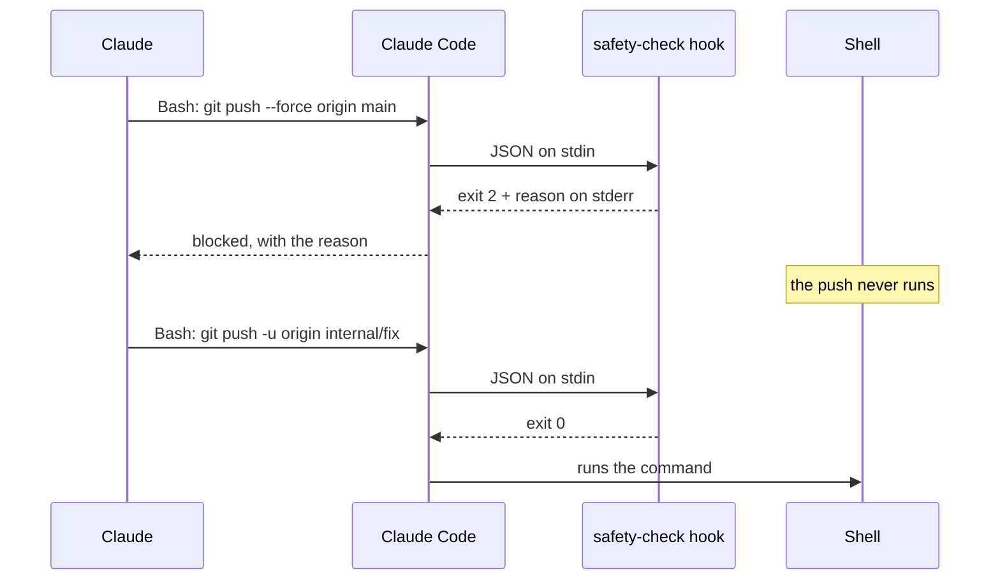
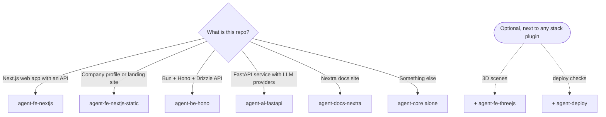
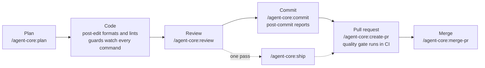
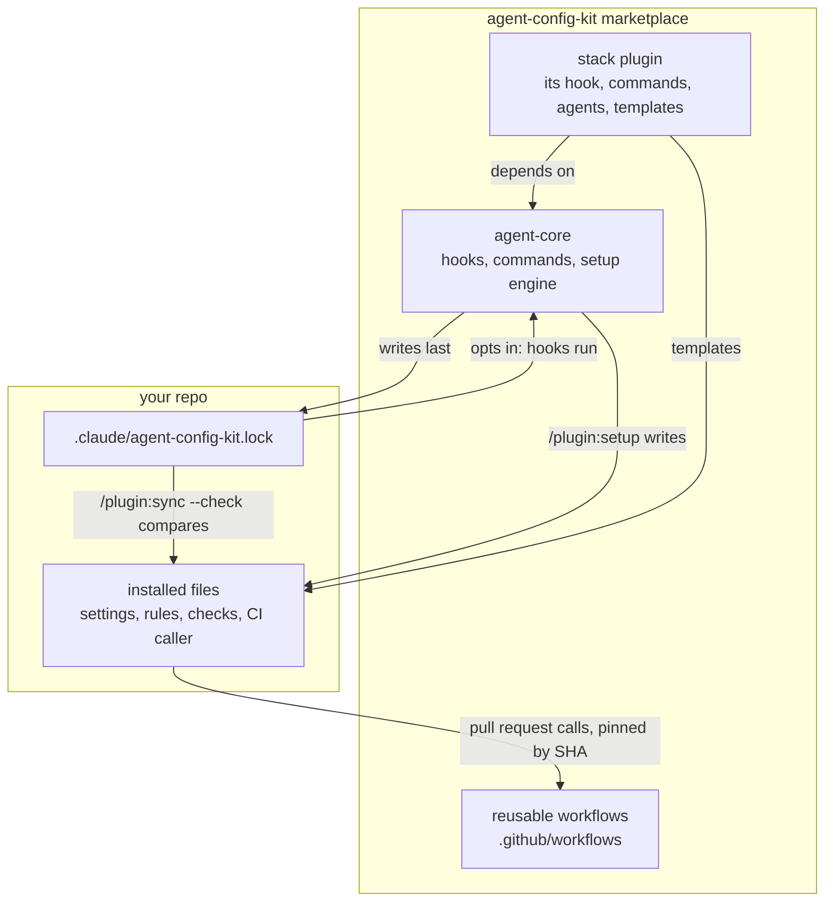
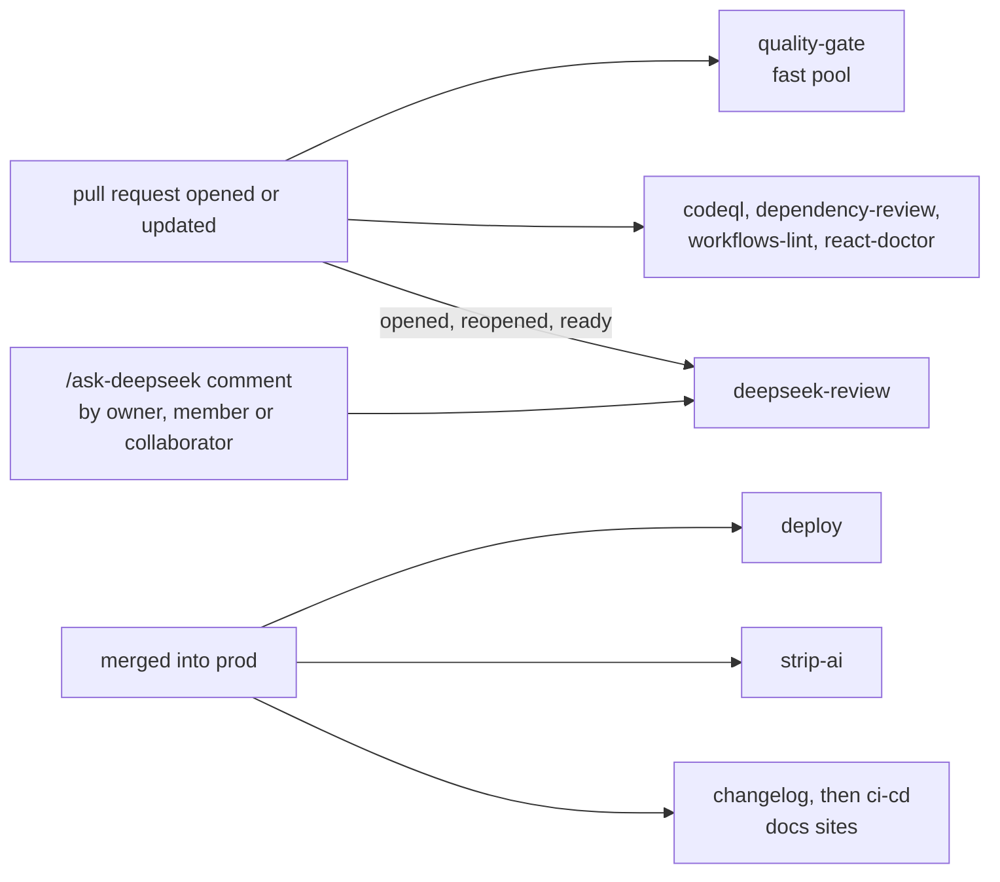

**English** | [Bahasa Indonesia](README.id.md)

<picture>
  <source media="(prefers-color-scheme: dark)" srcset="docs/assets/banner-kit-dark.svg">
  <source media="(prefers-color-scheme: light)" srcset="docs/assets/banner-kit-light.svg">
  
</picture>

# agent-config-kit

[](https://github.com/adhibuchori/agent-config-kit/actions/workflows/self-test.yml)
[](LICENSE)
[](CHANGELOG.md)

Claude Code plugins that stop an AI agent from doing the things you would regret: force-pushing to
`main`, deleting `src/`, reading your `.env` into the chat, or writing to the production database.
The guards are hooks that really refuse (exit code 2), not advice in a prompt. Around them the kit
installs the rules, check scripts and pull-request CI your stack needs, so the agent works the way
your team does: plan, review, commit, open a PR, merge.

> [!TIP]
> **TL;DR.** Add the marketplace, install `agent-core` plus the plugin for your stack, and run
> `/<plugin>:setup` in your repo. Setup shows every file it would write and writes only when you
> reply **go**. From then on, dangerous commands are refused with a reason, `.env` files and
> production writes stay locked until *you* unlock them, and `/agent-core:help` tells you which
> command comes next. The guards run on your machine and never touch the network; only commands you
> start yourself (the GitHub and deploy steps, a React Doctor scan) go online.

## Contents

- [Why this exists](#why-this-exists)
- [See it in action](#see-it-in-action)
- [Who it is for](#who-it-is-for)
- [Choose your plugin](#choose-your-plugin)
- [Quick start](#quick-start)
- [A normal day with the kit](#a-normal-day-with-the-kit)
- [What gets installed](#what-gets-installed)
- [How the pieces fit](#how-the-pieces-fit)
- [What the rules cover](#what-the-rules-cover)
- [Everything the kit ships](#everything-the-kit-ships)
- [Configuration](#configuration)
- [What gets blocked, and how to turn it off](#what-gets-blocked-and-how-to-turn-it-off)
- [Unlocking .env and the production database](#unlocking-env-and-the-production-database)
- [Team setup](#team-setup)
- [Works well with: RTK and Ponytail](#works-well-with-rtk-and-ponytail)
- [CI/CD at a glance](#cicd-at-a-glance)
- [CI: reusable workflows](#ci-reusable-workflows)
- [Security model](#security-model)
- [Cost and overhead](#cost-and-overhead)
- [Limitations](#limitations)
- [Finished examples: the template repos](#finished-examples-the-template-repos)
- [Upgrade and uninstall](#upgrade-and-uninstall)
- [Versioning](#versioning)
- [FAQ and troubleshooting](#faq-and-troubleshooting)
- [Roadmap and out of scope](#roadmap-and-out-of-scope)
- [Contributing, security and license](#contributing-security-and-license)

## Why this exists

An instruction in `CLAUDE.md` is a request. A hook that exits 2 is a wall. Each story below is a
real kind of failure, what the kit does about it, and which pieces do the work.

1. **The agent force-pushes to `main`.**
   *The problem:* a rebase went wrong, the agent "fixes" it with `git push --force origin main`, and
   a teammate's commits are gone.
   *The fix:* protected branches are refused by refspec, `--all`, `--mirror` and the checked-out
   branch, from the shell and from GitHub's MCP tools. Work reaches `main` through a pull request.
   *Handled by:* [safety-check](docs/agent-core/safety-check.md),
   [mcp-guard](docs/agent-core/mcp-guard.md), the `deny` rules [setup](docs/agent-core/setup.md)
   installs.

2. **A secret lands in the transcript.**
   *The problem:* "let me check your config" becomes `cat .env.production`, and your API key is now
   in the chat log, on someone else's screen and in a bug report.
   *The fix:* no shell command may read or write a real `.env*` file, by any route the analyzer can
   read. Claude lists keys through a helper that masks every secret, and may change a value only
   after you unlock `env` yourself.
   *Handled by:* [safety-check](docs/agent-core/safety-check.md), [unlock](docs/unlock.md), the
   Bash sandbox setup can turn on.

3. **The agent writes to production.**
   *The problem:* a "quick cleanup" `DELETE` runs against the production database through an MCP
   tool.
   *The fix:* one read-only statement passes; every write waits until you run `! bun unlock db`,
   and the lock closes itself after 15 minutes.
   *Handled by:* [db-guard](docs/agent-core/db-guard.md), [unlock](docs/unlock.md).

4. **Rules in `CLAUDE.md` are ignored.**
   *The problem:* the file says "never hand-edit generated code" and "never skip the pre-commit
   hook", and after a long session the agent does both.
   *The fix:* the rules that matter are enforced where the agent cannot argue: a guard refuses the
   edit, and `--no-verify` is refused. The rest load only when a matching file is open, so
   `CLAUDE.md` stays short enough to be read.
   *Handled by:* [generated-guard](docs/agent-fe-nextjs/generated-guard.md),
   [migration-guard](docs/agent-be-hono/migration-guard.md),
   [safety-check](docs/agent-core/safety-check.md), the rules under `.claude/rules/`.

5. **CI YAML copied into many repos drifts.**
   *The problem:* each repo got a copy of the quality gate; one fix landed in three of them, and
   nobody knows which repos still skip the secret scan.
   *The fix:* each repo calls one reusable workflow pinned to a commit, and `/<plugin>:sync --check`
   reports any file that drifted from what setup installed.
   *Handled by:* [CI: reusable workflows](#ci-reusable-workflows),
   [sync](docs/agent-core/sync.md).

6. **The agent wipes someone else's work.**
   *The problem:* two sessions share a checkout; one runs `git reset --hard` or `git stash`, or
   `rm -rf src` to "start clean".
   *The fix:* commands that wipe uncommitted work or delete protected paths are refused, and after
   every commit Claude is shown exactly which files it carried.
   *Handled by:* [safety-check](docs/agent-core/safety-check.md),
   [post-commit](docs/agent-core/post-commit.md), [/agent-core:commit](docs/agent-core/commit.md).

<details>
<summary><strong>Before and after: the same five minutes, without and with the kit</strong></summary>

### Without the kit

```text
You:     The deploy failed, can you fix the env and push?
Claude:  Let me look at the env file.            $ cat .env.production      ← secret now in the chat
Claude:  DATABASE_URL is wrong. Fixing it.       $ sed -i … .env.production
Claude:  Pushing the fix.                        $ git push --force origin main
         (a teammate's commit from ten minutes ago is gone)
```

### With the kit

```text
You:     The deploy failed, can you fix the env and push?
Claude:  $ cat .env.production
         [safety] BLOCKED: .env.production holds secrets … List its keys with
         `bash scripts/env/show.sh .env.production` (secret values masked).
Claude:  $ bash scripts/env/show.sh .env.production
         DATABASE_URL=post…(58 chars)  … DATABASE_URL points at the old host.
         It is locked; please run: ! bun unlock env
You:     ! bun unlock env
Claude:  $ printf '%s' "$NEW_URL" | bash scripts/env/set.sh .env.production DATABASE_URL
Claude:  I'll push a work branch and open a PR: /agent-core:create-pr
```

The refusals above are the hooks' real messages (shortened with `…`); the lines around them show
where they appear in a session.

</details>

## See it in action

<picture>
  <source media="(prefers-color-scheme: dark)" srcset="docs/assets/demo-blocked-dark.svg">
  <source media="(prefers-color-scheme: light)" srcset="docs/assets/demo-blocked-light.svg">
  
</picture>

This is what the hook really sends back, captured in a repo set up with agent-fe-nextjs. Claude
Code gives the hook the tool call as JSON; the hook answers with exit code 2 and a reason on
stderr, which Claude reads and acts on:

```text
tool call  Bash  {"command": "git push --force origin main"}
exit 2     [safety] BLOCKED: pushing to a protected branch (dev/prod/main/master) is not allowed.
           Push your work branch and open a PR; when a release needs this push, the user runs it
           with `!`.

tool call  Bash  {"command": "git status"}
exit 0     (nothing: the command runs)
```

You can reproduce it from a clone of this repo in one line; each hook's page has its own
[Check it yourself](docs/agent-core/safety-check.md#check-it-yourself) snippet.

<picture>
  <source media="(prefers-color-scheme: dark)" srcset="docs/assets/hook-flow-dark.svg">
  <source media="(prefers-color-scheme: light)" srcset="docs/assets/hook-flow-light.svg">
  
</picture>



The illustrations are animated (a blinking hedgehog, the command typing in). If your system asks
for reduced motion, they show a still picture instead.

## Who it is for

**A good fit if you:**

- use Claude Code (the CLI or an IDE extension) on real repositories, alone or in a team;
- build with one of the supported stacks: a Next.js app, a static Next.js site, a Bun + Hono +
  Drizzle API, a FastAPI + LLM service, or a Nextra docs site;
- want refusals you can trust, and a setup you can read before it writes anything.

**Not a fit if you:**

- use Claude only on claude.ai or in Cowork: they do not install plugins that have a `bin/`
  folder, and agent-core needs its `bin/` for setup;
- want a security boundary against a hostile agent: the hooks read command text and are a
  guardrail against slips and injected instructions (see [Security model](#security-model));
- need a stack the kit does not cover yet (see [.out-of-scope](.out-of-scope/README.md) for what
  was decided against, and open a feature issue for the rest).

## Choose your plugin

Every repo gets **agent-core** plus **one** stack plugin. The two add-ons are optional.



| Plugin | For | Adds on top of agent-core |
| --- | --- | --- |
| [agent-core](plugins/agent-core/README.md) | every repo (required) | 7 hooks and a setup reminder, 16 commands, 2 agents, the setup engine |
| [agent-fe-nextjs](plugins/agent-fe-nextjs/README.md) | Next.js app with a generated API client | generated-guard, 5 commands, 3 agents, 2 skills |
| [agent-fe-nextjs-static](plugins/agent-fe-nextjs-static/README.md) | company profile, landing page | 6 commands, 3 agents, 11 site checks |
| [agent-be-hono](plugins/agent-be-hono/README.md) | Bun + Hono + Drizzle API | migration-guard, reviewer, backend gates |
| [agent-ai-fastapi](plugins/agent-ai-fastapi/README.md) | FastAPI + LLM providers, uv | migration-guard, AI-service reviewer |
| [agent-docs-nextra](plugins/agent-docs-nextra/README.md) | Nextra documentation site | generated-guard, security and SEO reviewers |
| [agent-fe-threejs](plugins/agent-fe-threejs/README.md) | add-on: three.js / React Three Fiber | 3D rule and asset budget check |
| [agent-deploy](plugins/agent-deploy/README.md) | add-on: any host | outside deploy smoke test, fallback promotion |

## Quick start

<picture>
  <source media="(prefers-color-scheme: dark)" srcset="docs/assets/install-flow-dark.svg">
  <source media="(prefers-color-scheme: light)" srcset="docs/assets/install-flow-light.svg">
  :setup, which shows a dry run before it applies anything.">
</picture>

<!-- install:start -->
1. **Add the marketplace** (once per machine). In a terminal:

   ```bash
   claude plugin marketplace add adhibuchori/agent-config-kit
   ```

   Inside Claude Code, `/plugin marketplace add adhibuchori/agent-config-kit` does the same.

2. **Install agent-core and one stack plugin.** Inside Claude Code:

   ```text
   /plugin install agent-core@agent-config-kit
   /plugin install agent-fe-nextjs@agent-config-kit
   ```

   Swap `agent-fe-nextjs` for the stack plugin that fits your repo. Installing a stack plugin also
   installs agent-core, because every stack plugin depends on it. If the new commands do not show
   up, restart Claude Code.

3. **Run setup in your repo**, for the stack plugin you installed:

   ```text
   /agent-fe-nextjs:setup
   ```

   Setup asks a few questions, one at a time, each with a recommended answer. Then it shows a dry
   run of every file it would write, and writes only when you reply **go**. Commit the new files
   together with `.claude/agent-config-kit.lock`: the lock is what turns the hooks on for everyone
   who clones the repo.

**Updates** reach you only when a plugin's version is bumped. Run
`claude plugin marketplace update agent-config-kit`, then
`claude plugin update <plugin>@agent-config-kit`, restart Claude Code, and run `/<plugin>:sync` in
each repo.
<!-- install:end -->

**What you will see.** Setup's draft for a small Next.js app starts like this (real output,
shortened with `…`):

```text
agent-setup plan · agent-fe-nextjs 1.0.3 + agent-core 1.0.4 · project .
  create   .claude/rules/web/security.md
  …
  create   .claude/settings.json                   +$schema, +16 permissions.allow, +7 permissions.ask, +14 permissions.deny, +sandbox.enabled, …
  block    .gitignore                              agent-config-kit block (16 lines) (new file)
  block    CLAUDE.md                               ## Agent config kit (appended)
  alias    package.json                            scripts.unlock = "bash scripts/ops/unlock.sh"
  by-hand  tsconfig.json                           add what …/_kit/snippets/tsconfig.scripts.jsonc holds; the engine does not merge this format
  lock     .claude/agent-config-kit.lock           written last; turns the hooks on
digest sha256:664a6b9d…
```

After **go**, `/agent-fe-nextjs:sync --check` ends with `result: in sync (0 findings; exit 0)`.

Since 1.0.1 the stack plugins pin the reusable quality gate to the v1.0.0 release commit, so setup
installs the CI caller with the rest. A caller that still holds the release placeholder is held back
with a `warn` line instead of a workflow that would fail; a later `/<plugin>:sync` installs it. See [CI: reusable workflows](#ci-reusable-workflows).

## A normal day with the kit

`/agent-core:help` prints this flow at any time. Each step names the commands and the hooks that
help there.



| Step | You run | What helps by itself |
| --- | --- | --- |
| Plan | `/agent-core:plan add password reset` (or a stack planner such as `/agent-fe-nextjs:plan-fullstack`) | the stack's rules load when the plan reads matching files |
| Code | nothing: just ask | [post-edit](docs/agent-core/post-edit.md) formats and lints each written file; [safety-check](docs/agent-core/safety-check.md) and the other guards refuse what should not run |
| Review | `/agent-core:review` | the stack reviewer and [security-guard](docs/agent-core/security-guard.md) report by severity |
| Commit | `/agent-core:commit`, then `git commit -- <paths>` | the pre-commit gate runs `scripts/check/gates.sh --hook`; [post-commit](docs/agent-core/post-commit.md) shows what landed |
| PR | `/agent-core:create-pr` | the reusable quality gate runs on the pull request |
| Merge | `/agent-core:merge-pr 42` | `scripts/ops/pr-ready.sh` checks readiness first |
| Debug | `/agent-core:rca <symptom>` or `/debug <symptom>` | [prompt-intent](docs/agent-core/prompt-intent.md) routes `/debug` to the reproduction-first command |

## What gets installed

Two places change: your Claude Code setup gets the plugins, and your repo gets the files setup
writes. This is the repo side for agent-core + agent-fe-nextjs (other stacks differ in the stack
files):

```text
your-repo/
├── CLAUDE.md                     yours; setup appends one "## Agent config kit" block (about 25 lines)
├── AGENTS.md, SSOT.md            created only if missing (numbered rules; facts about the codebase)
├── .gitignore                    yours; setup adds one managed block (.claude/state/, env files, …)
├── package.json                  yours; setup adds missing scripts only, such as "unlock"
├── docs/unlock.md                how you open .env and database writes
├── .mcp.json                     pinned MCP servers, if you answer mcp=yes (created once, then yours)
├── .gitleaks.toml                the secret scan's narrow allowlist (created once, then yours)
├── .claude/
│   ├── agent-config-kit.lock     the record of what setup wrote; its presence turns the hooks on
│   ├── settings.json             permissions (allow, ask, deny) and the Bash sandbox, merged into yours
│   ├── agent-config.example.json every hook setting with its default; copy to agent-config.json to change one
│   ├── rules/                    rules that load only while Claude edits a matching file
│   ├── anti-patterns/            one file per known trap, plus INDEX.md
│   ├── docs/                     review checklist, standards and why the lint config says what it says
│   ├── mcp/*.example.json        rarely used MCP servers, loaded for one session when you need one
│   └── *.example.md              ops, database and CI-runner notes to fill in
├── scripts/
│   ├── check/                    the gates: gates.sh runs what gates.list names
│   ├── ops/                      unlock.sh (you run it) and pr-ready.sh (merge readiness)
│   └── env/                      show.sh (masked listing) and set.sh (writes only while unlocked)
├── .github/workflows/            pull-request-only CI: the quality gate caller, CodeQL, dependency review,
│                                 workflow lint; optional AI review, React Doctor, deploy and strip callers
├── .github/CODEOWNERS            who reviews CI, the guardrails and what reaches production (then yours)
├── .husky/pre-commit             runs the gates on staged files
└── oxlint.json, knip.ts, …       lint and dead-code config, created once and then yours
```

The hooks themselves are **not** copied into your repo: they run from the installed plugin, so an
update to the plugin updates them. Every file of every plugin, one by one, is in
[Every installed file](#every-installed-file).

## How the pieces fit



<picture>
  <source media="(prefers-color-scheme: dark)" srcset="docs/assets/layers-dark.svg">
  <source media="(prefers-color-scheme: light)" srcset="docs/assets/layers-light.svg">
  
</picture>

Each layer has one job. `CLAUDE.md` routes (short on purpose), `AGENTS.md` holds numbered rules a
review can cite, `SSOT.md` holds facts about the codebase, the machine layer enforces (with the
plugin, the hooks live in the plugin and the rules in `.claude/rules/`), and the gate decides
what may merge.

## What the rules cover

The hooks stop the few things that are expensive to undo. The rules are the rest: how code in each
stack is written, reviewed, tested and shipped, written down where Claude reads them and turned into
a gate wherever a machine can decide. Almost every rule loads only while Claude touches the files it
governs, so the whole set costs nothing until it is needed.

### Payload encryption: sealed bodies and one endpoint registry

The flagship module, and opt-in: answer `payload-encryption=yes` in the setup of agent-fe-nextjs,
agent-be-hono or agent-ai-fastapi. Every request and response body that crosses a service boundary
then travels as an AES-256-GCM envelope bound to its method, route pattern, status and key, inside a
two-minute window; every endpoint is declared in one registry with its policy beside its path; and
two checks keep both true before anything merges. The frontend, the backend and a Python service
carry the same wire format, proven against one shared set of test vectors.
[The full guide](docs/payload-encryption.md) says how to wire it in and what it does not protect.

1. **A hand-written `fetch` sends plaintext past the transport.**
   *The problem:* one screen calls the API directly, and its body and answer travel in the clear
   while every other request is sealed; nobody notices, because it works.
   *The fix:* the transport refuses a route the registry does not hold, the backend refuses a
   plaintext body on a sealed route (`ENVELOPE_REQUIRED`), and `check:endpoints` fails on a `fetch`
   outside the transport and on a route path typed anywhere but the registry.
   *Handled by:* `src/lib/payload/`, the registry, `check:endpoints`.
2. **Two copies of the cipher drift apart.**
   *The problem:* the frontend's copy changes how it builds the authenticated data; both repos'
   tests stay green, and every request fails in the browser with an error that says nothing.
   *The fix:* each copy opens the same committed ciphertexts and refuses the same replays, and
   `check:crypto-interop` seals with one copy and opens with the other when the peer is checked out.
   *Handled by:* `payload-vectors.json`, `check:crypto-interop`, the Python `test_vectors.py`.
3. **A debugging switch ships to production.**
   *The problem:* someone turns encryption off to chase a bug, and the branch merges that way.
   *The fix:* the committed switch must say `strict` (`check:endpoints`), every service refuses to
   start with `off` in production, and debugging uses an environment variable in your own shell.
   *Handled by:* `payload.config.json`, `resolveEncryptionMode`, `check:endpoints`.
4. **A captured request is replayed on another route.**
   *The problem:* an envelope lifted from a log is sent to a more dangerous endpoint.
   *The fix:* the authenticated data names the method, the route pattern, the key id and the time,
   so it opens nowhere else, and anything older than two minutes is refused before the cipher runs.
   *Handled by:* `envelope.ts`, `codec.ts` (and their Python twins).

| Piece | What it does | How to use | Why it helps |
| --- | --- | --- | --- |
| `payload-encryption` setup answer (fe-nextjs, be-hono, ai-fastapi) | Installs the module; nothing changes until you answer yes | `/agent-be-hono:setup`, answer `yes` | Opt-in, and the draft shows every file first |
| `src/lib/payload/` (TypeScript) | The cipher, key rings, browser key agreement, the switch, the endpoint matcher; tests at 100% | the backend mounts `createPayloadMiddleware`, the frontend's transport calls `createBrowserPayload` | A reviewed reference instead of hand-rolled crypto |
| `src/app/core/payload/` (Python) | The same envelope as plain ASGI middleware; tests at 100% branch coverage | `app.add_middleware(PayloadMiddleware, …)`, added first | A Python service speaks the same format |
| Endpoint registry and `generate:endpoints` | Every route with its policy; the spec-derived half is generated | `bun run generate:endpoints` after the spec changes | Every route has a decided policy |
| `check:endpoints` | Registry drift, exemption reasons, route literals, raw `fetch`, the committed switch, peer parity | in `gates.list` | Plaintext cannot slip in through new code |
| `check:crypto-interop` and `payload-vectors.json` | Opens the shared vectors, refuses the replays, cross-checks peer copies | in `gates.list` | Copies of the cipher cannot drift apart unseen |
| `.claude/PAYLOAD-CONTRACT.md` and `rules/common/payload-contract.md` | The contract, threat model and wiring; the short form loads with the transport | read on demand | Claude follows the contract while it edits the transport |

The browser hop is not end-to-end encryption: the person using the browser holds the key. It buys
integrity, route binding, replay resistance and ciphertext in every log and HAR file; TLS, httpOnly
cookies and a server-side proxy still carry confidentiality. The contract document says so first.

### The rest of the rule set

| Area | What the rules and checks hold | Where |
| --- | --- | --- |
| Components and data | Components render and hold no logic; no request waterfalls; hooks and screens live with their feature; three states on every screen; fixtures stay in tests | fe-nextjs rules, `AGENTS.md` §B, §D, §N; `check:soc`, `check:hooks` |
| Sessions and errors | The frontend never decides authorization or stores a session; every error code has a message; no raw backend message reaches the screen | `AGENTS.md` §M, `common/error-codes.md`; `check:error-codes` |
| Types, dead code, one home | No `any`, no double assertion, no unused code, one home per shared identifier | core rules; `double-assertion.sh`, knip or vulture, `check:constants` |
| Tests and coverage | A 100% floor on the logic layer, tests in CI's environment, mocks that refuse what the real client refuses | coverage rules; `coverage-policy.mjs`, `ci-env.sh`, `check:mocks` |
| Database | Migrations generated, never hand-written; every foreign key indexed; transactions short | be-hono and pipeline rules; `migrations.sh`, `index-coverage.sh` |
| APIs and images | The spec builds and is committed; the image builds what the gate validated | `hono.md`; `check:openapi`, `check:dockerfile` |
| UI | Measured, not guessed; one component per role; skeletons measured against their screen | UI and skeleton rules; `check:skeleton-pairs`, `check:responsive` |
| Operations | How the guards fail, the unlock, server access and break-glass, client IP behind a CDN, deploys proven by time | `OPERATIONS.example.md`, `DATABASE.example.md`, `CI-RUNNERS.example.md` |
| Known traps | One file per trap that cost real time: auth sessions, passkeys, CSS pipelines, test runners, coverage tools | `.claude/anti-patterns/` (34 frontend, 12 backend, 12 static site, 9 docs, 6 Python) |

## Everything the kit ships

Each table answers three questions for every piece: what it does, how you use it, and why it
helps. Every name links to its page. The complete generated list is at the end of this section.

### Hooks

| Name | What it does | How to use | Why it helps |
| --- | --- | --- | --- |
| [safety-check](docs/agent-core/safety-check.md) | Refuses destructive or irreversible shell commands, protected pushes, gate skipping and any shell read of a real `.env*` file | Runs by itself before every `Bash` call | The one command you would regret never runs |
| [db-guard](docs/agent-core/db-guard.md) | Lets one read-only SQL statement through; holds writes until you unlock `db` | Runs by itself before the production SQL tool | No surprise `DELETE` in production |
| [mcp-guard](docs/agent-core/mcp-guard.md) | Refuses GitHub MCP writes onto protected branches | Runs by itself before four GitHub MCP tools | Closes the route around the shell guard |
| [generated-guard](docs/agent-fe-nextjs/generated-guard.md) (fe-nextjs, docs-nextra) | Refuses hand edits to generated output | Runs by itself before file writes | Edits go to the source, not to a file the generator will overwrite |
| [migration-guard](docs/agent-be-hono/migration-guard.md) (be-hono, ai-fastapi) | Refuses hand edits to generated migrations | Runs by itself before file writes | The database, the migration log and the schema keep agreeing |
| [post-edit](docs/agent-core/post-edit.md) | Formats, then lints, each written file with your own tools | Runs by itself after file writes | Findings are fixed in the next edit, not at commit time |
| [post-commit](docs/agent-core/post-commit.md) | Shows what a commit actually carried | Runs by itself after a commit | Another session's staged work cannot ride along unseen |
| [prompt-intent](docs/agent-core/prompt-intent.md) | Routes `/debug` to reproduction-first debugging | Type `/debug <symptom>` | Debugging starts from a reproduction, not a guess |
| [session-start](docs/agent-core/session-start.md) | Makes Claude's zsh behave like bash on globs and word splitting | Runs by itself at session start | Fewer confusing shell failures |
| setup-check (agent-core) | Says when setup has not run here, or sync has not run since a plugin update | Runs by itself at session start; silent when all is current | You never run a new plugin version against old files |

### Commands

Type them in Claude Code. `/agent-core:help` lists them too. The commands that install files,
commit, push, merge or post to GitHub (setup, sync, commit, create-pr, merge-pr, resolve-pr-review,
ship, promote, branch-cleanup, checkpoint, and agent-deploy's two) start only when you type them:
Claude cannot start them on its own (`disable-model-invocation`).

| Name | What it does | How to use | Why it helps |
| --- | --- | --- | --- |
| [/&lt;plugin&gt;:setup](docs/agent-core/setup.md) | Installs the plugin's permissions, rules, checks and CI after a dry run | `/agent-fe-nextjs:setup` once per repo | Plugins cannot ship these; you see every write first |
| [/&lt;plugin&gt;:sync](docs/agent-core/sync.md) | Reports drift (`--check`) or brings unchanged files up to date | `/agent-fe-nextjs:sync --check` | Every repo stays on the same version of the rules |
| [/agent-core:help](docs/agent-core/help.md) | Says which command comes next | `/agent-core:help` | No need to memorise commands |
| [/agent-core:plan](docs/agent-core/plan.md) | Writes a plan before code and waits for your yes | `/agent-core:plan add password reset` | Scope and risks are agreed before work starts |
| [/agent-core:review](docs/agent-core/review.md) | Reviews staged work or the branch, by severity | `/agent-core:review` | The stack's rules are checked line by line |
| [/agent-core:commit](docs/agent-core/commit.md) | Runs the gates and drafts the message | `/agent-core:commit` | A red gate never becomes a commit |
| [/agent-core:create-pr](docs/agent-core/create-pr.md) | Drafts the PR from your template, then opens it | `/agent-core:create-pr` | Consistent PRs, never a push to `main` |
| [/agent-core:merge-pr](docs/agent-core/merge-pr.md) | Checks readiness, then merges with a merge commit | `/agent-core:merge-pr 42` | Skipped checks and open threads are caught |
| [/agent-core:resolve-pr-review](docs/agent-core/resolve-pr-review.md) | Triages review comments against your rules and answers each | `/agent-core:resolve-pr-review 42` | Bot suggestions that break your rules are declined with a reason |
| [/agent-core:ship](docs/agent-core/ship.md) | Review, fix every Medium-or-higher finding, commit and push in one pass | `/agent-core:ship` | Finished work leaves the machine reviewed |
| [/agent-core:promote](docs/agent-core/promote.md) | PR to `dev`, promotion to `prod`, deploy verified by time | `/agent-core:promote` | "Merged" and "live" are not confused |
| [/agent-core:branch-cleanup](docs/agent-core/branch-cleanup.md) | Deletes merged branches after you confirm | `/agent-core:branch-cleanup` | A tidy remote, nothing unmerged lost |
| [/agent-core:rca](docs/agent-core/rca.md) | Reproduce, find the cause, fix with a failing test | `/agent-core:rca checkout returns 500` | Fixes that stay fixed |
| [/agent-core:check-fix](docs/agent-core/check-fix.md) | Runs the gates, fixes each failure at its cause, re-runs until green | `/agent-core:check-fix` | Green gates without silenced findings |
| [/agent-core:checkpoint](docs/agent-core/checkpoint.md) | Local safety commit of this session's files | `/agent-core:checkpoint before refactor` | A cheap way back |
| [/agent-core:checkpoint-summary](docs/agent-core/checkpoint-summary.md) | Session handover summary | `/agent-core:checkpoint-summary` | The next session starts where this one ended |
| [/agent-core:learn-session](docs/agent-core/learn-session.md) | Writes lessons into rules, checks or anti-patterns | `/agent-core:learn-session` | The same trap is not hit twice |
| [/agent-fe-nextjs:a11y-audit](docs/agent-fe-nextjs/a11y-audit.md) | Accessibility audit of `.tsx` files | `/agent-fe-nextjs:a11y-audit src/` | Missing names, alt text and focus styles are found before release |
| [/agent-fe-nextjs:review-soc](docs/agent-fe-nextjs/review-soc.md) | Moves logic out of components, from gate findings | `/agent-fe-nextjs:review-soc` | Components stay easy to change |
| [/agent-fe-nextjs:plan-fullstack](docs/agent-fe-nextjs/plan-fullstack.md) | Plans across the frontend and its API | `/agent-fe-nextjs:plan-fullstack invites` | Contract changes are planned, not discovered |
| [/agent-fe-nextjs-static:review](docs/agent-fe-nextjs-static/review.md) | Static-site review: export safety, SEO, a11y, CWV, headers | `/agent-fe-nextjs-static:review` | Catches what an app review misses |
| [/agent-fe-nextjs-static:a11y-audit](docs/agent-fe-nextjs-static/a11y-audit.md) | Built pages in a real browser | `/agent-fe-nextjs-static:a11y-audit` | Tests what visitors get |
| [/agent-fe-nextjs-static:seo-audit](docs/agent-fe-nextjs-static/seo-audit.md) | Robots, sitemap, canonical, hreflang, share images, JSON-LD | `/agent-fe-nextjs-static:seo-audit` | The site is findable and previews stay hidden |
| [/agent-fe-nextjs-static:launch-checklist](docs/agent-fe-nextjs-static/launch-checklist.md) | PASS / FAIL / MANUAL table before launch | `/agent-fe-nextjs-static:launch-checklist https://…` | Nothing is forgotten on launch day |
| [/agent-deploy:verify-deploy](docs/agent-deploy/verify-deploy.md) | Outside smoke test of a live deploy | `/agent-deploy:verify-deploy https://… --pr 42` | Proof the deploy reached production |
| [/agent-deploy:promote-deploy](docs/agent-deploy/promote-deploy.md) | Fallback promotion when CI cannot run | `/agent-deploy:promote-deploy internal/x` | Production does not go stale during a CI outage |

### Agents

Subagents review in their own context and only report. `/agent-core:review` picks the right one;
you can also ask: "Use the `agent-core:security-guard` subagent on this branch."

| Name | What it does | How to use | Why it helps |
| --- | --- | --- | --- |
| [agent-core:reviewer](docs/agent-core/reviewer.md) | Checks a diff against `AGENTS.md` and `.claude/rules/` | Via `/agent-core:review` when no stack reviewer exists | Rule-cited findings in any stack |
| [agent-core:security-guard](docs/agent-core/security-guard.md) | Secrets, injection, authorisation, guardrail edits | Via `/agent-core:review`, or ask for it | Security regressions are flagged before commit |
| [agent-fe-nextjs:reviewer](docs/agent-fe-nextjs/reviewer.md) | Next.js layering, components, data layer, structure | Via `/agent-core:review` | Your `AGENTS.md` rules, checked |
| [agent-fe-nextjs:i18n-guard](docs/agent-fe-nextjs/i18n-guard.md) | next-intl key parity and hardcoded strings | Ask after touching catalogues | No half-translated screens |
| [agent-fe-nextjs:seo-validator](docs/agent-fe-nextjs/seo-validator.md) | Metadata, canonical, sitemap, OG, JSON-LD | Ask after metadata changes | Pages stay findable and shareable |
| [agent-fe-nextjs-static:seo-validator](docs/agent-fe-nextjs-static/seo-validator.md) | The same for a static site, plus preview indexing | Via `/agent-fe-nextjs-static:seo-audit` | Judges what scripts cannot |
| [agent-fe-nextjs-static:security-guard](docs/agent-fe-nextjs-static/security-guard.md) | Host headers, hash CSP, forms, third-party scripts | Via `/agent-fe-nextjs-static:review` | Static hosting has its own traps |
| [agent-fe-nextjs-static:i18n-guard](docs/agent-fe-nextjs-static/i18n-guard.md) | Static locale routing and hreflang | Ask after i18n changes | Works without middleware |
| [agent-be-hono:reviewer](docs/agent-be-hono/reviewer.md) | Layers, error contract, queries and indexes | Via `/agent-core:review` | Slow queries and leaky errors are caught in review |
| [agent-ai-fastapi:ai-reviewer](docs/agent-ai-fastapi/ai-reviewer.md) | Provider indirection, streaming, problem+json, typing | Via `/agent-core:review` | LLM-service mistakes no gate sees |
| [agent-docs-nextra:security-guard](docs/agent-docs-nextra/security-guard.md) | Headers, CSP, secrets in the export, raw HTML | Ask on config changes | The public export leaks nothing |
| [agent-docs-nextra:seo-validator](docs/agent-docs-nextra/seo-validator.md) | Page metadata, headings, robots, sitemap | Ask on content changes | Docs stay searchable |

### Skills

skeleton loads by itself when the conversation matches its trigger. react-doctor runs only when you
type it, because it may download the pinned React Doctor CLI.

| Name | What it does | How to use | Why it helps |
| --- | --- | --- | --- |
| [agent-fe-nextjs:react-doctor](docs/agent-fe-nextjs/react-doctor.md) | Scans React code with your project's React Doctor CLI, or downloads the pinned version once after you agree; results stay local | `/agent-fe-nextjs:react-doctor` | Security, performance and a11y issues before commit |
| [agent-fe-nextjs:skeleton](docs/agent-fe-nextjs/skeleton.md) | Builds a loading skeleton from the real component and measures it | "the skeleton jumps" | No layout shift when data arrives |

### Rules

Rules are Markdown files setup installs under `.claude/rules/`. Almost all of them load only while
Claude reads or edits a matching file, so they cost nothing the rest of the time. Change one by
editing the file (it is yours; sync reports the edit as `modified`, and `agent-sync own` keeps it).

<details>
<summary><strong>All 51 rule files, by plugin</strong></summary>

| Rule file | What it covers | Loads when Claude touches | Why it helps |
| --- | --- | --- | --- |
| `common/working-agreements.md` (core) | How work is done: one line per agreement | every session (under 5 KB) | Corrections are made once |
| `common/folder-shape.md` (core) | Folder shape, checked by `folder-shape.mjs` | `src/`, `tests/`, `scripts/`, … | No dumping-ground folders |
| `typescript/types.md`, `python/types.md` (core) | No `any` / `Any` | `*.ts`, `*.py` | Types stay meaningful |
| `typescript/dead-code.md`, `python/dead-code.md` (core) | Dead code, checked by knip / vulture | code and config | Unused code does not pile up |
| `web/security.md` (fe-nextjs) | Frontend security | pages, API client, security lib | XSS and unsafe URLs are caught early |
| `web/separation-of-concerns.md` (fe-nextjs) | Logic out of components (S1–S11) | components, hooks, lib | Components stay presentational |
| `web/data-fetching.md` (fe-nextjs) | No request waterfalls | hooks, components, layouts | Faster screens |
| `web/file-organization.md` (fe-nextjs) | Where hooks and components live | hooks, components, testing | Findable files |
| `web/responsive.md` (fe-nextjs, optional) | Named breakpoints, fluid widths | `*.tsx`, `*.css` | Screens hold at every width |
| `web/dialog-content.md` (fe-nextjs, optional) | Every dialog has a description | `*.tsx`, messages | Screen readers announce dialogs |
| `web/skeletons.md` (fe-nextjs, optional) | Skeletons match their screen | skeleton files | No layout shift |
| `web/testing.md`, `typescript/coverage.md` (fe-nextjs) | Test conventions and the coverage floor | tests, vitest config | Coverage cannot quietly drop |
| `web/ui-conventions.md`, `typescript/conventions.md`, `common/error-codes.md` (fe-nextjs) | UI copy, TS style, error-code messages | components, styles, errors | Consistent UI and honest errors |
| `web/static-export.md` (static) | Keep the site static | `next.config.*`, middleware, routes | Nothing silently stops working on a static host |
| `web/seo.md` (static) | Search and sharing metadata | layouts, pages, sitemap, robots | Findable, well-shared pages |
| `web/security.md` (static) | Headers on static hosting, hash CSP | `next.config.*`, `public/_headers`, routes | Headers that actually apply |
| `web/performance.md` (static) | Core Web Vitals and budgets | `*.tsx`, `*.css`, `public/`, fonts | Fast first load |
| `web/forms-on-static-hosting.md` (static) | Endpoints, honeypot, rate limit | form files | Forms that survive spam and serverless |
| `web/analytics-consent.md` (static) | Consent-first analytics | layouts, analytics files | Privacy-law compliance by default |
| `web/heavy-hero.md` (static) | Heavy visuals without a slow page | hero, canvas, video files | LCP stays fast |
| `web/no-app-machinery.md` (static) | No app providers on a static site | providers, layouts | Smaller bundles |
| `web/design-quality.md`, `web/responsive.md`, `typescript/conventions.md` (static) | Marketing-site design and layout | pages, components, CSS | Sites that do not look templated |
| `web/i18n.md` (static, optional) | Static locale routing and hreflang | messages, locale routes | Languages without middleware |
| `backend/hono.md`, `backend/drizzle.md` (be-hono) | Hono + zod-openapi, Drizzle conventions | app, modules, db | One way to write a route and a query |
| `backend/performance.md`, `backend/testing.md` (be-hono) | Query performance, test conventions | modules, db, tests | Fast queries and trustworthy tests |
| `common/error-codes.md`, `common/patterns.md`, `common/testing.md`, `typescript/coverage.md` (be-hono) | Error codes, patterns, coverage | source and tests | A stable error contract |
| `backend/fastapi.md`, `backend/providers.md` (ai-fastapi) | FastAPI patterns, the provider layer | api, modules, providers | LLM providers can be swapped |
| `backend/performance.md`, `backend/testing.md` (ai-fastapi) | Async performance, tests | app, tests | No blocking calls in async code |
| `common/coding-style.md`, `common/patterns.md`, `common/testing.md`, `python/coverage.md` (ai-fastapi) | Python style, patterns, coverage | `*.py`, tests, config | Consistent Python |
| `common/payload-contract.md` (fe-nextjs, be-hono, ai-fastapi, optional) | Sealed bodies, the endpoint registry, keys, refusals | transport, registry, middleware, `payload.config.json` | Plaintext and drift are caught while the code is written |
| `docs-site/content.md` (docs-nextra) | Docs content conventions | content, components, generators | Consistent pages |
| `web/3d.md` (fe-threejs) | Scene gating, fallback, reduced motion, disposal, budgets | shaders, 3D and scene files | 3D that does not sink the page |

</details>

Anti-patterns are the rules' companions: one short file per known trap (symptom, cause, fix and
the signal that it is back), listed in `.claude/anti-patterns/INDEX.md`. `/agent-core:rca` reads
the index first and `/agent-core:learn-session` adds new ones.

### Checks and gates

Checks are scripts setup installs under `scripts/check/`. The pre-commit gate
(`.husky/pre-commit` → `bash scripts/check/gates.sh --hook`) and CI run the ones
`scripts/check/gates.list` names. Run all of them by hand with `bash scripts/check/gates.sh`.

<details>
<summary><strong>Every check script, by plugin</strong></summary>

| Script | What it does | How to use | Why it helps |
| --- | --- | --- | --- |
| `scripts/check/gates.sh` (core) | Runs every gate in `gates.list`, one log each, a table at the end | `bash scripts/check/gates.sh` (`--hook`, `--only`, `--paths`) | One command for "is this ready?" |
| `scripts/check/ai-config.sh` (core) | Always-loaded context budget (15,000 bytes), rule citations, MCP pins | in `gates.list` | `CLAUDE.md` stays short enough to be read |
| `scripts/check/skills.sh` (core) | Scans skills, commands, agents and hooks with SkillSpector (pinned) | runs when those change | A prompt-injection line is a supply-chain risk |
| `scripts/check/double-assertion.sh` (core) | Refuses `x as unknown as T` | in `gates.list` | The compiler's type check stays on |
| `scripts/check/secrets.sh` (core) | Scans the staged changes with gitleaks and `.gitleaks.toml`; fails when gitleaks is missing, warns when its release is not CI's pin | in `gates.list` (Python: `.pre-commit-config.yaml`) | A key is stopped before the commit exists, and a missing scanner never reads as a pass |
| `scripts/check/folder-shape.mjs` (core) | Folder shape (SHAPE-1…4) | in `gates.list` | Structure that scales |
| `scripts/ops/pr-ready.sh` (core) | Checks, mergeability, unresolved threads in one read | `bash scripts/ops/pr-ready.sh 42` | Merge decisions from facts |
| `scripts/ops/unlock.sh` (core) | Opens `env` or `db` for a few minutes (you only) | `! bun unlock env` | See [Unlocking](#unlocking-env-and-the-production-database) |
| `scripts/env/show.sh`, `set.sh`, `envfile.py` (core) | Masked `.env` listing; one-key write while unlocked; the parser both share | `bash scripts/env/show.sh .env` | Secrets never enter the chat |
| `scripts/check/hook-probes.sh`, `hook-probes.tsv` (core) | Feeds every probe to the hooks the way Claude Code does and checks each exit code | `HOOKS_DIR=<dir> bash scripts/check/hook-probes.sh` | Proves a guard still blocks after you change it or its settings |
| `scripts/sync/workflows.sh` (core) | Mirrors your own commands from `_workflow-source/` into `.claude/commands/` | `bash scripts/sync/workflows.sh --check` | One source for commands you write yourself |
| `audit.ts`, `coverage-policy.mjs`, `error-codes.ts`, `error-catch.ts`, `hooks.ts`, `no-reexport.ts`, `soc.ts`, `tailwind-classes.ts` (fe-nextjs) | Dependency audit, coverage floor, error-code messages, swallowed errors, hook placement, re-exports, logic in components, canonical Tailwind classes | package scripts, e.g. `bun run check:soc` | Each one turns an `AGENTS.md` rule into a gate |
| `i18n.ts`, `i18n-casing.ts`, `dialog-desc.ts`, `responsive.ts`, `skeleton-switch.sh` (fe-nextjs, optional) | Translation parity and casing, dialog descriptions, responsive layout, the skeleton preview switch | `bun run check:i18n`, … | Only installed for the modules you use |
| `static-export.mjs` (static) | Refuses what breaks or silently stops working under export | `npm run check:static` | Fast, before any build |
| `site-audit.mjs` (static) | Runs every built-site check in one table | `npm run check:site` | The post-build gate |
| `sitemap-robots.mjs`, `metadata.mjs`, `og-image.mjs`, `jsonld.mjs`, `broken-links.mjs` (static) | Robots and sitemap, per-route metadata, share cards, structured data, links | via `site-audit.mjs` | SEO proven on the real build |
| `security-headers.mjs` (static) | Host headers file, hash CSP matches the build | via `site-audit.mjs` | Headers that apply on static hosting |
| `image-budget.mjs`, `font-budget.mjs`, `bundle-budget.mjs` (static) | Image, font and first-load JS/CSS budgets | via `site-audit.mjs` | Fast pages stay fast |
| `a11y.mjs`, `serve.mjs` (static) | pa11y-ci or axe over built pages, served locally | `npm run check:a11y` | Accessibility in a real browser |
| `constants.ts`, `coverage-files.mjs`, `coverage-policy.mjs`, `module-mocks.ts` (be-hono) | One home per identifier, every file loaded by a test, coverage floor, process-wide mocks | package scripts | Tests that prove what they claim |
| `migrations.sh`, `index-coverage.sh` (be-hono) | Schema and migrations agree; every foreign key has an index | in `gates.list` | No drift, no slow joins |
| `ci-env.sh`, `.env.ci.example` (be-hono) | Runs the unit tests with exactly CI's variables (the env file the CI caller passes, `.env.ci.example` by default) and nothing from your shell or a `.env` file | in `gates.list`; one file: `bash scripts/check/ci-env.sh bun test <path>` | A test that only passes on your local credentials fails before CI |
| `coverage-policy.mjs`, `.pre-commit-config.yaml` (ai-fastapi) | Coverage floor; ruff, mypy, pytest, vulture, import-linter | `uv run pre-commit run` | The Python gate |
| `audit.ts`, `.github/scripts/check-comment-*` (docs-nextra, fe-nextjs) | Dependency audit, comment style | in `gates.list` | Advisories and noise are caught |
| `endpoints.ts`, `crypto-interop.ts`, `payload-vectors.json`, `generate/endpoints.ts` (fe-nextjs, be-hono, optional) | The payload contract's registry, drift and interop checks, and the registry generator | `bun run check:endpoints`, `bun run check:crypto-interop` | Sealed stays sealed, and copies of the cipher agree |
| `openapi.ts`, `generate/openapi.ts` (be-hono) | The spec builds, describes a route and equals the committed `openapi.json`; `spec:export` writes it | `bun run check:openapi`, `bun run spec:export` | Frontends generate clients from a current spec |
| `dockerfile.ts` (fe-nextjs, be-hono) | The image generates its client before the build, pins by versioned digest, runs the Bun the gate ran | `bun run check:dockerfile` | A green gate means a working image |
| `skeleton-pairs.ts` (fe-nextjs, optional) | A skeleton a screen renders is measured in the harness, or listed with a reason | `bun run check:skeleton-pairs` | Skeletons are measured, not guessed |
| `3d-budget.mjs` (fe-threejs) | Model, triangle and texture budgets for glTF/GLB | `node scripts/check/3d-budget.mjs` | 3D assets that load on a phone |
| `verify-deploy.sh`, `trigger-deploy.sh` (deploy) | Outside smoke test; webhook trigger that treats 3xx as failure | via the deploy commands | A deploy is proven, not assumed |

</details>

### CI workflows

All CI is **pull-request only**: no `push:` triggers, no schedules, no Dependabot. Every action is
pinned to a full commit SHA with a version comment, permissions are read-only, and checkouts keep
no token.

| Name | What it does | How to use | Why it helps |
| --- | --- | --- | --- |
| `<stack>-quality-gate.yml` (five reusable workflows in this repo) | Install from the lockfile, run `gates.list`, coverage floor, committed `.env`, unsafe-HTML/`eval`/URL-scheme scans on added lines, gitleaks, audit, SkillSpector, build, source maps, stack extras | Setup installs a caller; see [CI](#ci-reusable-workflows) | One gate, many repos, one pin |
| `deepseek-review.yml`, `deploy-webhook.yml`, `strip-ai.yml` (reusable, this repo) | The AI review, the deploy on merge and the agent-config strip behind the callers below | Setup installs the callers; see [CI](#ci-reusable-workflows) | One tested implementation, pinned by every caller |
| `.github/workflows/quality-gate.y*ml` (in your repo) | The small caller of your stack's gate, on pull requests | Installed by setup (the `ci-gate` question where there is one) | Nothing to copy by hand |
| `codeql.yml`, `dependency-review.yml`, `workflows-lint.yml` (core, in your repo) | CodeQL on PRs; new vulnerable or badly licensed dependencies; actionlint, zizmor and pinact on workflow changes | Installed by agent-core's setup | Supply-chain checks without schedulers |
| `deepseek-review.yml` (every stack; optional) | A DeepSeek review of each pull request as one comment, updated on `/ask-deepseek`; reads the diff over the API, runs no pull-request code | `deepseek-review=yes`, then the `DEEPSEEK_API_KEY` secret | A second reader for a cent or two a review |
| `deploy.yml` (deploy; optional) | POSTs to your deploy webhook when a pull request is merged into `prod`; a 3xx or 4xx fails the job | `deploy-on-merge=yes`, then the `DEPLOY_WEBHOOK_URL` secret | Deploys follow merges; a refused deploy turns red |
| `strip-ai.yml` (deploy; optional) | After a merge into `prod`, removes the agent config there, merges back into `dev`, verifies both | `strip-ai=yes` | Production carries no agent instructions |
| `react-doctor.yml` (fe-nextjs, fe-nextjs-static, docs-nextra; optional) | Advisory React Doctor comments on PRs; the vendor's action reports to its score service | Setup question (recommended **no**) | Never fails the check |
| `changelog.yaml`, `ci-cd.yaml` (docs-nextra; optional) | Regenerate docs pages and deploy on a merge into `prod` | Setup question | Docs follow the code |
| `actions/quality-gate` (this repo) | The composite action the five reusable gates run: plan, install, gates, coverage floor, diff scans, gitleaks | Called by the reusable workflows; see its [README](actions/quality-gate/README.md) | One tested implementation behind every stack's gate |
| `actions/deepseek-review`, `actions/deploy-webhook`, `actions/strip-ai` (this repo) | The steps behind the review, the deploy and the strip | Called by the reusable workflows; see their READMEs: [review](actions/deepseek-review/README.md), [deploy](actions/deploy-webhook/README.md), [strip](actions/strip-ai/README.md) | Tested with bats against a local HTTPS stand-in |
| `self-test.yml` (this repo) | validate `--strict`, catalog and versions, ShellCheck, bats on macOS and Ubuntu, workflow lint, gitleaks, README pair | Runs on every PR here | The kit tests itself the same way |

### Config files

| File | What it does | How to use | Why it helps |
| --- | --- | --- | --- |
| `.claude/agent-config-kit.lock` | Records what setup wrote; opts the repo in | Commit it; never edit | Hooks on for every clone; drift is measurable |
| `.claude/agent-config.json` | Per-repo hook settings (optional) | Copy keys from `.claude/agent-config.example.json` | Tune one rule without forking the kit |
| `.claude/settings.json` | Permissions, sandbox, team plugins (merged by setup) | Edit outside the kit's entries | The permission system backs up the hooks |
| `CLAUDE.md` block | `## Agent config kit`: the flow and the house rules, about 25 lines | Managed by setup and sync | Short, always-loaded guidance |
| `.gitignore` block | Hook state, local settings, real env files, build output | Managed by setup and sync | Secrets and state never get committed |
| `scripts/check/gates.list` | Which gates run, and on what | Edit freely (seeded) | Your gate, your list |
| `scripts/check/site.config.json` (static) | Site URL, mode and budgets | Edit freely (seeded) | Checks that fit your site |
| `scripts/check/3d-budget.json` (threejs) | Asset limits and exceptions | Edit freely (seeded) | Budgets with reasons |
| `.mcp.json` (core, optional) | Serena, GitHub, Context7, read-only databases, each pinned | Answer `mcp=yes` in setup | The servers the commands expect |
| `.claude/mcp/*.example.json` (core) | Rarely used servers (deploy platform, VPS provider, Cloudflare), off by default | `claude --mcp-config .claude/mcp/<name>.json` for one session | Their tools do not fill every session's context |
| `.gitleaks.toml` (core) | Keeps gitleaks' default rules; allows only the hook probes' fake token and `${VARIABLE}` references | Read by the pre-commit gate and CI | A secret scan that stays strict |
| `.skillspector-baseline.yaml` (core) | Reviewed SkillSpector findings the skills gate may ignore | Edit when you triage a finding | Every ignored finding is written down |
| `*.example.md`, `.claude/*.example.md` (core and stacks) | Operations, database, CI runners, analytics, Serena, product and design notes to fill in | Copy to the name without `.example` and fill it in | Commands read your facts instead of guessing |
| `.claude/docs/lint-config.md` (fe-nextjs, static, be-hono) | Why each lint rule and override exists (the configs are plain JSON) | Read before you change a rule | Rules keep their reason |
| `.github/PULL_REQUEST_TEMPLATE/*.md` (stacks) | Pull-request templates for work into `dev` and for promotions | Picked by `/agent-core:create-pr` | Every PR says what reviewers need |
| `.github/CODEOWNERS` (stacks) | Who GitHub asks to review: a catch-all, plus CI, the guardrails and what reaches production | Replace `@your-github-handle` (seeded) | Changes to the guards get a deliberate look |
| `.claude/OPERATIONS.example.md` | Deploy target and adapter commands | Copy to `OPERATIONS.md` and fill in | `promote` knows your platform |

### Every installed file

Generated from each plugin's templates and `_kit/setup.json`: every file setup can write, when it
writes it, and what it is. "Yours" means setup creates it once and sync never compares it again.

<!-- files:start -->
<!-- Generated by scripts/catalog.mjs from the plugin manifests, docs/ and docs/catalog.json. Edit those, then run it. -->

<details>
<summary><strong>agent-core</strong>: 39 files</summary>

| File | When setup installs it | What it is |
| --- | --- | --- |
| `.claude/CI-RUNNERS.example.md` | always; sync keeps it current | CI Runners — Two Pools Behind Repository Variables |
| `.claude/DATABASE.example.md` | always; sync keeps it current | Postgres — MCP Access for Debugging |
| `.claude/OPERATIONS.example.md` | always; sync keeps it current | Operations — Hooks, GitHub and CI, Reviews, MCP, Deploys, Access |
| `.claude/agent-config.example.json` | always; sync keeps it current | Every hook setting with its default; copy the keys you change to agent-config.json |
| `.claude/mcp/cloudflare.example.json` | always; sync keeps it current | An on-demand Cloudflare MCP server, loaded for one session with --mcp-config |
| `.claude/mcp/deploy-platform.example.json` | always; sync keeps it current | An on-demand deploy-platform MCP server to fill in and pin |
| `.claude/mcp/vps-provider.example.json` | always; sync keeps it current | An on-demand VPS-provider MCP server to fill in and pin |
| `.claude/rules/common/folder-shape.md` | always; sync keeps it current | SHAPE — Folder Shape |
| `.claude/rules/common/working-agreements.md` | once; then yours | Working Agreements |
| `.claude/rules/python/dead-code.md` | with `language=python` / `language=both`; sync keeps it current | Dead code (Python) |
| `.claude/rules/python/types.md` | with `language=python` / `language=both`; sync keeps it current | No `Any` (Python) |
| `.claude/rules/typescript/dead-code.md` | with `language=typescript` / `language=both`; sync keeps it current | Dead code (TypeScript) |
| `.claude/rules/typescript/types.md` | with `language=typescript` / `language=both`; sync keeps it current | No `any` (TypeScript) |
| `.claude/settings.json` | merged into yours (additive; your values win) | Permissions (allow, ask, deny) and, from agent-core, the Bash sandbox |
| `.github/workflows/codeql.yml` | always; sync keeps it current | CodeQL: code scanning on pull requests, advanced setup. |
| `.github/workflows/dependency-review.yml` | always; sync keeps it current | Dependency Review: fails a pull request that adds or bumps a dependency with a known vulnerability of high or critical severity. |
| `.github/workflows/workflows-lint.yml` | always; sync keeps it current | Workflows Lint: static checks for GitHub Actions files. |
| `.gitleaks.toml` | once; then yours | Gitleaks configuration, installed once by /agent-core:setup and yours from then on. |
| `.mcp.json` | with `mcp=yes`; once; then yours | Project MCP servers, each pinned: Serena, GitHub, Context7, read-only databases |
| `.skillspector-baseline.yaml` | once; then yours | SkillSpector triage record for scripts/check/skills.sh. |
| `docs/unlock.md` | always; sync keeps it current | Unlocking secrets and database writes |
| `scripts/check/ai-config.sh` | always; sync keeps it current | The AI-config checks that pre-commit and the CI quality gate share, so a docs-only commit meets them before CI does. |
| `scripts/check/double-assertion.sh` | with `language=typescript` / `language=both`; sync keeps it current | Refuses a TypeScript double assertion through `unknown` (`x as unknown as T`), which switches off the compiler's overlap check. |
| `scripts/check/folder-shape.mjs` | always; sync keeps it current | SHAPE — folder shape. |
| `scripts/check/gates.sh` | always; sync keeps it current | Runs this repo's gates from scripts/check/gates.list: one log per gate, a table at the end, and the tail of every failure. |
| `scripts/check/hook-probes.sh` | always; sync keeps it current | Proves the Claude Code hooks block what they must and let through what they must: every probe is fed to its hook the way Claude Code does it, JSON on stdin, and judged by exit code and output. |
| `scripts/check/hook-probes.tsv` | always; sync keeps it current | Probes for .claude/hooks/safety-check.sh, run by scripts/check/hook-probes.sh. |
| `scripts/check/secrets.sh` | always; sync keeps it current | Scans the staged changes for secrets before they become a commit: `gitleaks git --staged` (what `gitleaks protect --staged` was) with this repo's .gitleaks.toml. |
| `scripts/check/skills.sh` | always; sync keeps it current | Scans skills, slash commands, subagents and hooks with NVIDIA SkillSpector, pinned to one commit. |
| `scripts/env/envfile.py` | always; sync keeps it current | Reads and writes one .env key for show.sh and set.sh, values masked |
| `scripts/env/set.sh` | always; sync keeps it current | Sets one key of a .env file to the value on stdin, while the user has unlocked env (scripts/ops/unlock.sh env). |
| `scripts/env/show.sh` | always; sync keeps it current | Lists the keys of a .env file with every secret value masked, then the keys that differ from its template (.env.&lt;target&gt;.example). |
| `scripts/ops/pr-ready.sh` | always; sync keeps it current | Says whether a pull request can be merged, in one read: its checks, GitHub's mergeability, the review threads nobody resolved, and whether its head is the branch its base expects. |
| `scripts/ops/unlock.sh` | always; sync keeps it current | Opens one of the locks the hooks keep shut, for a few minutes, or shows or closes them |
| `scripts/sync/workflows.sh` | always; sync keeps it current | Mirrors _workflow-source/ into .agent/workflows/ and .claude/commands/. |
| `CLAUDE.md` | one managed block, appended | `## Agent config kit` |
| `.gitignore` | one managed block (3 lines) | `.claude/state/`, `.claude/settings.local.json`, `.claude/session-logs/` |
| `package.json` | missing scripts only: unlock | `scripts` |
| `.claude/agent-config-kit.lock` | written last; its presence turns the hooks on | The record of what setup wrote; commit it |

</details>

<details>
<summary><strong>agent-ai-fastapi</strong>: 60 files</summary>

| File | When setup installs it | What it is |
| --- | --- | --- |
| `.claude/ANALYTICS.example.md` | with `analytics=yes`; once; then yours | Analytics — Read API Access |
| `.claude/PAYLOAD-CONTRACT.md` | with `payload-encryption=yes`; sync keeps it current | Payload Contract: Sealed Bodies and One Endpoint Registry |
| `.claude/SERENA-WORKSPACE.example.md` | with `serena-workspace=yes`; once; then yours | Serena — Multi-Repo Workspace Scoping |
| `.claude/anti-patterns/INDEX.md` | once; then yours | Anti-Patterns Index |
| `.claude/anti-patterns/a-check-that-matches-nothing-passes.md` | always; sync keeps it current | A check whose scanner matches nothing reports success |
| `.claude/anti-patterns/git-apply-check-passes-then-deletes.md` | always; sync keeps it current | `git apply --check` passes, then the patch deletes the files |
| `.claude/anti-patterns/hooks-read-env-vars-never-set.md` | always; sync keeps it current | A hook that reads `CLAUDE_TOOL_INPUT_*` never fires |
| `.claude/anti-patterns/hooks-silent-noop-on-macos.md` | always; sync keeps it current | Hooks that silently do nothing on macOS |
| `.claude/anti-patterns/pythonpath-breaks-mypy-plugin.md` | always; sync keeps it current | Inherited `PYTHONPATH` breaks mypy's pydantic plugin |
| `.claude/anti-patterns/shared-git-index-across-sessions.md` | always; sync keeps it current | One checkout, several sessions, one `.git/index` |
| `.claude/docs/code-review-checklist.md` | once; then yours | Code Review Checklist |
| `.claude/examples/pipeline/README.md` | with `pipeline=yes`; once; then yours | Pipeline shape — a service that owns its schema |
| `.claude/examples/pipeline/alembic.md` | with `pipeline=yes`; once; then yours | Alembic and the Schema |
| `.claude/examples/pipeline/pipeline-testing.md` | with `pipeline=yes`; once; then yours | Testing the Pipeline |
| `.claude/examples/pipeline/pipeline.md` | with `pipeline=yes`; once; then yours | Pipeline Patterns |
| `.claude/rules/backend/fastapi.md` | always; sync keeps it current | FastAPI Patterns |
| `.claude/rules/backend/performance.md` | always; sync keeps it current | Performance |
| `.claude/rules/backend/providers.md` | always; sync keeps it current | Providers — the wrapping-API layer |
| `.claude/rules/backend/testing.md` | always; sync keeps it current | Testing Conventions |
| `.claude/rules/common/coding-style.md` | always; sync keeps it current | Coding Style |
| `.claude/rules/common/patterns.md` | always; sync keeps it current | Common Patterns |
| `.claude/rules/common/payload-contract.md` | with `payload-encryption=yes`; sync keeps it current | Payload Contract (short form) |
| `.claude/rules/common/testing.md` | always; sync keeps it current | Testing Requirements |
| `.claude/rules/python/coverage.md` | always; sync keeps it current | COVER — Test Coverage (Python) |
| `.claude/settings.json` | merged into yours (additive; your values win) | Permissions (allow, ask, deny) and, from agent-core, the Bash sandbox |
| `.dockerignore` | once; then yours | The Docker build context. |
| `.github/CODEOWNERS` | once; then yours | Code owners: GitHub asks them to review every pull request that touches a matching path. |
| `.github/PULL_REQUEST_TEMPLATE/dev.md` | with `pr-templates=yes`; once; then yours | The pull-request template for work going into dev |
| `.github/PULL_REQUEST_TEMPLATE/promotion.md` | with `pr-templates=yes`; once; then yours | The pull-request template for a dev to prod promotion |
| `.github/workflows/deepseek-review.yml` | with `deepseek-review=yes`; held until a release pins the reusable workflow to a real commit | An AI review of each pull request by DeepSeek, installed by /agent-ai-fastapi:setup when you answer deepseek-review=yes. |
| `.github/workflows/quality-gate.yml` | with `ci-gate=yes`; sync keeps it current | Quality Gate for a FastAPI + LLM service: every pull request into a protected branch runs the FastAPI gate that agent-config-kit ships as a reusable workflow (ai-fastapi-quality-gate.yml; its header lists the checks). |
| `.pre-commit-config.yaml` | once; then yours | The commit gate. |
| `AGENTS.md` | once, if missing; then yours | AGENTS.md — &lt;repo-name&gt; |
| `CLAUDE.md` | the starter, when the repo has no CLAUDE.md | &lt;Project Name&gt; — Claude Code Config |
| `SSOT.md` | once, if missing; then yours | SSOT.md — &lt;repo-name&gt; |
| `payload.config.json` | with `payload-encryption=yes`; once; then yours | The payload contract switch (strict, committed), the route exemptions with their reasons, and the peers to check |
| `pyproject.toml` | once, if missing; then yours | Python project and tool settings: ruff, mypy, pytest, coverage, vulture |
| `scripts/check/coverage-policy.mjs` | always; sync keeps it current | COVER: refuses a coverage gate that was weakened. |
| `scripts/check/gates.list` | once; then yours | This repo's gates. |
| `scripts/check/payload-vectors.json` | with `payload-encryption=yes`; sync keeps it current | Shared test vectors every implementation of the envelope must open and refuse; never regenerated to pass |
| `scripts/vulture/whitelist.py` | once; then yours | Names vulture must not report as dead code |
| `src/app/core/payload/__init__.py` | with `payload-encryption=yes`; once; then yours | The payload contract package. |
| `src/app/core/payload/codec.py` | with `payload-encryption=yes`; once; then yours | Sealing and opening JSON envelopes with AES-256-GCM. |
| `src/app/core/payload/envelope.py` | with `payload-encryption=yes`; once; then yours | The envelope format, freshness and AAD builders. |
| `src/app/core/payload/errors.py` | with `payload-encryption=yes`; once; then yours | The payload error codes. |
| `src/app/core/payload/keys.py` | with `payload-encryption=yes`; once; then yours | Pre-shared key rings for server-to-server hops. |
| `src/app/core/payload/middleware.py` | with `payload-encryption=yes`; once; then yours | The payload contract as plain ASGI middleware. |
| `src/app/core/payload/mode.py` | with `payload-encryption=yes`; once; then yours | The strict/off switch of the payload contract. |
| `src/app/core/payload/policy.py` | with `payload-encryption=yes`; once; then yours | The route registry types and the policy decisions. |
| `tests/unit/core/payload/__init__.py` | with `payload-encryption=yes`; once; then yours | Tests for the payload contract; a package so their module names never collide. |
| `tests/unit/core/payload/test_codec.py` | with `payload-encryption=yes`; once; then yours | Unit tests for app.core.payload.codec: part of the payload contract. |
| `tests/unit/core/payload/test_envelope.py` | with `payload-encryption=yes`; once; then yours | Unit tests for app.core.payload.envelope: part of the payload contract. |
| `tests/unit/core/payload/test_keys.py` | with `payload-encryption=yes`; once; then yours | Unit tests for app.core.payload.keys: part of the payload contract. |
| `tests/unit/core/payload/test_middleware.py` | with `payload-encryption=yes`; once; then yours | Unit tests for app.core.payload.middleware: part of the payload contract. |
| `tests/unit/core/payload/test_mode.py` | with `payload-encryption=yes`; once; then yours | Unit tests for app.core.payload.mode: part of the payload contract. |
| `tests/unit/core/payload/test_policy.py` | with `payload-encryption=yes`; once; then yours | Unit tests for app.core.payload.policy: part of the payload contract. |
| `tests/unit/core/payload/test_vectors.py` | with `payload-encryption=yes`; once; then yours | Unit tests for app.core.payload.vectors: part of the payload contract. |
| `CLAUDE.md` | one managed block, appended | `## Agent config kit` |
| `.gitignore` | one managed block (18 lines) | `.serena/`, `.skillspector/`, `.env`, `.env.*`, `!.env.example`, `!.env.*.example`, `.venv/`, `__pycache__/`, `*.pyc`, `.pytest_cache/`, `.mypy_cache/`, `.ruff_cache/`, `.import_linter_cache/`, `.coverage`, `htmlcov/`, `dist/`, `build/`, `*.egg-info/` |
| `pyproject.toml` | by hand: the draft names `_kit/snippets/pyproject.tools.toml` | |

</details>

<details>
<summary><strong>agent-be-hono</strong>: 92 files</summary>

| File | When setup installs it | What it is |
| --- | --- | --- |
| `.claude/ANALYTICS.example.md` | with `analytics=yes`; sync keeps it current | Analytics — Read API Access |
| `.claude/PAYLOAD-CONTRACT.md` | with `payload-encryption=yes`; sync keeps it current | Payload Contract: Sealed Bodies and One Endpoint Registry |
| `.claude/SERENA-WORKSPACE.example.md` | with `serena-workspace=yes`; sync keeps it current | Serena — Multi-Repo Workspace Scoping |
| `.claude/anti-patterns/INDEX.md` | once; then yours | Anti-Patterns Index |
| `.claude/anti-patterns/a-check-that-matches-nothing-passes.md` | always; sync keeps it current | A check whose scanner matches nothing reports success |
| `.claude/anti-patterns/auth-cookie-cache-outlives-revocation.md` | always; sync keeps it current | A revoked session keeps working until its cookie cache ages out |
| `.claude/anti-patterns/better-auth-account-endpoints-are-gated.md` | always; sync keeps it current | Better Auth's account endpoints are gated in ways the client does not show |
| `.claude/anti-patterns/better-auth-list-option-replaces-defaults.md` | always; sync keeps it current | A Better Auth plugin's list option replaces its defaults, it does not extend them |
| `.claude/anti-patterns/better-auth-passkey-quirks.md` | always; sync keeps it current | Passkeys: a dismissed prompt is an error, and user verification is not enforced |
| `.claude/anti-patterns/better-auth-user-hook-runs-first.md` | always; sync keeps it current | better-auth runs your `hooks.after` first, then lets a plugin overwrite it |
| `.claude/anti-patterns/bun-mock-module-is-process-wide.md` | always; sync keeps it current | `mock.module` is process-wide, and bun versions disagree on file order |
| `.claude/anti-patterns/gateway-cancel-result-is-not-the-state.md` | always; sync keeps it current | A payment gateway's cancel result is not the state of the payment |
| `.claude/anti-patterns/postgres-max-1-pool.md` | always; sync keeps it current | `postgres(url, { max: 1 })` outside a migration runner |
| `.claude/anti-patterns/queue-job-id-cannot-contain-colon.md` | always; sync keeps it current | A custom BullMQ job id with a `:` in it is never queued |
| `.claude/anti-patterns/rate-limit-double-next.md` | always; sync keeps it current | `await next()` inside a middleware's own try/catch |
| `.claude/anti-patterns/session-rows-are-a-mirror-not-the-session.md` | always; sync keeps it current | Deleting a `session` row does not end the session |
| `.claude/docs/code-review-checklist.md` | once; then yours | Code Review Checklist |
| `.claude/docs/lint-config.md` | always; sync keeps it current | Why the lint and format configs say what they say |
| `.claude/rules/backend/drizzle.md` | always; sync keeps it current | Drizzle ORM Conventions |
| `.claude/rules/backend/hono.md` | always; sync keeps it current | Hono + `@hono/zod-openapi` Patterns |
| `.claude/rules/backend/performance.md` | always; sync keeps it current | Backend Performance |
| `.claude/rules/backend/testing.md` | always; sync keeps it current | Backend Testing Conventions |
| `.claude/rules/common/error-codes.md` | always; sync keeps it current | Error codes |
| `.claude/rules/common/patterns.md` | always; sync keeps it current | Common Patterns |
| `.claude/rules/common/payload-contract.md` | with `payload-encryption=yes`; sync keeps it current | Payload Contract (short form) |
| `.claude/rules/common/testing.md` | always; sync keeps it current | Testing Requirements |
| `.claude/rules/typescript/coverage.md` | always; sync keeps it current | COVER — Test Coverage (TypeScript) |
| `.claude/settings.json` | merged into yours (additive; your values win) | Permissions (allow, ask, deny) and, from agent-core, the Bash sandbox |
| `.claude/test-preload.example.ts` | always; sync keeps it current | EXAMPLE — copy to `src/test/preload.ts` in the consuming repo and delete the clients it does not have. |
| `.dockerignore` | once; then yours | The build context holds only what the image builds from. |
| `.env.ci.example` | once; then yours | The variables the unit tests get in CI, and locally through scripts/check/ci-env.sh: dummy values only, never a real secret. |
| `.github/CODEOWNERS` | once; then yours | Code owners: GitHub asks them to review every pull request that touches a matching path. |
| `.github/PULL_REQUEST_TEMPLATE/dev.md` | with `pr-templates=yes`; once; then yours | The pull-request template for work going into dev |
| `.github/PULL_REQUEST_TEMPLATE/promotion.md` | with `pr-templates=yes`; once; then yours | The pull-request template for a dev to prod promotion |
| `.github/workflows/deepseek-review.yml` | with `deepseek-review=yes`; held until a release pins the reusable workflow to a real commit | An AI review of each pull request by DeepSeek, installed by /agent-be-hono:setup when you answer deepseek-review=yes. |
| `.github/workflows/quality-gate.yml` | with `ci-gate=yes`; sync keeps it current | The gate's steps live in agent-config-kit's reusable workflow, pinned to one commit. |
| `.husky/pre-commit` | once; then yours | Runs the gates on staged files before each commit |
| `.oxfmtrc.json` | once; then yours | Formatter settings for oxfmt |
| `.oxlintignore` | once; then yours | Paths the linter skips |
| `.oxlintrc.json` | once; then yours | Lint rules for oxlint; the reasons are in .claude/docs/lint-config.md |
| `AGENTS.md` | once, if missing; then yours | AGENTS.md — &lt;Project Name&gt; BE |
| `CLAUDE.md` | the starter, when the repo has no CLAUDE.md | &lt;Project Name&gt; BE — Claude Code Config |
| `SSOT.md` | once, if missing; then yours | SSOT.md — `&lt;repo-name&gt;` |
| `bunfig.toml` | once; then yours | Bun's test settings, including the test preload |
| `knip.ts` | once; then yours | Dead-code settings for knip |
| `payload.config.json` | with `payload-encryption=yes`; once; then yours | The payload contract switch (strict, committed), the route exemptions with their reasons, and the peers to check |
| `scripts/check/ci-env.sh` | always; sync keeps it current | Runs a command with the environment CI's unit tests get, and nothing else: PATH, HOME, TMPDIR, the locale, CI=true and CI's test variables. |
| `scripts/check/constants.config.json` | once; then yours | Where each kind of identifier lives, for the constants check |
| `scripts/check/constants.ts` | always; sync keeps it current | One home per identifier, enforced (AGENTS.md § G, "One home per identifier"). |
| `scripts/check/coverage-files.mjs` | always; sync keeps it current | Every source file must be loaded by at least one test. |
| `scripts/check/coverage-policy.mjs` | always; sync keeps it current | COVER: refuses a coverage gate that was weakened. |
| `scripts/check/crypto-interop.ts` | with `payload-encryption=yes`; sync keeps it current | Proves this repo's payload cipher still speaks the shared wire format (.claude/PAYLOAD-CONTRACT.md § Tests and interop). |
| `scripts/check/dockerfile.ts` | always; sync keeps it current | The production image builds what the quality gate validated. |
| `scripts/check/endpoints.ts` | with `payload-encryption=yes`; sync keeps it current | The static half of the payload contract (.claude/PAYLOAD-CONTRACT.md). |
| `scripts/check/gates.list` | once; then yours | This repo's gates: `bash scripts/check/gates.sh` runs them, and so does .husky/pre-commit. |
| `scripts/check/index-coverage.sh` | always; sync keeps it current | Foreign-key index gate (AGENTS.md §H Rule 32). |
| `scripts/check/migrations.sh` | always; sync keeps it current | Migration drift gate. |
| `scripts/check/module-mocks.ts` | once; then yours | MOCK — a module replacement must not reach the files that did not ask for one. |
| `scripts/check/openapi.ts` | always; sync keeps it current | The OpenAPI document builds, describes at least one route, and equals the committed openapi.json. |
| `scripts/check/payload-vectors.json` | with `payload-encryption=yes`; sync keeps it current | Shared test vectors every implementation of the envelope must open and refuse; never regenerated to pass |
| `scripts/generate/endpoints.ts` | with `payload-encryption=yes`; sync keeps it current | Writes the generated half of the endpoint registry from the OpenAPI spec and the exemptions in payload.config.json (.claude/PAYLOAD-CONTRACT.md § Registry). |
| `scripts/generate/openapi.ts` | always; sync keeps it current | Writes the OpenAPI document the app declares to openapi.json (`bun run spec:export`). |
| `scripts/lib/openapi-document.ts` | always; sync keeps it current | The OpenAPI document the app declares, built from `src/app.ts` without starting a server. |
| `scripts/lib/openapi-endpoints.ts` | with `payload-encryption=yes`; sync keeps it current | The payload contract's configuration, and the endpoint registry an OpenAPI document implies. |
| `scripts/lib/source-scan.ts` | always; sync keeps it current | Reading a source tree the way the payload checks need it: every TypeScript file, with comments and API prose blanked so a sentence that names a route is never read as code, and JSON compared by meaning rather than by formatting. |
| `src/lib/endpoints/__tests__/endpoints.test.ts` | always; sync keeps it current | Unit tests for the endpoint registry: part of the payload contract (.claude/PAYLOAD-CONTRACT.md). |
| `src/lib/endpoints/endpoints.generated.ts` | with `payload-encryption=yes`; once; then yours | Generated from `openapi.json` by `scripts/generate/endpoints.ts`. |
| `src/lib/endpoints/endpoints.ts` | with `payload-encryption=yes`; once; then yours | Every route this service serves, and what happens to its payload (.claude/PAYLOAD-CONTRACT.md). |
| `src/lib/payload/__tests__/aes-gcm.test.ts` | always; sync keeps it current | Unit tests for the AES-256-GCM layer: part of the payload contract (.claude/PAYLOAD-CONTRACT.md). |
| `src/lib/payload/__tests__/base64url.test.ts` | always; sync keeps it current | Unit tests for base64url and UTF-8 helpers: part of the payload contract (.claude/PAYLOAD-CONTRACT.md). |
| `src/lib/payload/__tests__/codec.test.ts` | always; sync keeps it current | Unit tests for sealing and opening JSON envelopes: part of the payload contract (.claude/PAYLOAD-CONTRACT.md). |
| `src/lib/payload/__tests__/ecdh.test.ts` | always; sync keeps it current | Unit tests for browser key agreement: part of the payload contract (.claude/PAYLOAD-CONTRACT.md). |
| `src/lib/payload/__tests__/envelope.test.ts` | always; sync keeps it current | Unit tests for the envelope shape, freshness and AAD builders: part of the payload contract (.claude/PAYLOAD-CONTRACT.md). |
| `src/lib/payload/__tests__/errors.test.ts` | always; sync keeps it current | Unit tests for the payload error codes: part of the payload contract (.claude/PAYLOAD-CONTRACT.md). |
| `src/lib/payload/__tests__/key-ring.test.ts` | always; sync keeps it current | Unit tests for pre-shared key rings: part of the payload contract (.claude/PAYLOAD-CONTRACT.md). |
| `src/lib/payload/__tests__/mode.test.ts` | always; sync keeps it current | Unit tests for the strict/off switch: part of the payload contract (.claude/PAYLOAD-CONTRACT.md). |
| `src/lib/payload/__tests__/policy.test.ts` | always; sync keeps it current | Unit tests for policies and the endpoint matcher: part of the payload contract (.claude/PAYLOAD-CONTRACT.md). |
| `src/lib/payload/__tests__/vectors.test.ts` | always; sync keeps it current | Unit tests for this copy against the shared test vectors: part of the payload contract (.claude/PAYLOAD-CONTRACT.md). |
| `src/lib/payload/aes-gcm.ts` | with `payload-encryption=yes`; once; then yours | The one cipher on the wire: AES-256-GCM through WebCrypto. |
| `src/lib/payload/base64url.ts` | with `payload-encryption=yes`; once; then yours | Bytes on the wire: base64url and UTF-8, the same way in the browser, on Node and on Bun. |
| `src/lib/payload/codec.ts` | with `payload-encryption=yes`; once; then yours | A JSON body into an envelope and back: the one place that decides the order of operations. |
| `src/lib/payload/ecdh.ts` | with `payload-encryption=yes`; once; then yours | Key agreement for the browser hop, where there is no secret the browser could hold. |
| `src/lib/payload/envelope.ts` | with `payload-encryption=yes`; once; then yours | The wire format: what an envelope is, and what its ciphertext is bound to. |
| `src/lib/payload/errors.ts` | with `payload-encryption=yes`; once; then yours | The closed set of ways an envelope can fail to become a payload. |
| `src/lib/payload/key-ring.ts` | with `payload-encryption=yes`; once; then yours | Pre-shared keys for server-to-server hops, which never reach a browser. |
| `src/lib/payload/mode.ts` | with `payload-encryption=yes`; once; then yours | The switch: whether this service enforces the payload contract. |
| `src/lib/payload/policy.ts` | with `payload-encryption=yes`; once; then yours | The endpoint registry's types, and the one place that decides what a policy seals. |
| `src/middlewares/__tests__/payload.middleware.test.ts` | with `payload-encryption=yes`; once; then yours | Unit tests for the Hono payload middleware: part of the payload contract (.claude/PAYLOAD-CONTRACT.md). |
| `src/middlewares/payload.middleware.ts` | with `payload-encryption=yes`; once; then yours | The payload contract at this service's edge (.claude/PAYLOAD-CONTRACT.md). |
| `CLAUDE.md` | one managed block, appended | `## Agent config kit` |
| `.gitignore` | one managed block (14 lines) | `.env`, `.env.*.local`, `.env.development`, `.env.local`, `.env.production`, `.env.staging`, `.env.test`, `.envrc`, `.serena/`, `.skillspector/`, `/coverage`, `build/`, `dist/`, `node_modules/` |
| `package.json` | missing scripts only: check:constants, check:dockerfile, check:coverage-policy, check:dead-code, check:folder-shape, check:mocks, db:generate, fl, fl:ci, format, format:check, lint, test:coverage, type-check, check:crypto-interop, check:endpoints, check:openapi, generate:endpoints, spec:export | `scripts` |

</details>

<details>
<summary><strong>agent-deploy</strong>: 6 files</summary>

| File | When setup installs it | What it is |
| --- | --- | --- |
| `.claude/settings.json` | merged into yours (additive; your values win) | Permissions (allow, ask, deny) and, from agent-core, the Bash sandbox |
| `.github/workflows/deploy.yml` | with `deploy-on-merge=yes`; held until a release pins the reusable workflow to a real commit | Deploys when a pull request is merged into prod, installed by /agent-deploy:setup when you answer deploy-on-merge=yes. |
| `.github/workflows/strip-ai.yml` | with `strip-ai=yes`; held until a release pins the reusable workflow to a real commit | Strips the agent config from prod after each merge, installed by /agent-deploy:setup when you answer strip-ai=yes. |
| `scripts/deploy/trigger-deploy.sh` | with `webhook=yes`; sync keeps it current | trigger-deploy.sh: start a deploy by POSTing to the deploy platform's webhook, and fail loudly when the platform declines it. |
| `scripts/deploy/verify-deploy.sh` | always; sync keeps it current | verify-deploy.sh: smoke-test a live deploy from the outside, on any host. |
| `CLAUDE.md` | one managed block, appended | `## Agent config kit` |

</details>

<details>
<summary><strong>agent-docs-nextra</strong>: 42 files</summary>

| File | When setup installs it | What it is |
| --- | --- | --- |
| `.claude/ANALYTICS.example.md` | with `analytics=yes`; once; then yours | Analytics — Read API Access |
| `.claude/agent-config.json` | with `generated-pages=yes`; once; then yours | This stack's hook settings, such as generatedPaths or migrationsDirs |
| `.claude/anti-patterns/INDEX.md` | once; then yours | Anti-Patterns Index |
| `.claude/anti-patterns/a-check-that-matches-nothing-passes.md` | always; sync keeps it current | A check whose scanner matches nothing reports success |
| `.claude/anti-patterns/bun-build-vs-bun-run-build.md` | always; sync keeps it current | `bun &lt;name&gt;` ≠ `bun run &lt;name&gt;`, for `build` and for `test` |
| `.claude/anti-patterns/commit-message-skip-ci-substring.md` | always; sync keeps it current | The skip-CI marker anywhere in a commit message silences every workflow |
| `.claude/anti-patterns/git-apply-check-passes-then-deletes.md` | always; sync keeps it current | `git apply --check` passes, then the patch deletes the files |
| `.claude/anti-patterns/max-lines-skips-blanks-and-comments.md` | always; sync keeps it current | `wc -l` disagrees with the `max-lines` rule, and only the rule decides |
| `.claude/anti-patterns/nextra-zod-v4-bug.md` | always; sync keeps it current | Nextra 4.6.x — Zod v4 LayoutPropsSchema bug |
| `.claude/anti-patterns/nodejs-25-webstorage-ssr.md` | always; sync keeps it current | Node.js 25 — Broken localStorage breaks Next.js SSR |
| `.claude/anti-patterns/oxfmt-rewrites-generated-files.md` | always; sync keeps it current | The formatter rewrites generated files unless it ignores them |
| `.claude/anti-patterns/shared-git-index-across-sessions.md` | always; sync keeps it current | One checkout, several sessions, one `.git/index` |
| `.claude/docs/code-review-checklist.md` | once; then yours | Code Review Checklist |
| `.claude/rules/docs-site/content.md` | once; then yours | Docs site content |
| `.claude/settings.json` | merged into yours (additive; your values win) | Permissions (allow, ask, deny) and, from agent-core, the Bash sandbox |
| `.env.development.example` | once; then yours | Development environment template for this docs site. |
| `.env.production.example` | once; then yours | Production environment template for this docs site. |
| `.github/CODEOWNERS` | once; then yours | Code owners: GitHub asks them to review every pull request that touches a matching path. |
| `.github/PULL_REQUEST_TEMPLATE/dev.md` | once; then yours | The pull-request template for work going into dev |
| `.github/PULL_REQUEST_TEMPLATE/promotion.md` | once; then yours | The pull-request template for a dev to prod promotion |
| `.github/scripts/check-comment-blocks.sh` | always; sync keeps it current | Caps consecutive comment runs under .github/ at 2 lines; shebangs are exempt. |
| `.github/scripts/check-comment-style.ts` | always; sync keeps it current | Comment standard: `//` is reserved for directives (ts-expect-error, oxlint-disable, |
| `.github/workflows/changelog.yaml` | with `ci-pipeline=yes`; once; then yours | Generate Content |
| `.github/workflows/ci-cd.yaml` | with `ci-pipeline=yes`; sync keeps it current | CI/CD Pipeline |
| `.github/workflows/deepseek-review.yml` | with `deepseek-review=yes`; held until a release pins the reusable workflow to a real commit | An AI review of each pull request by DeepSeek, installed by /agent-docs-nextra:setup when you answer deepseek-review=yes. |
| `.github/workflows/quality-gate.yaml` | always; sync keeps it current | The gate's steps live in agent-config-kit's reusable workflow, pinned to one commit. |
| `.github/workflows/react-doctor.yml` | with `react-doctor=yes`; sync keeps it current | React Doctor: security, performance, correctness, accessibility, and architecture checks for React. |
| `.husky/pre-commit` | always; sync keeps it current | Runs the gates on staged files before each commit |
| `.oxfmtrc.json` | once; then yours | Formatter settings for oxfmt |
| `.oxlintignore` | once; then yours | Paths the linter skips |
| `CLAUDE.md` | the starter, when the repo has no CLAUDE.md | CLAUDE.md — `&lt;Project Name&gt;` Docs |
| `doctor.config.json` | with `react-doctor=yes`; once; then yours | React Doctor settings (dead code is left to knip) |
| `knip.ts` | once; then yours | Dead-code settings for knip |
| `oxlint.json` | once; then yours | Lint rules for oxlint; the reasons are in .claude/docs/lint-config.md |
| `scripts/check/audit.ts` | always; sync keeps it current | Security audit gate — wraps `bun audit --json`. |
| `scripts/check/gates.list` | once; then yours | This repo's gates: `bash scripts/check/gates.sh` runs them, and so does .husky/pre-commit. |
| `scripts/next/env.ts` | always; sync keeps it current | Environment file bootstrap and preflight. |
| `scripts/next/run.mjs` | always; sync keeps it current | Starts the local Next.js binary, adding --no-experimental-webstorage only on the Node versions that have the flag |
| `wrangler.example.jsonc` | with `ci-pipeline=yes`; once; then yours | Copy to wrangler.jsonc and fill in the three placeholders; ci-cd.yaml deploys with it. |
| `CLAUDE.md` | one managed block, appended | `## Agent config kit` |
| `.gitignore` | one managed block (12 lines) | `.env`, `.env.local`, `.env.development`, `.env.production`, `.env.*.local`, `node_modules/`, `.next/`, `out/`, `*.tsbuildinfo`, `.wrangler/`, `app-source/`, `.generation-marker` |
| `package.json` | missing scripts only: env:init, format, fl, fl:ci, type-check, check:dead-code | `scripts` |

</details>

<details>
<summary><strong>agent-fe-nextjs</strong>: 141 files</summary>

| File | When setup installs it | What it is |
| --- | --- | --- |
| `.claude/ANALYTICS.example.md` | once; then yours | Analytics — Read API Access |
| `.claude/PAYLOAD-CONTRACT.md` | with `payload-encryption=yes`; sync keeps it current | Payload Contract: Sealed Bodies and One Endpoint Registry |
| `.claude/SERENA-WORKSPACE.example.md` | once; then yours | Serena — Shared Multi-Repo Workspace Scoping |
| `.claude/agent-config.json` | with `i18n=yes`; once; then yours | This stack's hook settings, such as generatedPaths or migrationsDirs |
| `.claude/anti-patterns/INDEX.md` | once; then yours | Anti-Patterns Index |
| `.claude/anti-patterns/auth-cookie-cache-outlives-revocation.md` | always; sync keeps it current | A revoked session keeps working until its cookie cache ages out |
| `.claude/anti-patterns/better-auth-account-endpoints-are-gated.md` | always; sync keeps it current | Better Auth's account endpoints are gated in ways the client does not show |
| `.claude/anti-patterns/better-auth-passkey-quirks.md` | always; sync keeps it current | Passkeys: a dismissed prompt is an error, and user verification is not enforced |
| `.claude/anti-patterns/bodiless-request-is-an-empty-stream.md` | always; sync keeps it current | A bodiless request arrives as an empty stream, not `null` |
| `.claude/anti-patterns/bun-build-vs-bun-run-build.md` | always; sync keeps it current | `bun &lt;name&gt;` ≠ `bun run &lt;name&gt;` — build **and** test |
| `.claude/anti-patterns/coverage-allowlist-hides-files.md` | always; sync keeps it current | A named-file coverage allowlist cannot report what is missing from it |
| `.claude/anti-patterns/cropper-letterboxes-and-caps-the-crop-area.md` | always; sync keeps it current | An image cropper's crop circle will not sit flush with its stage |
| `.claude/anti-patterns/deploy-platform-env-is-encrypted-at-rest.md` | always; sync keeps it current | A deploy platform that stores app env encrypted: never write it with SQL |
| `.claude/anti-patterns/dialog-inline-maxwidth-drops-ua-gutter.md` | always; sync keeps it current | An inline `maxWidth` on `&lt;dialog&gt;` removes the browser's edge gutter |
| `.claude/anti-patterns/fixed-popover-in-contained-ancestor-lands-offset.md` | always; sync keeps it current | A `position: fixed` pop-up inside a contained or transformed ancestor lands offset |
| `.claude/anti-patterns/git-apply-check-passes-then-deletes.md` | always; sync keeps it current | `git apply --check` passes, then the patch deletes the files |
| `.claude/anti-patterns/i18n-template-key-blinds-namespace.md` | always; sync keeps it current | One template key blinds the unused-key check for a whole namespace |
| `.claude/anti-patterns/jsdom-min-in-inline-style-breaks-getbyrole.md` | always; sync keeps it current | jsdom throws on `min()` in an inline style, and every `getByRole` in that tree fails |
| `.claude/anti-patterns/lightningcss-keeps-only-the-prefixed-backdrop-filter.md` | always; sync keeps it current | Writing both `backdrop-filter` forms can leave only the `-webkit-` one |
| `.claude/anti-patterns/live-session-flip-skips-flow-steps.md` | always; sync keeps it current | A live session refetch skips the auth flow's own steps |
| `.claude/anti-patterns/max-lines-skips-blanks-and-comments.md` | always; sync keeps it current | `wc -l` disagrees with the `max-lines` gate, and only the gate decides |
| `.claude/anti-patterns/nextjs-page-level-shell-loading-flashes-chrome.md` | always; sync keeps it current | A shell rendered by `page.tsx` turns every `loading.tsx` into a chrome flash |
| `.claude/anti-patterns/nodejs-25-webstorage-ssr.md` | always; sync keeps it current | Node.js 25 — Broken localStorage breaks Next.js SSR |
| `.claude/anti-patterns/openapi-change-needs-every-consumer-regenerated.md` | always; sync keeps it current | A spec change breaks the consumer you are not looking at |
| `.claude/anti-patterns/oxfmt-rewrites-generated-files.md` | always; sync keeps it current | oxfmt rewrites generated files unless they are ignored |
| `.claude/anti-patterns/parity-guard-compares-a-proxy.md` | always; sync keeps it current | A parity guard that compares a proxy sees nothing |
| `.claude/anti-patterns/promise-finally-rethrows.md` | always; sync keeps it current | `void promise.finally(fn)` does not swallow the rejection |
| `.claude/anti-patterns/react-compiler-memoises-tanstack-table.md` | always; sync keeps it current | React Compiler reuses a TanStack Table subtree forever |
| `.claude/anti-patterns/shared-git-index-across-sessions.md` | always; sync keeps it current | One checkout, several sessions, one `.git/index` |
| `.claude/anti-patterns/skeleton-height-drifts-from-real-row.md` | always; sync keeps it current | A skeleton's height drifts from the component it replaces |
| `.claude/anti-patterns/smooth-scroll-races-layout-shift.md` | always; sync keeps it current | A smooth scroll started before a layout-shifting state change gets visually undone |
| `.claude/anti-patterns/tailwind-raw-var-without-theme-mirror.md` | always; sync keeps it current | A Tailwind v4 colour class can name a token that has no `@theme` mirror |
| `.claude/anti-patterns/tolocalestring-ignores-app-locale.md` | always; sync keeps it current | `toLocaleString()` follows the runtime locale, not the app's |
| `.claude/anti-patterns/unlayered-css-beats-tailwind-layers.md` | always; sync keeps it current | One unlayered rule beats every Tailwind utility |
| `.claude/anti-patterns/unmapped-error-code-makes-the-ui-lie.md` | always; sync keeps it current | An unmapped error code makes the UI lie about which layer failed |
| `.claude/anti-patterns/unreachable-guard-vs-100-percent-branches.md` | always; sync keeps it current | A guard nothing can reach, against a 100% branch threshold |
| `.claude/anti-patterns/usemutation-result-defeats-memo.md` | always; sync keeps it current | The `useMutation` result object defeats a measured `memo()` |
| `.claude/anti-patterns/v8-negative-branch-counts.md` | always; sync keeps it current | v8 coverage reports a negative branch count for an `if` whose body exits |
| `.claude/anti-patterns/vitest-hook-return-value-is-a-teardown.md` | always; sync keeps it current | A concise `beforeEach` arrow turns your mock into a teardown |
| `.claude/docs/code-review-checklist.md` | always; sync keeps it current | Code Review Checklist |
| `.claude/docs/lint-config.md` | always; sync keeps it current | Why the lint and format configs say what they say |
| `.claude/docs/pre-promote-audit.md` | once; then yours | Pre-Promote Quality Audit |
| `.claude/docs/standards/dialog-content.md` | with `dialogs=yes`; sync keeps it current | DESC — Dialog Description Standard |
| `.claude/docs/standards/file-organization.md` | always; sync keeps it current | ORG — File Organization Standard |
| `.claude/docs/standards/responsive.md` | with `responsive=yes`; sync keeps it current | RESP — Responsive Layout Standard |
| `.claude/docs/standards/skeletons.md` | with `skeletons=yes`; sync keeps it current | SKEL — Loading Skeleton Standard |
| `.claude/rules/common/error-codes.md` | always; sync keeps it current | Error codes |
| `.claude/rules/common/payload-contract.md` | with `payload-encryption=yes`; sync keeps it current | Payload Contract (short form) |
| `.claude/rules/typescript/conventions.md` | always; sync keeps it current | TypeScript Conventions |
| `.claude/rules/typescript/coverage.md` | always; sync keeps it current | COVER — Test Coverage (TypeScript) |
| `.claude/rules/web/data-fetching.md` | always; sync keeps it current | FETCH — No Request Waterfalls |
| `.claude/rules/web/dialog-content.md` | with `dialogs=yes`; sync keeps it current | DESC — Dialog Description Standard |
| `.claude/rules/web/file-organization.md` | always; sync keeps it current | ORG — File Organization |
| `.claude/rules/web/responsive.md` | with `responsive=yes`; sync keeps it current | RESP — Responsive Layout Standard |
| `.claude/rules/web/security.md` | always; sync keeps it current | Frontend Security |
| `.claude/rules/web/separation-of-concerns.md` | always; sync keeps it current | SOC — Separation of Concerns |
| `.claude/rules/web/skeletons.md` | with `skeletons=yes`; sync keeps it current | SKEL — Loading Skeleton Standard |
| `.claude/rules/web/testing.md` | always; sync keeps it current | Frontend Testing |
| `.claude/rules/web/ui-conventions.md` | always; sync keeps it current | UI — Conventions |
| `.claude/serena-errors.md` | once; then yours | Serena Error Log |
| `.claude/settings.json` | merged into yours (additive; your values win) | Permissions (allow, ask, deny) and, from agent-core, the Bash sandbox |
| `.dockerignore` | once; then yours | The build context holds only what the image builds from. |
| `.env.development.example` | once; then yours | Development environment template. |
| `.env.production.example` | once; then yours | Production environment template. |
| `.github/CODEOWNERS` | once; then yours | Code owners: GitHub asks them to review every pull request that touches a matching path. |
| `.github/PULL_REQUEST_TEMPLATE/dev.md` | once; then yours | The pull-request template for work going into dev |
| `.github/PULL_REQUEST_TEMPLATE/promotion.md` | once; then yours | The pull-request template for a dev to prod promotion |
| `.github/scripts/check-comment-blocks.sh` | always; sync keeps it current | Caps consecutive comment runs under .github/ at 2 lines; shebangs are exempt. |
| `.github/scripts/check-comment-style.ts` | always; sync keeps it current | Comment standard: `//` is reserved for directives (ts-expect-error, oxlint-disable, |
| `.github/workflows/deepseek-review.yml` | with `deepseek-review=yes`; held until a release pins the reusable workflow to a real commit | An AI review of each pull request by DeepSeek, installed by /agent-fe-nextjs:setup when you answer deepseek-review=yes. |
| `.github/workflows/quality-gate.yaml` | always; sync keeps it current | The pull-request quality gate for this Next.js app, installed by /agent-fe-nextjs:setup. |
| `.github/workflows/react-doctor.yml` | with `react-doctor-ci=yes`; sync keeps it current | React Doctor: security, performance, correctness, accessibility, and architecture checks for React. |
| `.husky/pre-commit` | always; sync keeps it current | Runs the gates on staged files before each commit |
| `.oxfmtrc.json` | once; then yours | Formatter settings for oxfmt |
| `.oxlintignore` | once; then yours | Paths the linter skips |
| `AGENTS.md` | once, if missing; then yours | AGENTS.md — &lt;Project Name&gt; |
| `CLAUDE.md` | the starter, when the repo has no CLAUDE.md | &lt;Project Name&gt; FE — Claude Code Config |
| `DESIGN.example.md` | with `design-docs=yes`; once; then yours | Design System: &lt;Project Name&gt; |
| `PRODUCT.example.md` | with `design-docs=yes`; once; then yours | Product |
| `SSOT.md` | once, if missing; then yours | SSOT.md — `&lt;Project Name&gt;` FE |
| `doctor.config.json` | once; then yours | React Doctor settings (dead code is left to knip) |
| `knip.ts` | once; then yours | Dead-code settings for knip |
| `oxlint.json` | once; then yours | Lint rules for oxlint; the reasons are in .claude/docs/lint-config.md |
| `payload.config.json` | with `payload-encryption=yes`; once; then yours | The payload contract switch (strict, committed), the route exemptions with their reasons, and the peers to check |
| `scripts/check/audit.ts` | always; sync keeps it current | Security audit gate — wraps `bun audit --json`. |
| `scripts/check/coverage-policy.mjs` | always; sync keeps it current | COVER: refuses a coverage gate that was weakened. |
| `scripts/check/crypto-interop.ts` | with `payload-encryption=yes`; sync keeps it current | Proves this repo's payload cipher still speaks the shared wire format (.claude/PAYLOAD-CONTRACT.md § Tests and interop). |
| `scripts/check/dialog-desc.ts` | with `dialogs=yes`; sync keeps it current | DESC — dialog description standard. |
| `scripts/check/dockerfile.ts` | always; sync keeps it current | The production image builds what the quality gate validated. |
| `scripts/check/endpoints.ts` | with `payload-encryption=yes`; sync keeps it current | The static half of the payload contract (.claude/PAYLOAD-CONTRACT.md). |
| `scripts/check/error-catch.ts` | always; sync keeps it current | No failure is swallowed without saying so (.claude/rules/common/error-codes.md). |
| `scripts/check/error-codes.ts` | always; sync keeps it current | Every error code the API can send has a message here (.claude/rules/common/error-codes.md). |
| `scripts/check/gates.list` | once; then yours | This repo's gates: `bash scripts/check/gates.sh` runs them, and so does .husky/pre-commit. |
| `scripts/check/hooks.ts` | always; sync keeps it current | HOOK — hook folder placement (AGENTS.md Rule 30). |
| `scripts/check/i18n-casing.ts` | with `i18n=yes`; sync keeps it current | Title Case check for the words a button shows, in every locale (.claude/rules/web/ui-conventions.md § Copy). |
| `scripts/check/i18n.ts` | with `i18n=yes`; sync keeps it current | Checks for: 1. |
| `scripts/check/no-reexport.ts` | always; sync keeps it current | Refuses re-exports: a module may export only what it declares (AGENTS.md Rule 34). |
| `scripts/check/payload-vectors.json` | with `payload-encryption=yes`; sync keeps it current | Shared test vectors every implementation of the envelope must open and refuse; never regenerated to pass |
| `scripts/check/responsive.ts` | with `responsive=yes`; sync keeps it current | RESP — responsive layout. |
| `scripts/check/skeleton-pairs.ts` | with `skeletons=yes`; sync keeps it current | Every loading skeleton a screen renders is measured against that screen, or named as not yet. |
| `scripts/check/skeleton-switch.sh` | with `skeletons=yes`; sync keeps it current | IS_SKELETON_SHOWN and its twin IS_LOADER_SHOWN hold wired screens on their loading state, for comparing a placeholder with the real layout; IS_ERROR_SHOWN holds wired lists on their error state. |
| `scripts/check/soc.allow.json` | once; then yours | Reviewed exceptions for the separation-of-concerns check |
| `scripts/check/soc.ts` | always; sync keeps it current | SOC — refuses logic in the presentation layer (AGENTS.md Rule 32). |
| `scripts/check/tailwind-classes.ts` | always; sync keeps it current | Refuses a Tailwind class that is not in its canonical form (AGENTS.md Rule 33). |
| `scripts/generate/endpoints.ts` | with `payload-encryption=yes`; sync keeps it current | Writes the generated half of the endpoint registry from the OpenAPI spec and the exemptions in payload.config.json (.claude/PAYLOAD-CONTRACT.md § Registry). |
| `scripts/lib/openapi-endpoints.ts` | with `payload-encryption=yes`; sync keeps it current | The payload contract's configuration, and the endpoint registry an OpenAPI document implies. |
| `scripts/lib/source-scan.ts` | with `payload-encryption=yes`; sync keeps it current | Reading a source tree the way the payload checks need it: every TypeScript file, with comments and API prose blanked so a sentence that names a route is never read as code, and JSON compared by meaning rather than by formatting. |
| `scripts/lib/stylesheets.ts` | with `responsive=yes`; sync keeps it current | Loading the stylesheets `scripts/check/responsive.ts` validates. |
| `scripts/measure/waterfall.ts` | always; sync keeps it current | `bun run measure:waterfall --path '/en/projects/42'`: one fresh load of a URL, with every API request and image it made, when each started and when it ended. |
| `scripts/next/env.ts` | always; sync keeps it current | Environment file bootstrap and preflight. |
| `src/lib/api/endpoints/endpoints.generated.ts` | with `payload-encryption=yes`; once; then yours | Generated from `openapi.json` by `scripts/generate/endpoints.ts`. |
| `src/lib/api/endpoints/endpoints.ts` | with `payload-encryption=yes`; once; then yours | Every route this app calls, and what happens to its payload (.claude/PAYLOAD-CONTRACT.md). |
| `src/lib/payload/aes-gcm.ts` | with `payload-encryption=yes`; once; then yours | The one cipher on the wire: AES-256-GCM through WebCrypto. |
| `src/lib/payload/base64url.ts` | with `payload-encryption=yes`; once; then yours | Bytes on the wire: base64url and UTF-8, the same way in the browser, on Node and on Bun. |
| `src/lib/payload/bridge.ts` | with `payload-encryption=yes`; once; then yours | The frontend server's crypto boundary, where the browser hop meets the backend hop. |
| `src/lib/payload/client.ts` | with `payload-encryption=yes`; once; then yours | The browser's half of the payload contract: one agreed key per tab, and the sealing and opening the API client's transport calls around each request (.claude/PAYLOAD-CONTRACT.md). |
| `src/lib/payload/codec.ts` | with `payload-encryption=yes`; once; then yours | A JSON body into an envelope and back: the one place that decides the order of operations. |
| `src/lib/payload/ecdh.ts` | with `payload-encryption=yes`; once; then yours | Key agreement for the browser hop, where there is no secret the browser could hold. |
| `src/lib/payload/envelope.ts` | with `payload-encryption=yes`; once; then yours | The wire format: what an envelope is, and what its ciphertext is bound to. |
| `src/lib/payload/errors.ts` | with `payload-encryption=yes`; once; then yours | The closed set of ways an envelope can fail to become a payload. |
| `src/lib/payload/key-ring.ts` | with `payload-encryption=yes`; once; then yours | Pre-shared keys for server-to-server hops, which never reach a browser. |
| `src/lib/payload/mode.ts` | with `payload-encryption=yes`; once; then yours | The switch: whether this service enforces the payload contract. |
| `src/lib/payload/policy.ts` | with `payload-encryption=yes`; once; then yours | The endpoint registry's types, and the one place that decides what a policy seals. |
| `src/testing/lib/api/endpoints/endpoints.test.ts` | with `payload-encryption=yes`; once; then yours | Unit tests for the endpoint registry: part of the payload contract (.claude/PAYLOAD-CONTRACT.md). |
| `src/testing/lib/payload/aes-gcm.test.ts` | with `payload-encryption=yes`; once; then yours | Unit tests for the AES-256-GCM layer: part of the payload contract (.claude/PAYLOAD-CONTRACT.md). |
| `src/testing/lib/payload/base64url.test.ts` | with `payload-encryption=yes`; once; then yours | Unit tests for base64url and UTF-8 helpers: part of the payload contract (.claude/PAYLOAD-CONTRACT.md). |
| `src/testing/lib/payload/bridge.test.ts` | with `payload-encryption=yes`; once; then yours | Unit tests for the frontend server bridge between hops: part of the payload contract (.claude/PAYLOAD-CONTRACT.md). |
| `src/testing/lib/payload/client.test.ts` | with `payload-encryption=yes`; once; then yours | Unit tests for the browser transport calls: part of the payload contract (.claude/PAYLOAD-CONTRACT.md). |
| `src/testing/lib/payload/codec.test.ts` | with `payload-encryption=yes`; once; then yours | Unit tests for sealing and opening JSON envelopes: part of the payload contract (.claude/PAYLOAD-CONTRACT.md). |
| `src/testing/lib/payload/ecdh.test.ts` | with `payload-encryption=yes`; once; then yours | Unit tests for browser key agreement: part of the payload contract (.claude/PAYLOAD-CONTRACT.md). |
| `src/testing/lib/payload/envelope.test.ts` | with `payload-encryption=yes`; once; then yours | Unit tests for the envelope shape, freshness and AAD builders: part of the payload contract (.claude/PAYLOAD-CONTRACT.md). |
| `src/testing/lib/payload/errors.test.ts` | with `payload-encryption=yes`; once; then yours | Unit tests for the payload error codes: part of the payload contract (.claude/PAYLOAD-CONTRACT.md). |
| `src/testing/lib/payload/key-ring.test.ts` | with `payload-encryption=yes`; once; then yours | Unit tests for pre-shared key rings: part of the payload contract (.claude/PAYLOAD-CONTRACT.md). |
| `src/testing/lib/payload/mode.test.ts` | with `payload-encryption=yes`; once; then yours | Unit tests for the strict/off switch: part of the payload contract (.claude/PAYLOAD-CONTRACT.md). |
| `src/testing/lib/payload/policy.test.ts` | with `payload-encryption=yes`; once; then yours | Unit tests for policies and the endpoint matcher: part of the payload contract (.claude/PAYLOAD-CONTRACT.md). |
| `src/testing/lib/payload/vectors.test.ts` | with `payload-encryption=yes`; once; then yours | Unit tests for this copy against the shared test vectors: part of the payload contract (.claude/PAYLOAD-CONTRACT.md). |
| `CLAUDE.md` | one managed block, appended | `## Agent config kit` |
| `.gitignore` | one managed block (13 lines) | `*.tsbuildinfo`, `.env`, `.env.*.local`, `.env.development`, `.env.local`, `.env.production`, `.env.test`, `.envrc`, `.next/`, `.serena/`, `coverage/`, `next-env.d.ts`, `node_modules/` |
| `package.json` | missing scripts only: format, format:check, lint, fl, fl:ci, type-check, test, test:coverage, env:init, env:check, check:dead-code, check:hooks, check:reexport, check:soc, check:tailwind, check:error-codes, check:error-catch, check:i18n, check:dialog-desc, check:responsive, check:skeleton-switch, measure:waterfall, check:skeleton-pairs, check:dockerfile, check:endpoints, check:crypto-interop, generate:endpoints | `scripts` |
| `tsconfig.json` | by hand: the draft names `_kit/snippets/tsconfig.scripts.jsonc` | |
| `vitest.config.ts` | by hand: the draft names `_kit/snippets/vitest.coverage.ts` | |

</details>

<details>
<summary><strong>agent-fe-nextjs-static</strong>: 62 files</summary>

| File | When setup installs it | What it is |
| --- | --- | --- |
| `.claude/agent-config.json` | with `i18n=yes`; once; then yours | This stack's hook settings, such as generatedPaths or migrationsDirs |
| `.claude/anti-patterns/INDEX.md` | once; then yours | Anti-Patterns Index |
| `.claude/anti-patterns/bun-build-vs-bun-run-build.md` | always; sync keeps it current | `bun &lt;name&gt;` ≠ `bun run &lt;name&gt;` — build **and** test |
| `.claude/anti-patterns/export-keeps-building-without-headers-proxy-or-post.md` | always; sync keeps it current | A static export builds green without its headers, proxy or form endpoint |
| `.claude/anti-patterns/git-apply-check-passes-then-deletes.md` | always; sync keeps it current | `git apply --check` passes, then the patch deletes the files |
| `.claude/anti-patterns/hash-csp-goes-stale-on-every-build.md` | always; sync keeps it current | A hash-based CSP pasted once breaks the next build |
| `.claude/anti-patterns/in-memory-rate-limit-on-serverless.md` | always; sync keeps it current | A rate limit kept in memory does not limit a serverless endpoint |
| `.claude/anti-patterns/lightningcss-keeps-only-the-prefixed-backdrop-filter.md` | always; sync keeps it current | Writing both `backdrop-filter` forms can leave only the `-webkit-` one |
| `.claude/anti-patterns/nodejs-25-webstorage-ssr.md` | always; sync keeps it current | Node.js 25 — Broken localStorage breaks Next.js SSR |
| `.claude/anti-patterns/opengraph-image-has-no-extension-in-export.md` | always; sync keeps it current | A generated share image lands in `out/` without a file extension |
| `.claude/anti-patterns/page-opengraph-drops-the-site-share-image.md` | always; sync keeps it current | A page's own `openGraph` drops the site's share image |
| `.claude/anti-patterns/shared-git-index-across-sessions.md` | always; sync keeps it current | One checkout, several sessions, one `.git/index` |
| `.claude/anti-patterns/smooth-scroll-races-layout-shift.md` | always; sync keeps it current | A smooth scroll started before a layout-shifting state change gets visually undone |
| `.claude/anti-patterns/unlayered-css-beats-tailwind-layers.md` | always; sync keeps it current | One unlayered rule beats every Tailwind utility |
| `.claude/docs/lint-config.md` | always; sync keeps it current | Why the lint and format configs say what they say |
| `.claude/rules/typescript/conventions.md` | always; sync keeps it current | TypeScript conventions for a static site |
| `.claude/rules/web/analytics-consent.md` | always; sync keeps it current | Analytics and consent |
| `.claude/rules/web/design-quality.md` | always; sync keeps it current | Design quality for a marketing site |
| `.claude/rules/web/forms-on-static-hosting.md` | always; sync keeps it current | Forms on a static site |
| `.claude/rules/web/heavy-hero.md` | always; sync keeps it current | A heavy hero without a slow page |
| `.claude/rules/web/i18n.md` | with `i18n=yes`; sync keeps it current | Languages on a static site (next-intl) |
| `.claude/rules/web/no-app-machinery.md` | always; sync keeps it current | No app machinery on a static site |
| `.claude/rules/web/performance.md` | always; sync keeps it current | Performance: Core Web Vitals and budgets |
| `.claude/rules/web/responsive.md` | always; sync keeps it current | Responsive layout |
| `.claude/rules/web/security.md` | always; sync keeps it current | Security for a static site |
| `.claude/rules/web/seo.md` | always; sync keeps it current | Search and sharing metadata |
| `.claude/rules/web/static-export.md` | always; sync keeps it current | Keep the site static |
| `.claude/settings.json` | merged into yours (additive; your values win) | Permissions (allow, ask, deny) and, from agent-core, the Bash sandbox |
| `.env.example` | once; then yours | Copy to .env.local for local builds, and set the same names in the host's build environment. |
| `.github/CODEOWNERS` | once; then yours | Code owners: GitHub asks them to review every pull request that touches a matching path. |
| `.github/workflows/deepseek-review.yml` | with `deepseek-review=yes`; held until a release pins the reusable workflow to a real commit | An AI review of each pull request by DeepSeek, installed by /agent-fe-nextjs-static:setup when you answer deepseek-review=yes. |
| `.github/workflows/quality-gate.yaml` | with `ci-gate=yes`; sync keeps it current | The pull-request quality gate for this static site, installed by /agent-fe-nextjs-static:setup. |
| `.github/workflows/react-doctor.yml` | with `react-doctor=yes`; sync keeps it current | React Doctor: security, performance, correctness, accessibility and architecture findings for the site's React code, as review comments on the changed lines, one summary comment and a commit status. |
| `.husky/pre-commit` | always; sync keeps it current | Runs the gates on staged files before each commit |
| `.oxfmtrc.json` | once; then yours | Formatter settings for oxfmt |
| `AGENTS.md` | once, if missing; then yours | AGENTS.md — &lt;Site Name&gt; |
| `CLAUDE.md` | the starter, when the repo has no CLAUDE.md | &lt;Site Name&gt; — Claude Code Config |
| `SSOT.md` | once, if missing; then yours | SSOT.md — &lt;Site Name&gt; |
| `doctor.config.json` | with `react-doctor=yes`; sync keeps it current | React Doctor settings (dead code is left to knip) |
| `knip.json` | once; then yours | Dead-code settings for knip |
| `lighthouserc.json` | with `lighthouse=yes`; once; then yours | Lighthouse CI budgets: LCP, CLS and TBT |
| `oxlint.json` | once; then yours | Lint rules for oxlint; the reasons are in .claude/docs/lint-config.md |
| `public/_headers` | with `headers=yes`; once; then yours | Response headers for every page, in the _headers format several static hosts read: a path pattern line, then indented "Name: value" lines. |
| `scripts/check/a11y.mjs` | always; sync keeps it current | Accessibility of the built pages in a real browser. |
| `scripts/check/broken-links.mjs` | always; sync keeps it current | Internal links and assets of the built pages resolve: every same-site href/src/srcset (links, images, scripts, stylesheets, icons, media) names a file in the build, and every #fragment names an id on its target page. |
| `scripts/check/bundle-budget.mjs` | always; sync keeps it current | First-load weight of every built page: the JavaScript it runs (same-site &lt;script src&gt; files plus inline scripts) and the CSS it loads (stylesheets plus inline &lt;style&gt;), gzipped at level 6 the way most hosts send them. |
| `scripts/check/font-budget.mjs` | always; sync keeps it current | Font budget: at most fonts.maxFamilies families (default 2), self-hosted (no third-party font requests), with the file count, total size, static weights and formats kept in check. |
| `scripts/check/gates.list` | once; then yours | This repo's gates: `bash scripts/check/gates.sh` runs them, and so does .husky/pre-commit. |
| `scripts/check/image-budget.mjs` | always; sync keeps it current | Images and other public/ assets. |
| `scripts/check/jsonld.mjs` | always; sync keeps it current | Structured data in the built pages: every &lt;script type="application/ld+json"&gt; parses as JSON, names schema.org as its @context, gives every node a @type, carries the minimum properties this kit asks of common types, and uses absolute URLs. |
| `scripts/check/lib/site.mjs` | always; sync keeps it current | Shared helpers for the static-site checks in scripts/check/ (installed by agent-fe-nextjs-static). |
| `scripts/check/metadata.mjs` | always; sync keeps it current | Per-route metadata of the built pages: &lt;html lang&gt;, viewport, a unique title and description, an absolute self-canonical on the production origin, and reciprocal hreflang alternates with x-default. |
| `scripts/check/og-image.mjs` | always; sync keeps it current | Share cards of the built pages: every indexable page has og:title and an og:image that is an absolute URL on the production origin, exists in the build, is PNG/JPEG/GIF/WebP, is at least the configured size (1200x630 by default) and under the byte budget, and matches any declared og:image:width/height. |
| `scripts/check/security-headers.mjs` | always; sync keeps it current | Security headers for static hosting. |
| `scripts/check/serve.mjs` | always; sync keeps it current | Serves the built site on 127.0.0.1 the way a static host would, for the checks that need a browser: a11y.mjs, and Lighthouse CI through lighthouserc.json. |
| `scripts/check/site-audit.mjs` | always; sync keeps it current | Runs every static-site check against the built site and prints one table: the post-build gate (CI after `next build`, /agent-fe-nextjs-static:seo-audit and :launch-checklist). |
| `scripts/check/site.config.json` | once; then yours | Site URL, mode and budgets the site checks read |
| `scripts/check/sitemap-robots.mjs` | always; sync keeps it current | robots.txt and the sitemap of the built site. |
| `scripts/check/static-export.mjs` | always; sync keeps it current | Keeps a static site static, from the source (no build needed; fast enough for pre-commit). |
| `CLAUDE.md` | one managed block, appended | `## Agent config kit` |
| `.gitignore` | one managed block (5 lines) | `.next/`, `out/`, `node_modules/`, `*.tsbuildinfo`, `.lighthouseci/` |
| `package.json` | missing scripts only: format, format:check, lint, fl:ci, type-check, check:dead-code, check:static, check:site, check:bundle, check:a11y, check:lighthouse, serve:build | `scripts` |

</details>

<details>
<summary><strong>agent-fe-threejs</strong>: 8 files</summary>

| File | When setup installs it | What it is |
| --- | --- | --- |
| `.claude/rules/web/3d.md` | always; sync keeps it current | 3D scenes: three.js and React Three Fiber |
| `.claude/settings.json` | merged into yours (additive; your values win) | Permissions (allow, ask, deny) and, from agent-core, the Bash sandbox |
| `docs/3d-skills.md` | always; sync keeps it current | 3D skills, installed by reference |
| `scripts/check/3d-budget.json` | once; then yours | Model, triangle and texture limits, with reasoned exceptions |
| `scripts/check/3d-budget.mjs` | always; sync keeps it current | 3D-BUDGET — asset budgets for a site that ships three.js or React Three Fiber scenes. |
| `CLAUDE.md` | one managed block, appended | `## Agent config kit` |
| `.claude/settings.json` | by hand: the draft names `_kit/snippets/skill-overrides.json` | |
| `scripts/check/gates.list` | by hand: the draft names `_kit/snippets/gates.list` | |

</details>
<!-- files:end -->

<details>
<summary><strong>The complete generated catalog (every hook, command, agent, skill and workflow)</strong></summary>

<!-- catalog:start -->
<!-- Generated by scripts/catalog.mjs from the plugin manifests, docs/ and docs/catalog.json. Edit those, then run it. -->

### agent-core

| Component | Kind | What it does | How to use | Why it helps | Docs |
| --- | --- | --- | --- | --- | --- |
| `session-start` | Hook (SessionStart) | session-start makes the zsh that runs Claude's shell commands behave like bash on three common traps: an unmatched glob aborts the command, `=word` expands to a path, and `$var` does not word-split. | Runs by itself at session start | Fewer confusing shell failures | [session-start](docs/agent-core/session-start.md) |
| `prompt-intent` | Hook (UserPromptSubmit) | prompt-intent points a `/debug` shorthand at the kit's reproduction-first debugging command (`/agent-core:rca`, or your project's own `/rca`), and prunes the hooks' state of sessions idle for two days. | Type `/debug <symptom>` | Debugging starts from a reproduction, not a guess | [prompt-intent](docs/agent-core/prompt-intent.md) |
| `safety-check` | Hook (PreToolUse on `Bash`) | safety-check reads every shell command Claude is about to run and refuses the ones an agent should never run on its own: destructive deletes, commands that wipe uncommitted work, pushes to protected branches, skipping the pre-commit gate, and any shell read or write of a real `.env*` file. | Runs by itself before every `Bash` call | The one command you would regret never runs | [safety-check](docs/agent-core/safety-check.md) |
| `db-guard` | Hook (PreToolUse on `mcp__.*`) | db-guard lets one read-only SQL statement reach the production database and holds every write until you unlock `db`. | Runs by itself before the production SQL tool | No surprise `DELETE` in production | [db-guard](docs/agent-core/db-guard.md) |
| `mcp-guard` | Hook (PreToolUse on GitHub MCP writes) | mcp-guard stops the GitHub MCP tools from writing straight onto a protected branch: `push_files`, `create_or_update_file`, `delete_file` and `create_branch` with a `branch` in `protectedBranches`. | Runs by itself before four GitHub MCP write tools | Closes the route around the shell guard | [mcp-guard](docs/agent-core/mcp-guard.md) |
| `post-commit` | Hook (PostToolUse on `Bash`) | post-commit shows Claude what a commit actually carried, right after it lands, and says so when the commit holds paths its pathspec did not name. | Runs by itself after a commit | Another session's staged work cannot ride along unseen | [post-commit](docs/agent-core/post-commit.md) |
| `post-edit` | Hook (PostToolUse on file edits) | post-edit formats, then lints, the file Claude just wrote, with your project's own tools, and hands Claude any finding. | Runs by itself after each file write | Findings are fixed in the next edit, not at commit time | [post-edit](docs/agent-core/post-edit.md) |
| `/agent-core:branch-cleanup` | Command (you start it) | After a promotion, deletes every merged branch on the remote and locally except dev, prod, the default branch and open-PR heads, once the user confirms the list. Unmerged branches are reported and kept. | `/agent-core:branch-cleanup` | A tidy remote, nothing unmerged lost | [branch-cleanup](docs/agent-core/branch-cleanup.md) |
| `/agent-core:check-fix` | Command | Runs this repo's quality gates, fixes each failure at its cause (never by silencing it), and re-runs until every gate passes or only a decision is left. Changes files, never commits. | `/agent-core:check-fix` when a gate is red | Green gates without silenced findings | [check-fix](docs/agent-core/check-fix.md) |
| `/agent-core:checkpoint-summary` | Command | Summarises the session for a handover — what was done, what is pending, what comes next. Prints the summary; optionally writes a gitignored local log under .claude/session-logs/. | `/agent-core:checkpoint-summary` | The next session starts where this one ended | [checkpoint-summary](docs/agent-core/checkpoint-summary.md) |
| `/agent-core:checkpoint` | Command (you start it) | Creates a local safety commit of this session's changes, by pathspec, with an ISO timestamp, before a risky change. Commits only; never pushes. | `/agent-core:checkpoint before refactor` | A cheap way back | [checkpoint](docs/agent-core/checkpoint.md) |
| `/agent-core:commit` | Command (you start it) | Runs the quality gates, inspects the staged changes, and drafts a commit message in this repo's format. Drafts only; does not commit. | `/agent-core:commit` | A red gate never becomes a commit | [commit](docs/agent-core/commit.md) |
| `/agent-core:create-pr` | Command (you start it) | Detects the branch context, drafts a PR title and a description from the repo's PR template, confirms both with the user, then pushes the branch and opens the PR into dev. | `/agent-core:create-pr` | Consistent PRs, never a push to `main` | [create-pr](docs/agent-core/create-pr.md) |
| `/agent-core:help` | Command | Shows which agent-config-kit command to run next (plan → review → commit → create-pr → merge-pr), lists every command of every kit plugin, and explains how the user unlocks .env files and database writes. Reads only. | `/agent-core:help` | No need to memorise commands | [help](docs/agent-core/help.md) |
| `/agent-core:learn-session` | Command | Captures durable learnings from this session and writes each one into the check, rule, reference or anti-pattern that will load again. Edits files under .claude/ (and scripts/check/ for a new check); does not commit unless asked. | `/agent-core:learn-session` | The same trap is not hit twice | [learn-session](docs/agent-core/learn-session.md) |
| `/agent-core:merge-pr` | Command (you start it) | Checks a PR's readiness, confirms the merge, merges it on GitHub with a merge commit, and deletes an internal/* head branch by name afterwards. Never deletes dev, prod, the default branch or any other long-lived head. | `/agent-core:merge-pr 42` | Skipped checks and open threads are caught | [merge-pr](docs/agent-core/merge-pr.md) |
| `/agent-core:plan` | Command | Produces an implementation plan (scope, tasks, data, risks, open questions) before any code is written, and waits for the user to confirm it. Reads only; writes nothing. | `/agent-core:plan add password reset` | Scope and risks are agreed before work starts | [plan](docs/agent-core/plan.md) |
| `/agent-core:promote` | Command (you start it) | Full promotion pipeline — takes internal/{scope} through a PR into dev and a promotion PR into prod, audits the production env and migrations, and verifies the deployment by timestamp. Merges PRs with merge commits, deletes the internal head by name, and posts review replies on GitHub. | `/agent-core:promote` | "Merged" and "live" are not confused | [promote](docs/agent-core/promote.md) |
| `/agent-core:rca` | Command | Reproduction-first debugging. Reproduces the bug at the lowest rung that shows it, finds the line that causes it, and fixes it with a test that fails without the fix. Ends with the fix and its test uncommitted in the working tree; no commit, no push. | `/agent-core:rca checkout returns 500` | Fixes that stay fixed | [rca](docs/agent-core/rca.md) |
| `/agent-core:resolve-pr-review` | Command (you start it) | Fetches a PR's review comments, triages them against the repo's rules, applies the ones the user accepts, re-runs the gates, then replies on each review thread and summarises on the PR. | `/agent-core:resolve-pr-review 42` | Bot suggestions that break your rules are declined with a reason | [resolve-pr-review](docs/agent-core/resolve-pr-review.md) |
| `/agent-core:review` | Command | Reviews the staged changes, or else the branch against origin/dev, against this repo's rules, handing the detailed pass to the installed stack reviewer (agent-core:reviewer otherwise), and reports findings by severity. Reads and reports; changes nothing. | `/agent-core:review` | The stack's rules are checked line by line | [review](docs/agent-core/review.md) |
| `/agent-core:setup` | Command (you start it) | Install agent-core's permissions, rules, check scripts and the unlock and .env helpers into this repo, after a dry run you approve | `/agent-core:setup`, once per repo | Plugins cannot ship permissions or rules; you see every write first | [setup](docs/agent-core/setup.md) |
| `/agent-core:ship` | Command (you start it) | Stages every change in the working tree, runs /agent-core:review and /security-review, fixes every Medium-or-higher and every security finding, re-runs the gates, then commits and pushes the current internal branch to origin. Refuses to run on dev or prod. | `/agent-core:ship` | Finished work leaves the machine reviewed | [ship](docs/agent-core/ship.md) |
| `/agent-core:sync` | Command (you start it) | Compare this repo with what agent-core's setup installed; --check reports drift and double hook wiring (read-only, non-zero exit), otherwise shows a sync draft and writes it on go | `/agent-core:sync --check` | Drift and double hook wiring show up with an exit code | [sync](docs/agent-core/sync.md) |
| `agent-core:reviewer` | Agent | Checks a diff against this repo's own rules, the numbered rules in AGENTS.md and the file-type rules in .claude/rules/, and reports each violation with its rule, file, line and fix. Use it for a code review when no stack reviewer (agent-fe-nextjs, agent-be-hono, agent-ai-fastapi) is installed. Reads only; changes nothing. | Via `/agent-core:review` when no stack reviewer is installed | Rule-cited findings in any stack | [reviewer](docs/agent-core/reviewer.md) |
| `agent-core:security-guard` | Agent | Reviews a diff for security regressions in any stack - secrets and env exposure, injection and unsafe sinks, missing authorisation, request trust, dependency advisories, and edits to the agent's own guardrails (settings, hook config, unlock and .env helpers, workflows). Use before committing a change to config, handlers, queries, rendering of user content or CI. Reports findings; changes nothing. | Via `/agent-core:review`, or ask for it | Security regressions are flagged before commit | [security-guard](docs/agent-core/security-guard.md) |
| `.github/workflows/codeql.yml` | Workflow | `.github/workflows/codeql.yml` runs GitHub's CodeQL code scanning on every pull request, for the languages the repository holds: GitHub Actions always, JavaScript and TypeScript when there is a `tsconfig.json`, Python when there is a `pyproject.toml`. | Runs by itself on every pull request | Code scanning without a weekly schedule | [codeql](docs/agent-core/codeql.md) |
| `.github/workflows/dependency-review.yml` | Workflow | `.github/workflows/dependency-review.yml` fails a pull request that adds or raises a dependency with a known high or critical vulnerability, in runtime and development dependencies alike. | Runs by itself on every pull request | Vulnerable dependencies are stopped when they are added, without Dependabot | [dependency-review](docs/agent-core/dependency-review.md) |
| `.github/workflows/workflows-lint.yml` | Workflow | `.github/workflows/workflows-lint.yml` checks your GitHub Actions files when a pull request changes them: actionlint (with ShellCheck over every `run:` block) for syntax and expressions, zizmor (pedantic, offline) for security problems such as template injection or a token left in the checkout, and pinact for every `uses:` being a full commit SHA whose version comment is true. | Runs when a pull request touches `.github/` or `actions/` | Unpinned actions and injectable workflows never merge | [workflows-lint](docs/agent-core/workflows-lint.md) |

### agent-ai-fastapi

| Component | Kind | What it does | How to use | Why it helps | Docs |
| --- | --- | --- | --- | --- | --- |
| `migration-guard` | Hook (PreToolUse on file edits) | migration-guard refuses hand edits to generated migrations: files under the folders listed in `migrationsDirs` in `.claude/agent-config.json`. | Runs by itself before file writes | The database, the migration log and the schema keep agreeing | [migration-guard](docs/agent-ai-fastapi/migration-guard.md) |
| `/agent-ai-fastapi:setup` | Command (you start it) | Install agent-ai-fastapi's backend and Python rules, anti-patterns, pre-commit and gate config, pipeline example and pull-request CI into this FastAPI + uv repo, after a dry run you approve | `/agent-ai-fastapi:setup`, once per repo | Plugins cannot ship permissions or rules; you see every write first | [setup](docs/agent-ai-fastapi/setup.md) |
| `/agent-ai-fastapi:sync` | Command (you start it) | Check this repo against agent-ai-fastapi's installed files with --check (read-only, exits non-zero on drift or double hook wiring), hand a managed file over with own, or update the files after a dry run you approve | `/agent-ai-fastapi:sync --check` | Drift and double hook wiring show up with an exit code | [sync](docs/agent-ai-fastapi/sync.md) |
| `agent-ai-fastapi:ai-reviewer` | Agent | Reviews the uncommitted diff of a FastAPI + LLM service against the repo's AGENTS.md rules that no gate checks - layer boundaries, the problem+json error contract, provider indirection, streaming and completion status, tests, security, typing past the Any ban, and one home per identifier. Reports findings; edits nothing. | Via `/agent-core:review` | LLM-service mistakes no gate sees | [ai-reviewer](docs/agent-ai-fastapi/ai-reviewer.md) |
| `.github/workflows/deepseek-review.yml` | Workflow (optional) | `.github/workflows/deepseek-review.yml` asks DeepSeek for a review of a pull request's diff and posts it as one comment, which later runs update in place. | Answer `deepseek-review=yes`, add `DEEPSEEK_API_KEY`; comment `/ask-deepseek` to re-run | A second reader on every pull request for a cent or two | [deepseek-review](docs/agent-ai-fastapi/deepseek-review.md) |
| `.github/workflows/quality-gate.yml` | Workflow (optional) | `.github/workflows/quality-gate.yml` runs agent-config-kit's `ai-fastapi-quality-gate.yml` reusable workflow on every pull request, pinned to one commit of the kit. | Answer `ci-gate=yes` (recommended); runs on every pull request | Every pull request runs the same gates as the pre-commit hook, and more | [quality-gate](docs/agent-ai-fastapi/quality-gate.md) |

### agent-be-hono

| Component | Kind | What it does | How to use | Why it helps | Docs |
| --- | --- | --- | --- | --- | --- |
| `migration-guard` | Hook (PreToolUse on file edits) | migration-guard refuses hand edits to generated migrations: files under the folders listed in `migrationsDirs` in `.claude/agent-config.json`. | Runs by itself before file writes | The database, the migration log and the schema keep agreeing | [migration-guard](docs/agent-be-hono/migration-guard.md) |
| `/agent-be-hono:setup` | Command (you start it) | Install agent-be-hono's backend rules, anti-patterns, gate scripts, lint and test config and pull-request CI into this Bun + Hono + Drizzle repo, after a dry run you approve | `/agent-be-hono:setup`, once per repo | Plugins cannot ship permissions or rules; you see every write first | [setup](docs/agent-be-hono/setup.md) |
| `/agent-be-hono:sync` | Command (you start it) | Check this repo against agent-be-hono's installed files with --check (read-only, exits non-zero on drift or double hook wiring), or update them after a dry run you approve | `/agent-be-hono:sync --check` | Drift and double hook wiring show up with an exit code | [sync](docs/agent-be-hono/sync.md) |
| `agent-be-hono:reviewer` | Agent | Reviews the uncommitted diff of a Bun + Hono + Drizzle API against this repo's AGENTS.md rules (layer boundaries, error contract, database access, query shape and indexes, tests, code quality) and reports each violation with its rule number. Changes no file. | Via `/agent-core:review` | Slow queries and leaky errors are caught in review | [reviewer](docs/agent-be-hono/reviewer.md) |
| `.github/workflows/deepseek-review.yml` | Workflow (optional) | `.github/workflows/deepseek-review.yml` asks DeepSeek for a review of a pull request's diff and posts it as one comment, which later runs update in place. | Answer `deepseek-review=yes`, add `DEEPSEEK_API_KEY`; comment `/ask-deepseek` to re-run | A second reader on every pull request for a cent or two | [deepseek-review](docs/agent-be-hono/deepseek-review.md) |
| `.github/workflows/quality-gate.yml` | Workflow (optional) | `.github/workflows/quality-gate.yml` runs agent-config-kit's `be-hono-quality-gate.yml` reusable workflow on every pull request, pinned to one commit of the kit. | Answer `ci-gate=yes` (recommended); runs on every pull request | Every pull request runs the same gates as the pre-commit hook, and more | [quality-gate](docs/agent-be-hono/quality-gate.md) |

### agent-deploy

| Component | Kind | What it does | How to use | Why it helps | Docs |
| --- | --- | --- | --- | --- | --- |
| `/agent-deploy:promote-deploy` | Command (you start it) | Fallback promotion for when CI cannot run. Proves CI is down, runs the gates locally, merges internal/&lt;scope&gt; into dev and dev into prod without a pull request (the user pushes), strips the AI config from prod by hand where the repo strips it, audits the production env and migrations, deploys through the repo's deploy adapter, verifies the deployment by time, and commits a run log of what CI still owes | `/agent-deploy:promote-deploy internal/x` | Production does not go stale during a CI outage | [promote-deploy](docs/agent-deploy/promote-deploy.md) |
| `/agent-deploy:setup` | Command (you start it) | Install agent-deploy's post-deploy smoke script, the optional deploy-webhook trigger and their ask-first permissions into this repo, after a dry run you approve | `/agent-deploy:setup`, once per repo | Plugins cannot ship permissions or rules; you see every write first | [setup](docs/agent-deploy/setup.md) |
| `/agent-deploy:sync` | Command (you start it) | Compare this repo with what agent-deploy's setup installed; --check reports drift and double hook wiring (read-only, non-zero exit), otherwise shows a sync draft and writes it on go | `/agent-deploy:sync --check` | Drift and double hook wiring show up with an exit code | [sync](docs/agent-deploy/sync.md) |
| `/agent-deploy:verify-deploy` | Command (you start it) | Smoke-test a live deploy from outside (HTTP 200, canonical URL, robots and sitemap, security headers, a GitHub deployment newer than the merge). Uses the network, and only when you start it | `/agent-deploy:verify-deploy https://… --pr 42` | Proof the deploy reached production | [verify-deploy](docs/agent-deploy/verify-deploy.md) |
| `.github/workflows/deploy.yml` | Workflow (optional) | `.github/workflows/deploy.yml` starts a deploy when a pull request is merged into `prod`: it calls agent-config-kit's `deploy-webhook.yml` reusable workflow, which POSTs to your deploy platform's webhook for `refs/heads/prod`. | Answer `deploy-on-merge=yes`, add `DEPLOY_WEBHOOK_URL` | Deploys follow merges, and a refused deploy turns red | [deploy](docs/agent-deploy/deploy.md) |
| `.github/workflows/strip-ai.yml` | Workflow (optional) | `.github/workflows/strip-ai.yml` keeps agent configuration out of what you deploy. | Answer `strip-ai=yes`; runs after each merge into `prod` | Production carries no agent instructions; `dev` keeps them | [strip-ai](docs/agent-deploy/strip-ai.md) |

### agent-docs-nextra

| Component | Kind | What it does | How to use | Why it helps | Docs |
| --- | --- | --- | --- | --- | --- |
| `generated-guard` | Hook (PreToolUse on file edits) | generated-guard refuses hand edits to generated output: any file or folder listed in `generatedPaths` in `.claude/agent-config.json`. | Runs by itself before file writes | Edits go to the source, not to a file the generator will overwrite | [generated-guard](docs/agent-docs-nextra/generated-guard.md) |
| `/agent-docs-nextra:setup` | Command (you start it) | Install agent-docs-nextra's rules, anti-patterns, gate scripts, lint config and pull-request CI into this Nextra docs repo, after a dry run you approve | `/agent-docs-nextra:setup`, once per repo | Plugins cannot ship permissions or rules; you see every write first | [setup](docs/agent-docs-nextra/setup.md) |
| `/agent-docs-nextra:sync` | Command (you start it) | Check this repo against agent-docs-nextra's installed files with --check (read-only, exits non-zero on drift or double hook wiring), or update them after a dry run you approve | `/agent-docs-nextra:sync --check` | Drift and double hook wiring show up with an exit code | [sync](docs/agent-docs-nextra/sync.md) |
| `agent-docs-nextra:security-guard` | Agent | Reviews a Nextra docs-site change for response headers and CSP, secrets reaching the static export, raw HTML and XSS, and the Worker's public addresses. Use when a change touches next.config.mjs, components, public/, wrangler.jsonc or environment variables. Reports findings; changes nothing. | Ask on config changes | The public export leaks nothing | [security-guard](docs/agent-docs-nextra/security-guard.md) |
| `agent-docs-nextra:seo-validator` | Agent | Reviews a Nextra docs-site change for page metadata, heading outline, and the favicon, robots and sitemap files a static export serves. Use when a change touches app/layout.tsx metadata, content pages or public files. Reports findings; changes nothing. | Ask on content changes | Docs stay searchable | [seo-validator](docs/agent-docs-nextra/seo-validator.md) |
| `.github/workflows/changelog.yaml` | Workflow (optional) | `.github/workflows/changelog.yaml` regenerates the site's generated pages after a release: the changelog at `content/changelog.mdx` and the API reference under `content/technical`, built from the application repository's `prod` branch. | Answer `ci-pipeline=yes`; runs after a merge into `prod` or the app's release | Generated pages follow the application's releases | [changelog](docs/agent-docs-nextra/changelog.md) |
| `.github/workflows/ci-cd.yaml` | Workflow (optional) | `.github/workflows/ci-cd.yaml` builds the static export of `prod` (`next build`, then the search index) and uploads it to an assets-only Cloudflare Worker. | Called by `changelog.yaml` | The site deploys only after its new pages landed | [ci-cd](docs/agent-docs-nextra/ci-cd.md) |
| `.github/workflows/deepseek-review.yml` | Workflow (optional) | `.github/workflows/deepseek-review.yml` asks DeepSeek for a review of a pull request's diff and posts it as one comment, which later runs update in place. | Answer `deepseek-review=yes`, add `DEEPSEEK_API_KEY`; comment `/ask-deepseek` to re-run | A second reader on every pull request for a cent or two | [deepseek-review](docs/agent-docs-nextra/deepseek-review.md) |
| `.github/workflows/quality-gate.yaml` | Workflow | `.github/workflows/quality-gate.yaml` runs agent-config-kit's `docs-nextra-quality-gate.yml` reusable workflow on every pull request, pinned to one commit of the kit. | Installed by setup; runs on every pull request into `dev` or `prod` | Every pull request runs the same gates as the pre-commit hook, and more | [quality-gate](docs/agent-docs-nextra/quality-gate.md) |
| `.github/workflows/react-doctor.yml` | Workflow (optional) | `.github/workflows/react-doctor.yml` runs the React Doctor action on each pull request and reports security, performance, correctness, accessibility and architecture findings as review comments on the changed lines, one summary comment and a commit status. | Answer `react-doctor=yes` | React findings in the pull request; never blocks | [react-doctor](docs/agent-docs-nextra/react-doctor.md) |

### agent-fe-nextjs

| Component | Kind | What it does | How to use | Why it helps | Docs |
| --- | --- | --- | --- | --- | --- |
| `generated-guard` | Hook (PreToolUse on file edits) | generated-guard refuses hand edits to generated output: any file or folder listed in `generatedPaths` in `.claude/agent-config.json`. | Runs by itself before file writes | Edits go to the source, not to a file the generator will overwrite | [generated-guard](docs/agent-fe-nextjs/generated-guard.md) |
| `/agent-fe-nextjs:a11y-audit` | Command | Accessibility audit of the .tsx files under a path, for accessible names, alt text, focus styles, keyboard traps and ARIA roles; reports findings by severity and changes nothing | `/agent-fe-nextjs:a11y-audit src/` | Missing names, alt text and focus styles are found before release | [a11y-audit](docs/agent-fe-nextjs/a11y-audit.md) |
| `/agent-fe-nextjs:plan-fullstack` | Command | Plan a fullstack feature before any code is written. Checks the backend API, the OpenAPI contract, the generated client and existing components first, then lists scope, ordered tasks, risks and open questions. Writes nothing | `/agent-fe-nextjs:plan-fullstack invites` | Contract changes are planned, not discovered | [plan-fullstack](docs/agent-fe-nextjs/plan-fullstack.md) |
| `/agent-fe-nextjs:review-soc` | Command | Separation of Concerns audit — run the gates, then move what they find out of the presentation layer into hooks, lib and the constants homes. | `/agent-fe-nextjs:review-soc` | Components stay easy to change | [review-soc](docs/agent-fe-nextjs/review-soc.md) |
| `/agent-fe-nextjs:setup` | Command (you start it) | Install agent-fe-nextjs's permissions, TypeScript and web rules, anti-patterns, gate scripts, lint configs and pull-request CI caller into this Next.js app, after a dry run you approve | `/agent-fe-nextjs:setup`, once per repo | Plugins cannot ship permissions or rules; you see every write first | [setup](docs/agent-fe-nextjs/setup.md) |
| `/agent-fe-nextjs:sync` | Command (you start it) | Check this repo against agent-fe-nextjs's installed files with --check (read-only, exits non-zero on drift or double hook wiring), or update them after a dry run you approve | `/agent-fe-nextjs:sync --check` | Drift and double hook wiring show up with an exit code | [sync](docs/agent-fe-nextjs/sync.md) |
| `agent-fe-nextjs:i18n-guard` | Agent | Validates next-intl usage in a diff — key parity between the locale catalogues, hardcoded user-facing strings, namespaced translators, locale-aware navigation and formatting, and hreflang alternates. Use after touching src/messages/ or any t() call. | Ask after touching message catalogues | No half-translated screens | [i18n-guard](docs/agent-fe-nextjs/i18n-guard.md) |
| `agent-fe-nextjs:reviewer` | Agent | Validates a changed TypeScript/TSX diff against this repo's AGENTS.md — layer ownership, logic-free components, styling, data-layer boundaries, React Compiler, file length, structure rules 30-34, and JSDoc. Use after editing components, hooks or lib code, before committing. | Via `/agent-core:review` | Your `AGENTS.md` rules, checked | [reviewer](docs/agent-fe-nextjs/reviewer.md) |
| `agent-fe-nextjs:seo-validator` | Agent | Validates search and sharing metadata for public routes — metadataBase, per-route titles and descriptions, canonical and hreflang alternates, robots and sitemap, Open Graph images, and JSON-LD. Use after changing metadata, public pages, robots, sitemap or share images. | Ask after metadata changes | Pages stay findable and shareable | [seo-validator](docs/agent-fe-nextjs/seo-validator.md) |
| `agent-fe-nextjs:react-doctor` | Skill (you start it) | User-invoked React scan and triage (`/agent-fe-nextjs:react-doctor`). Runs the React Doctor CLI for lint, accessibility, bundle-size and architecture diagnostics, with its telemetry and lookups turned off. Uses the project's own installed CLI; without one it downloads the pinned react-doctor 0.9.14 from npm once, after the user agrees. Includes a regression check and a local triage workflow. | `/agent-fe-nextjs:react-doctor` | Security, performance and a11y issues before commit | [react-doctor](docs/agent-fe-nextjs/react-doctor.md) |
| `agent-fe-nextjs:skeleton` | Skill | Use when building, fixing or checking a loading skeleton or placeholder in this frontend, or when a skeleton is said to be off, to jump, or not to match its screen ("skeleton", "loading state", "placeholder", "layout shift", IS_SKELETON_SHOWN). Derives heights from the real component, wires the preview switch, and measures the pair at four widths until they differ by at most half a pixel. | "the skeleton jumps", or `/agent-fe-nextjs:skeleton` | No layout shift when data arrives | [skeleton](docs/agent-fe-nextjs/skeleton.md) |
| `.github/workflows/deepseek-review.yml` | Workflow (optional) | `.github/workflows/deepseek-review.yml` asks DeepSeek for a review of a pull request's diff and posts it as one comment, which later runs update in place. | Answer `deepseek-review=yes`, add `DEEPSEEK_API_KEY`; comment `/ask-deepseek` to re-run | A second reader on every pull request for a cent or two | [deepseek-review](docs/agent-fe-nextjs/deepseek-review.md) |
| `.github/workflows/quality-gate.yaml` | Workflow | `.github/workflows/quality-gate.yaml` runs agent-config-kit's `fe-nextjs-quality-gate.yml` reusable workflow on every pull request, pinned to one commit of the kit. | Installed by setup; runs on every pull request | Every pull request runs the same gates as the pre-commit hook, and more | [quality-gate](docs/agent-fe-nextjs/quality-gate.md) |
| `.github/workflows/react-doctor.yml` | Workflow (optional) | `.github/workflows/react-doctor.yml` runs the React Doctor action on each pull request and reports security, performance, correctness, accessibility and architecture findings as review comments on the changed lines, one summary comment and a commit status. | Answer `react-doctor-ci=yes` | React findings in the pull request; never blocks | [react-doctor](docs/agent-fe-nextjs/react-doctor.workflow.md) |

### agent-fe-nextjs-static

| Component | Kind | What it does | How to use | Why it helps | Docs |
| --- | --- | --- | --- | --- | --- |
| `/agent-fe-nextjs-static:a11y-audit` | Command | Accessibility audit of the built site. Runs pa11y-ci or axe in a real browser against every built page, adds the source lint and a read for what automated checkers miss, and reports findings by severity without changing anything | `/agent-fe-nextjs-static:a11y-audit` | Tests what visitors get | [a11y-audit](docs/agent-fe-nextjs-static/a11y-audit.md) |
| `/agent-fe-nextjs-static:launch-checklist` | Command | Pre-launch checklist for a static site. Runs every gate and build check, checks legal pages, icons, 404, forms, analytics consent and preview indexing, and, given the live URL, its headers, robots, sitemap and share image; prints a pass, fail or manual table | `/agent-fe-nextjs-static:launch-checklist https://…` | Nothing is forgotten on launch day | [launch-checklist](docs/agent-fe-nextjs-static/launch-checklist.md) |
| `/agent-fe-nextjs-static:review` | Command | Review the staged changes, or else the branch against its base, for a static site. Static-export safety, search metadata, accessibility, performance and Core Web Vitals, security headers and design, reported by severity; changes nothing until you pick an option at the end | `/agent-fe-nextjs-static:review` | Catches what an app review misses | [review](docs/agent-fe-nextjs-static/review.md) |
| `/agent-fe-nextjs-static:seo-audit` | Command | SEO audit of the built site. Checks robots, the sitemap, canonical and hreflang links, per-route titles and descriptions, share images, JSON-LD and internal links with the site checks, then reviews what they cannot judge; reports without changing anything | `/agent-fe-nextjs-static:seo-audit` | The site is findable and previews stay hidden | [seo-audit](docs/agent-fe-nextjs-static/seo-audit.md) |
| `/agent-fe-nextjs-static:setup` | Command (you start it) | Install agent-fe-nextjs-static's permissions, static-site rules, check scripts, lint and budget configs and pull-request CI caller into this Next.js site, after a dry run you approve | `/agent-fe-nextjs-static:setup`, once per repo | Plugins cannot ship permissions or rules; you see every write first | [setup](docs/agent-fe-nextjs-static/setup.md) |
| `/agent-fe-nextjs-static:sync` | Command (you start it) | Check this repo against agent-fe-nextjs-static's installed files with --check (read-only, exits non-zero on drift or double hook wiring), or update them after a dry run you approve | `/agent-fe-nextjs-static:sync --check` | Drift and double hook wiring show up with an exit code | [sync](docs/agent-fe-nextjs-static/sync.md) |
| `agent-fe-nextjs-static:i18n-guard` | Agent | Validates next-intl usage in a static-site diff. Locale routing that works without middleware (app/[locale] with generateStaticParams and setRequestLocale), catalogue key parity, hardcoded user-facing strings, locale-aware formatting, and complete reciprocal hreflang alternates. Use after touching message catalogues, locale routing or localized metadata. Optional; reports only. | Ask after i18n changes | Languages work without middleware | [i18n-guard](docs/agent-fe-nextjs-static/i18n-guard.md) |
| `agent-fe-nextjs-static:security-guard` | Agent | Reviews a static-site diff for security regressions. Response headers in the host's config (the _headers file or nginx, not next.config under export), a hash-based CSP that still matches the build, secrets in public variables, XSS sinks and unsafe URLs, form endpoints, third-party scripts, and edits to the agent's own guard files. Use before committing a change to headers, next.config, forms, scripts or rendered HTML. Reports only. | Via `/agent-fe-nextjs-static:review` | Static hosting has its own traps | [security-guard](docs/agent-fe-nextjs-static/security-guard.md) |
| `agent-fe-nextjs-static:seo-validator` | Agent | Validates search and sharing metadata of a static Next.js site in a diff or a full audit. robots and the sitemap, canonical and hreflang links, per-route titles and descriptions, Open Graph images, JSON-LD validity and fit, preview indexing. Use after changing public pages, metadata, robots, the sitemap, share images or structured data. Reports only. | Via `/agent-fe-nextjs-static:seo-audit` | Judges what scripts cannot | [seo-validator](docs/agent-fe-nextjs-static/seo-validator.md) |
| `.github/workflows/deepseek-review.yml` | Workflow (optional) | `.github/workflows/deepseek-review.yml` asks DeepSeek for a review of a pull request's diff and posts it as one comment, which later runs update in place. | Answer `deepseek-review=yes`, add `DEEPSEEK_API_KEY`; comment `/ask-deepseek` to re-run | A second reader on every pull request for a cent or two | [deepseek-review](docs/agent-fe-nextjs-static/deepseek-review.md) |
| `.github/workflows/quality-gate.yaml` | Workflow (optional) | `.github/workflows/quality-gate.yaml` runs agent-config-kit's `fe-nextjs-static-quality-gate.yml` reusable workflow on every pull request, pinned to one commit of the kit. | Answer `ci-gate=yes` (recommended); runs on every pull request | Every pull request runs the same gates as the pre-commit hook, and more | [quality-gate](docs/agent-fe-nextjs-static/quality-gate.md) |
| `.github/workflows/react-doctor.yml` | Workflow (optional) | `.github/workflows/react-doctor.yml` runs the React Doctor action on each pull request and reports security, performance, correctness, accessibility and architecture findings as review comments on the changed lines, one summary comment and a commit status. | Answer `react-doctor=yes` | React findings in the pull request; never blocks | [react-doctor](docs/agent-fe-nextjs-static/react-doctor.md) |

### agent-fe-threejs

| Component | Kind | What it does | How to use | Why it helps | Docs |
| --- | --- | --- | --- | --- | --- |
| `/agent-fe-threejs:setup` | Command (you start it) | Install agent-fe-threejs's 3D scene rules, asset-budget check and skills-by-reference guide into this Next.js repo, after a dry run you approve | `/agent-fe-threejs:setup`, once per repo | Plugins cannot ship permissions or rules; you see every write first | [setup](docs/agent-fe-threejs/setup.md) |
| `/agent-fe-threejs:sync` | Command (you start it) | Compare this repo with what agent-fe-threejs's setup installed; --check reports drift and double hook wiring (read-only, non-zero exit), otherwise shows a sync draft and writes it on go | `/agent-fe-threejs:sync --check` | Drift and double hook wiring show up with an exit code | [sync](docs/agent-fe-threejs/sync.md) |
<!-- catalog:end -->

</details>

## Configuration

The hooks read `.claude/agent-config.json` in your repo. Every key is optional, and a key you set
replaces its default whole. The full table, with defaults, is in
[agent-core's README](plugins/agent-core/README.md#configuration).

### Customize recipes

Each recipe below was run against the hooks; the result is shown.

**Protect another branch.** Keep the defaults and add yours:

```json
{ "protectedBranches": ["dev", "prod", "main", "master", "release"] }
```

`git push origin release` from Claude is then refused: `[safety] BLOCKED: pushing to a protected
branch (dev/prod/main/master/release) is not allowed.`

**Guard another generated folder** (agent-fe-nextjs, agent-docs-nextra):

```json
{ "generatedPaths": ["src/lib/api/generated", "src/generated", "openapi.json", "openapi.yaml", "openapi.yml", "src/gen"] }
```

**Turn one guard off.** `"generatedPaths": []` or `"migrationsDirs": []` switches that guard off in
this repo. Other hooks have no per-hook switch; see
[What gets blocked](#what-gets-blocked-and-how-to-turn-it-off).

**Protect another path from `rm -r`:**

```json
{ "protectedPaths": ["src", "app", "components", "content", "tests", "scripts", ".claude", ".github", ".git", "docs/adr"] }
```

**Let a wrapper through to the command it runs:**

```json
{ "commandWrappers": ["dotenvx run -f= --env-file="] }
```

`dotenvx run -f .env.local -- git push origin main` is then judged as `git push origin main`.

**Guard a differently named production SQL tool:**

```json
{ "dbWriteGuard": { "toolPattern": "mcp__analytics-prod__query" } }
```

**Get told when one translation file changed without its partner:**

```json
{ "localePairs": [["messages/en.json", "messages/id.json"]] }
```

post-edit then adds: `messages/en.json changed but messages/id.json did not.`

**Write your own rule.** Add a Markdown file under `.claude/rules/` with a `paths:` list in its
frontmatter, so it loads only for matching files:

```markdown
---
paths:
  - 'src/payments/**'
---

# Payments

- Amounts are integers in the smallest currency unit. Never floats.
```

**Add an anti-pattern.** Copy an existing file in `.claude/anti-patterns/`, keep its shape
(symptom, cause, fix, signal), and add a line to `INDEX.md`. Or run `/agent-core:learn-session`
at the end of the session that found the trap.

## What gets blocked, and how to turn it off

| What | Blocked by | Why | Do this instead | How to turn it off |
| --- | --- | --- | --- | --- |
| Push to or delete `dev`, `prod`, `main`, `master` | safety-check, mcp-guard | Protected branches change by PR | Push a work branch, `/agent-core:create-pr`; a release push is yours with `!` | `protectedBranches` |
| `rm -r` of protected paths, the repo or home; `find -delete` | safety-check | Work git may not hold | `git rm -r <path>`; throwaways named `zz-*` | `protectedPaths` |
| `reset --hard`, `clean -f`, `checkout .`, `stash` without paths | safety-check | Wipes other sessions' work | Name your paths | none: run it yourself with `!` |
| `--no-verify`, `HUSKY=0`, `SKIP=` | safety-check | The gate is the bar | Fix what the gate reports | none |
| Shell reads or writes of real `.env*` files | safety-check (+ sandbox, deny rules) | Secrets in the transcript | `scripts/env/show.sh`; `set.sh` after `! bun unlock env` | none; the sandbox can be turned off in `.claude/settings.json` |
| Claude running `unlock` | safety-check | Only you unlock | You run `! bun unlock env` | none |
| Shell changes to the guards: the hooks, `scripts/check/hook-probes.*`, `scripts/ops/unlock.sh`, `scripts/env/`, the files that turn the guards on | safety-check | A guard Claude can rewrite guards nothing | The Edit tool, where you see the diff; or you run it with `!` | none |
| Production SQL writes | db-guard | Production data | `! bun unlock db` | `dbWriteGuard.toolPattern`, or keep the server read-only |
| Hand edits to generated code | generated-guard | Lost at the next generation | Change the source, run the generator | `"generatedPaths": []` |
| Hand edits to migrations | migration-guard | History must not change | Generate a new migration | `"migrationsDirs": []` |

To silence a whole plugin in one repo for yourself:
`claude plugin disable <plugin>@agent-config-kit --scope local` (disable the stack plugin before
agent-core, which it depends on). Each hook's page has a "How to disable" section.

## Unlocking .env and the production database

<picture>
  <source media="(prefers-color-scheme: dark)" srcset="docs/assets/unlock-flow-dark.svg">
  <source media="(prefers-color-scheme: light)" srcset="docs/assets/unlock-flow-light.svg">
  
</picture>

Two things are locked by default, and only you can open them. Type the command with `!` in front,
so it runs as you, outside Claude's hooks:

| Your repo uses | Open `.env*` (20 min) | Open DB writes (15 min) | Lock everything |
| --- | --- | --- | --- |
| bun | `! bun unlock env` | `! bun unlock db` | `! bun unlock off` |
| npm | `! npm run unlock env` | `! npm run unlock db` | `! npm run unlock off` |
| pnpm | `! pnpm unlock env` | `! pnpm unlock db` | `! pnpm unlock off` |
| yarn | `! yarn unlock env` | `! yarn unlock db` | `! yarn unlock off` |
| no Node (Python) | `! ./scripts/ops/unlock.sh env` | `! ./scripts/ops/unlock.sh db` | `! ./scripts/ops/unlock.sh off` |

- `status` shows what is open and until when; add minutes (1 to 240) to choose the length:
  `! bun unlock env 5`.
- Asking in the chat unlocks nothing. Claude running the command is refused.
- Locked or not, Claude may list a `.env` file with `bash scripts/env/show.sh <file>` (secrets
  masked) and read the database with one read-only statement.
- The package-manager forms need the `unlock` script in `package.json`, which setup adds when the
  repo has one.

The whole mechanism, with its honest limits: [docs/unlock.md](docs/unlock.md).

## Team setup

Commit `.claude/agent-config-kit.lock` and the files setup wrote: the lock turns the hooks on for
everyone who clones the repo. Setup's `team-plugins` question (recommended **yes**) also adds this
to `.claude/settings.json`, so Claude Code offers each teammate the marketplace and agent-core when
they trust the folder:

```json
{
  "extraKnownMarketplaces": {
    "agent-config-kit": {
      "source": { "source": "github", "repo": "adhibuchori/agent-config-kit" }
    }
  },
  "enabledPlugins": {
    "agent-core@agent-config-kit": true
  }
}
```

Add your stack plugin next to it, for example `"agent-fe-nextjs@agent-config-kit": true`, or run
`claude plugin install agent-fe-nextjs@agent-config-kit --scope project`, which writes that line.

## Works well with: RTK and Ponytail

Two tools you may already use. Both are optional and yours to install: the kit never installs
either one, and nothing in it needs them.

### Using RTK

[RTK](https://github.com/rtk-ai/rtk) is a command-line proxy that shortens the output of common
commands before the agent reads it. Its Claude Code hook rewrites the commands the agent runs, for
example `git diff` into `rtk git diff`.

| Topic | How the kit handles it |
| --- | --- |
| Install | Optional. The kit never installs RTK and works the same without it. |
| The guards | safety-check reads `rtk <command>` and `rtk proxy <command>` (and `rtk err`, `test` and `summary`) as the command they run, so `rtk git push --force origin main` is refused like the plain push. RTK's file readers (`rtk read`, `smart`, `json`, `log`) count as `cat`. 37 probe rows prove it both ways. |
| Exact output | A step that decides from what a command prints (an empty `git diff --cached`, the whole diff a review reads, the paths to unstage, CI status) must see all of it, and RTK's summary can drop lines or print one where there were none. Checks that run inside a script (`gates.sh`, `pr-ready.sh`, `secrets.sh`, `ci-env.sh`) are never rewritten. Where a command or agent runs git, grep or gh itself, it says to use `rtk proxy <command>` when RTK is installed, which runs the command unfiltered. |

To see what RTK would do to a command, `rtk rewrite "git diff --cached"` prints the rewritten form.

### Ponytail

[Ponytail](https://github.com/DietrichGebert/ponytail) (MIT) is a personal plugin that makes the
agent climb a ladder before it writes code: does this need to exist, is it already in the codebase,
in the standard library, a platform feature, an installed dependency. The kit states the same
ladder as one rule (`working-agreements.md`, and Rule 2 of the stack starters' `AGENTS.md`), so the
two agree. It is not in this marketplace; install it from its own:

```text
/plugin marketplace add DietrichGebert/ponytail
/plugin install ponytail@ponytail
```

Run it in **`lite`** mode: `PONYTAIL_DEFAULT_MODE=lite`, or `/ponytail lite` in a session. Its
default `full` and its `ultra` aim for the shortest diff and challenge the requirement, which can
skip work the gates require, such as the test that keeps coverage at 100% or a doc comment a rule
asks for, and the commit then fails. `lite` builds what was asked and only names the lazier option.

## CI/CD at a glance

Every workflow the kit installs starts from a pull request: one that is opened or updated, a
comment on one, or one that is merged. Nothing runs on a push or on a schedule, and there is no
Dependabot ([ADR 0004](docs/adr/0004-pull-request-only-ci.md)).



| Workflow | Runs when | Runner | What it costs | Secrets |
| --- | --- | --- | --- | --- |
| `quality-gate` | every pull request into the stack's branches | `CI_RUNNER_FAST`, then `CI_RUNNER`, then `ubuntu-latest` | one job of a few minutes | none |
| `codeql` | every pull request | `CI_RUNNER`, then `ubuntu-latest` | a few minutes per language; free on public repositories, GitHub Code Security on private ones | none (the `CODE_SECURITY` variable on a private repository) |
| `dependency-review` | every pull request | `CI_RUNNER`, then `ubuntu-latest` | under a minute | none |
| `workflows-lint` | a pull request that touches `.github/` or `actions/` | `CI_RUNNER`, then `ubuntu-latest` (needs Docker) | about a minute | none |
| `react-doctor` (optional) | a pull request opened or updated | `CI_RUNNER`, then `ubuntu-latest` | a few minutes; reports to the vendor's score service | none |
| `deepseek-review` (optional) | a pull request into `dev`, `main` or `master` opened, reopened or marked ready; `/ask-deepseek` | `CI_RUNNER`, then `ubuntu-latest` | under a minute, plus DeepSeek tokens: usually a cent or two, at most about ten US cents | `DEEPSEEK_API_KEY` |
| `deploy` (optional) | a pull request merged into `prod` | `CI_RUNNER`, then `ubuntu-latest` | seconds; longer only while the platform is busy (retries within 12 minutes) | `DEPLOY_WEBHOOK_URL`; `DOCS_DISPATCH_TOKEN` to tell a docs site |
| `strip-ai` (optional) | a pull request merged into `prod` | `CI_RUNNER`, then `ubuntu-latest` | under a minute | none (the job's own token pushes) |
| `changelog`, then `ci-cd` (docs-nextra, optional) | a pull request merged into `prod`; the app's `app-deployed` event | `CI_RUNNER`; the build takes `CI_RUNNER_FAST` first | a few minutes | `APP_REPO_TOKEN`, `CLOUDFLARE_API_TOKEN`, `CLOUDFLARE_ACCOUNT_ID` |

**The runner split.** Two repository variables choose the runners, and nothing is hard-coded. The
job a person waits on (the quality gate, and the docs build) takes `CI_RUNNER_FAST` first; the
rest (advisory checks, the AI review, everything after a merge) takes `CI_RUNNER`. Runners bill
each job by the started minute, so a faster, paid runner only saves money above a minute: place a
job by who waits for its result. Leave both unset and everything runs on `ubuntu-latest`; set
`CI_RUNNER_FAST` alone to move only the gate. Every reusable workflow also takes a `runs-on`
input. The installed `.claude/CI-RUNNERS.example.md` has the combinations, a safe budget test and
the escape hatches.

**The one comment trigger.** `/ask-deepseek` is the only workflow that answers a comment, and
`scripts/workflow-policy.py` keeps it in one shape: a comment on a pull request by the
repository's owner, a member or a collaborator; `contents: read` and `pull-requests: write` only;
no checkout, so no pull-request code runs; the diff read over the API as data. GitHub runs a
comment trigger from the default branch's copy of the file, so a pull request cannot change it,
and a fork's pull request is never sent.

## CI: reusable workflows

Each stack has a reusable quality gate in this repo: `fe-nextjs-quality-gate.yml`,
`fe-nextjs-static-quality-gate.yml`, `be-hono-quality-gate.yml`, `ai-fastapi-quality-gate.yml` and
`docs-nextra-quality-gate.yml`. Setup's `ci-gate` question installs a caller like this one (every
input is optional):

```yaml
name: Quality Gate

on:
  pull_request:
    branches: [dev, prod, main, master]

permissions:
  contents: read

jobs:
  quality-gate:
    permissions:
      contents: read
    uses: adhibuchori/agent-config-kit/.github/workflows/fe-nextjs-quality-gate.yml@<40-hex commit sha> # v1.0.0
    with:
      coverage-threshold: 100
```

- **Pin by SHA** (as above) for a gate that never changes under you; `/<plugin>:sync` brings the
  next pin when a plugin release moves it. `@v1` follows the latest 1.x release instead, if you
  prefer updates without a sync.
- **Held until pinned.** A caller template cannot pin the commit that contains it, so a release
  first ships its callers with an all-zero placeholder and pins them in a follow-up release
  ([RELEASING.md](RELEASING.md)). While a caller still holds the placeholder, setup does not install
  it: the draft shows `warn … not installed`, `sync --check` lists it as `held`, and the next
  `/<plugin>:sync` after the pinned release installs it.
- **Pull requests only.** No `push:`, no schedules, no Dependabot: CI runs when a PR asks for it.
- **Least privilege.** `contents: read`, no `secrets: inherit`, and the checkout keeps no token.
- Common inputs: `runs-on` (empty uses the repo variable `CI_RUNNER_FAST`, then `CI_RUNNER`, then
  `ubuntu-latest`), `timeout-minutes`, `strict`, `base-ref`, `env-file` (a committed
  `*.example` file of dummy values), `ignore-scripts`, `package-manager`, `node-version`,
  `bun-version`, `coverage-threshold`. The header of each workflow file documents its inputs.
- The self-repository form the gates use to call their action needs github.com with runner
  2.336.0 or newer (GitHub-hosted runners are). GitHub Enterprise Server does not support it.

Three more reusable workflows sit behind optional callers. Each takes a `runs-on` input (empty uses
`CI_RUNNER`, then `ubuntu-latest`) and `timeout-minutes`; every input is optional, and every secret
is passed by name.

| Reusable workflow | Caller setup installs | Inputs | Secrets |
| --- | --- | --- | --- |
| `deepseek-review.yml` | `.github/workflows/deepseek-review.yml` (each stack, `deepseek-review=yes`) | `instructions`, `exclude`, `model` (`deepseek-v4-pro`; `deepseek-flash` is cheaper), `base-url`, `max-diff-bytes` (100,000), `max-tokens` (16,384), `reasoning-effort` (`low`) | `DEEPSEEK_API_KEY` (without it the job passes and sends nothing) |
| `deploy-webhook.yml` | `.github/workflows/deploy.yml` (agent-deploy, `deploy-on-merge=yes`) | `ref` (the branch the pull request merged into), `retry-delays` (`30 90 180`), `webhook-timeout`, `docs-repository` | `DEPLOY_WEBHOOK_URL` (required in practice: without it the job fails), `DOCS_DISPATCH_TOKEN` |
| `strip-ai.yml` | `.github/workflows/strip-ai.yml` (agent-deploy, `strip-ai=yes`) | `prod-branch` (`prod`), `dev-branch` (`dev`), `paths`, `extra-paths`, `back-merge` | none: the job's token, with `contents: write` |

None of them checks out code it does not need: the review and the deploy check out nothing, and
the strip checks out the production branch without keeping the token.

## Security model

- **The guards run on your machine.** Hooks, `bin/` and `libexec/` are scripts that read their
  JSON input and files in your repo. They open no network connection, send no telemetry and
  download nothing at run time; CI checks that for every hook script.
- **What does use the network, and only when you start it:** the GitHub steps
  (`/agent-core:create-pr`, `merge-pr`, `resolve-pr-review`, `ship`, `promote`, `branch-cleanup`),
  the deploy commands (`/agent-deploy:verify-deploy`, `promote-deploy`, and the optional
  `trigger-deploy.sh`, which posts to your deploy webhook), and `/agent-fe-nextjs:react-doctor`,
  which uses your project's React Doctor CLI or asks before it downloads the pinned version once.
  Your own gates may reach a package registry (a dependency audit), and the MCP servers in
  `.mcp.json` run only after Claude Code asks you.
- **CI answers pull requests only.** Workflows run on pull-request events and `workflow_call`,
  with `contents: read` by default, SHA-pinned actions, checkouts that keep no token, and named
  secrets only. The one comment trigger, `/ask-deepseek`, is limited to trusted commenters and
  runs no pull-request code ([CI/CD at a glance](#cicd-at-a-glance)).
- **Guards fail closed.** Only exit 2 blocks in Claude Code; a crash or timeout would let a call
  through. So each guard refuses what it cannot check (bad input, missing python3, a hang), and
  each feedback hook stays silent on failure.
- **Every rule is proven both ways.** 845 probe rows say what safety-check must block (569) and let
  through (276); the kit's own probe harness runs 2,288 probes against the plugin's scripts; 1,563
  bats tests cover the hooks, the setup engine, the stack checks and the CI scripts, on macOS
  (bash 3.2) and Ubuntu. Audit them: [tests/hooks/](tests/hooks/safety-probes.bats),
  [tests/setup/](tests/setup/check.bats).
- **Nothing is installed silently.** Setup shows a draft, writes only on **go**, never overwrites
  or deletes a file, and the write step needs a second permission prompt.
- **Layers, not one wall.** The hooks read command text; the `deny` rules in
  `.claude/settings.json` and Claude Code's Bash sandbox (which the operating system enforces) back
  them up. What each layer does not stop is listed in [docs/unlock.md](docs/unlock.md).
- **Allow rules stay narrow.** The permissions setup installs allow named scripts only (for
  example `bun run test`, `uv run pytest`); a bare `bun run`, `uv run` or `npx` would run any code
  without a prompt, and `docker compose` (which can delete volumes) always asks.
- **Report a bypass privately**: [SECURITY.md](SECURITY.md). A way past a guard counts.

## Cost and overhead

Measured on an Apple M5 with macOS `/bin/bash` 3.2 and python3 3.14, median of 25 runs per hook:

| What | Cost |
| --- | --- |
| A hook in a repo that has **not** opted in | about 41 ms, then exit 0 without reading anything |
| safety-check on a command | about 100–110 ms |
| db-guard, mcp-guard, post-edit (no formatter installed) | about 70 ms each |
| post-commit, prompt-intent, session-start, setup-check | about 42–62 ms |
| The `CLAUDE.md` block setup adds (agent-core + agent-fe-nextjs) | 1,498 bytes, 25 lines |
| Always-loaded context after a fresh setup (starter `CLAUDE.md` + block + unscoped rules) | agent-core 5.5 KB, fe-nextjs 14.2 KB, fe-nextjs-static 9.2 KB, be-hono 14.7 KB, ai-fastapi 13.8 KB, docs-nextra 13.5 KB; `ai-config.sh` fails above 15,000 bytes |
| Command, agent and skill descriptions Claude Code lists | agent-core 3.9 KB; each stack plugin 0.3–2.5 KB |
| CI | runs only on pull requests; nothing on push, nothing on a schedule |
| The optional DeepSeek review | usually a cent or two a pull request, at most about ten US cents (the diff and the answer are capped); each comment shows its tokens |

A formatter or linter that post-edit runs adds its own time (60 s timeout).

## Limitations

- **Plugins cannot ship permissions or `.claude/rules/`.** That is why setup exists: it installs
  them into your repo after a dry run ([ADR 0001](docs/adr/0001-plugins-cannot-carry-permissions.md)).
- **claude.ai and Cowork do not install plugins with a `bin/` folder.** agent-core's setup engine
  lives in `bin/`, so the kit needs Claude Code itself (CLI or IDE extension).
- **Prerequisites:** bash 3.2 or newer, git, python3 3.8 or newer (the command analyzer, db-guard
  and setup need it), and optionally jq. Without python3, safety-check falls back to plain-text
  rules and db-guard refuses every call to the production SQL tool (other MCP tools pass).
- **The hooks read command text.** A script Claude writes and then runs is executed, not read.
  Turn the Bash sandbox on for the layer the operating system enforces.
- **No per-hook switch.** Claude Code turns a plugin on or off as a whole; settings narrow single
  rules.
- **One primary stack per repo.** Setup refuses a second primary stack plugin in the same repo.

## Finished examples: the template repos

Four template repos show what a repo looks like with the same configuration applied as plain files
(hooks included, no plugin needed). They are also useful as a finished example of setup's result:

| Template repo | Matching plugin |
| --- | --- |
| [fe-agent-config](https://github.com/adhibuchori/fe-agent-config) | agent-fe-nextjs |
| [be-agent-config](https://github.com/adhibuchori/be-agent-config) | agent-be-hono |
| [ai-agent-config](https://github.com/adhibuchori/ai-agent-config) | agent-ai-fastapi |
| [docs-agent-config](https://github.com/adhibuchori/docs-agent-config) | agent-docs-nextra |

Do not use both for one repo: a repo copied from a template already wires the hooks in
`.claude/settings.json`, and the plugin would run them twice. `/<plugin>:sync --check` reports that
as `double-wired` (exit 4); delete those entries from `.claude/settings.json` to switch to the
plugin.

## Upgrade and uninstall

**Upgrade.**

```bash
claude plugin marketplace update agent-config-kit
claude plugin update agent-fe-nextjs@agent-config-kit   # and agent-core@agent-config-kit
```

Restart Claude Code, then run `/agent-fe-nextjs:sync` in each repo: it shows what changed and
writes on **go**. Read [CHANGELOG.md](CHANGELOG.md) first; a change you must act on has a
**Breaking:** line. An update reaches you only when a plugin's version is bumped.

**Roll back.** Every file setup and sync wrote is in your git history, so `git revert` or
`git checkout <commit> -- <paths>` undoes a sync. The marketplace serves each plugin's current
version; to stay on an older one, add the marketplace from a local checkout of its tag instead
(`claude plugin marketplace add` accepts a local path):

```bash
git clone --branch agent-core--v1.0.0 https://github.com/adhibuchori/agent-config-kit.git
claude plugin marketplace remove agent-config-kit
claude plugin marketplace add ./agent-config-kit
```

**Uninstall.**

1. In each repo, remove what setup installed: `git rm .claude/agent-config-kit.lock`, then the
   files listed in the lock's `files` (the managed blocks in `CLAUDE.md` and `.gitignore` sit
   between `agent-config-kit` markers). The hooks keep guarding a repo they once saw opted in,
   lock or no lock, until step 2 removes the plugins.
2. Remove the plugins:

   ```bash
   claude plugin uninstall agent-fe-nextjs@agent-config-kit
   claude plugin prune                      # removes agent-core if it was only a dependency
   claude plugin marketplace remove agent-config-kit
   ```

## Versioning

- Each plugin has its own version in its `plugin.json` (SemVer). A release is tagged
  `<plugin>--vX.Y.Z`, the format `claude plugin tag` creates.
- The reusable workflows are released as `vX.Y.Z` (immutable) with a moving `v1` tag. Removing an
  input or changing a default is a major version.
- [CHANGELOG.md](CHANGELOG.md) follows Keep a Changelog, with one section per plugin per release.
  How a release is made: [RELEASING.md](RELEASING.md).

## FAQ and troubleshooting

<details>
<summary><strong>A hook blocked something legitimate. What now?</strong></summary>

Claude quotes the hook's `BLOCKED:` line, which says why and what to do instead; usually the safer
route works. If the command really is right, run it yourself with `!` in front. To see exactly what
a hook decides, pipe the same call to it (each hook's page has the one-liner). If a rule is too
broad for your repo, narrow it in `.claude/agent-config.json`; if it is wrong, open a **Hook bug**
issue with the command.

</details>

<details>
<summary><strong>Hooks do nothing in my repo.</strong></summary>

The repo has not opted in. Run `/<plugin>:setup` and commit `.claude/agent-config-kit.lock` (or
create `.claude/agent-config.json`, even `{}`). Also check that the plugins are enabled:
`claude plugin list`.

</details>

<details>
<summary><strong>The production SQL tool is refused with "db-guard reads SQL with python3".</strong></summary>

python3 is missing. db-guard fails closed on its SQL tool (`dbWriteGuard.toolPattern`). Its
matcher is `mcp__.*`, but a call to any other MCP tool passes: jq reads the name and bash rules it
out first. A `toolPattern` beyond plain names, `|` and `( )` needs python3 for every MCP call.
Install python3 3.8 or newer.

</details>

<details>
<summary><strong>Does it work with macOS's old bash 3.2?</strong></summary>

Yes. Every script is written for bash 3.2 and tested with `/bin/bash` on macOS in CI. There is no
`timeout` command on macOS; the hooks stop slow work themselves.

</details>

<details>
<summary><strong>jq or python3 is missing.</strong></summary>

jq is optional. python3 is not: without it, safety-check keeps only plain-text rules, db-guard
refuses the production SQL tool, and setup and sync cannot run (`agent-setup` says "python3 is
required").

</details>

<details>
<summary><strong>I ran unlock but Claude is still refused.</strong></summary>

- Check it is open: `! bun unlock status`.
- The unlock expired (20 minutes for `env`, 15 for `db`); run it again.
- `.claude/state/` must be gitignored; `set.sh` refuses to run until it is (setup adds it).
- In a background session with `allowUnsandboxedCommands: false`, or on Linux with
  `CLAUDE_CODE_SUBPROCESS_ENV_SCRUB` set, your `!` command runs inside the sandbox, which refuses
  the write: run `unlock` in your own terminal.
- Direct `cat .env` stays refused even while unlocked; unlocking opens `set.sh`, not the shell.

</details>

<details>
<summary><strong>Each hook seems to run twice.</strong></summary>

Double wiring: your `.claude/settings.json` wires the kit's hook scripts (a template repo does) and
the plugin runs them too. `/<plugin>:sync --check` exits 4 and names the entry; delete it.

</details>

<details>
<summary><strong>Setup says "agent-setup: command not found".</strong></summary>

agent-core is not enabled in this session, or you are on claude.ai or Cowork. Run
`claude plugin list`, enable agent-core, and restart Claude Code.

</details>

<details>
<summary><strong>Setup says the quality-gate caller was "not installed".</strong></summary>

That release still pins the reusable workflow to the all-zero placeholder, so the caller would
fail every pull request. Setup holds it back on purpose, and `sync --check` lists it as `held`
(not drift). After the next plugin release pins a real commit, `/<plugin>:sync` installs it. To
use the gate before that, write the caller yourself with a real SHA from this repository's
releases, as shown in [CI](#ci-reusable-workflows).

</details>

<details>
<summary><strong>Will setup overwrite my CLAUDE.md or settings?</strong></summary>

No. It appends one managed block to `CLAUDE.md`, merges `.claude/settings.json` additively (your
values win and are reported as `conflict`), adds missing `package.json` scripts only, and keeps
every existing file. The draft shows each of these before anything is written.

</details>

## Roadmap and out of scope

Planned, in rough order. Each item becomes an issue before work starts; comment there to help.

- **Pinned callers in the first follow-up release**, so setup installs the CI gate on day one.
- **More stacks** on the same plan: a plain Node or Python library, and a Go service.
- **Lifecycle labels** for plugins (experimental, stable, deprecated) in the marketplace listing.
- **Docs pages for the template repos**, so a template user finds the same per-component pages.
- **A measured-overhead check in CI**, so a slower hook fails the pull request that made it slower.

Not planned, with the reasons: [.out-of-scope/](.out-of-scope/README.md), for example guards that
read permission from the chat, scheduled CI, or network access in hooks.

## Contributing, security and license

- [CONTRIBUTING.md](CONTRIBUTING.md): run the gate locally, tests, style.
- [SECURITY.md](SECURITY.md): report vulnerabilities privately; hook bypasses count.
- [CODE_OF_CONDUCT.md](CODE_OF_CONDUCT.md): Contributor Covenant 3.0.
- [CONTEXT.md](CONTEXT.md): the glossary; every term here means one thing.
- [docs/adr/](docs/adr/0001-plugins-cannot-carry-permissions.md): why the hard-to-reverse choices were made;
  [ADR 0006](docs/adr/0006-design-choices.md) collects the smaller choices behind the guards,
  permissions, commands and templates, each with its reason.
- [.out-of-scope/](.out-of-scope/README.md): what the kit deliberately does not do.
- License: [MIT](LICENSE), except one adapted skill. `plugins/agent-fe-nextjs/skills/react-doctor/`
  keeps Million Software's Modified MIT License ([its LICENSE](plugins/agent-fe-nextjs/skills/react-doctor/LICENSE)):
  using those files as training or evaluation data for an AI model, or as input to a pipeline that
  trains one, and selling them as a hosted or paid service, need the vendor's written permission.
  agent-fe-nextjs therefore declares `MIT AND LicenseRef-Million-Modified-MIT`.

<p align="center">
  <picture>
    <source media="(prefers-color-scheme: dark)" srcset="docs/assets/mascot-dark.svg">
    <source media="(prefers-color-scheme: light)" srcset="docs/assets/mascot-light.svg">
    
  </picture>
</p>
